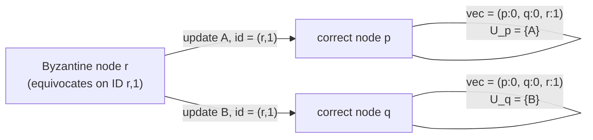
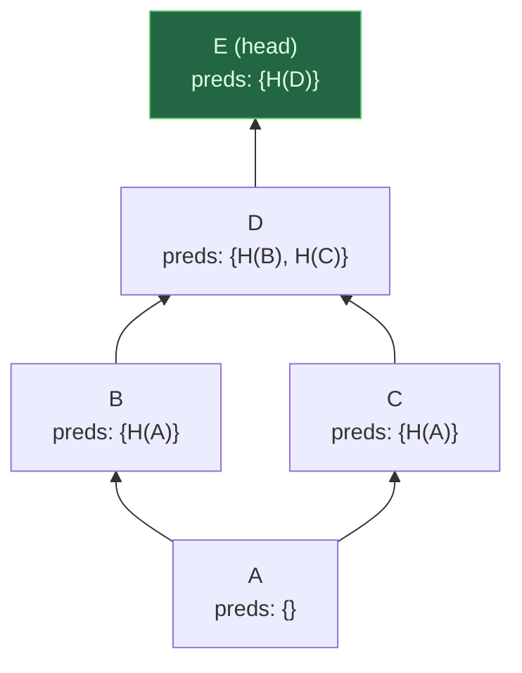
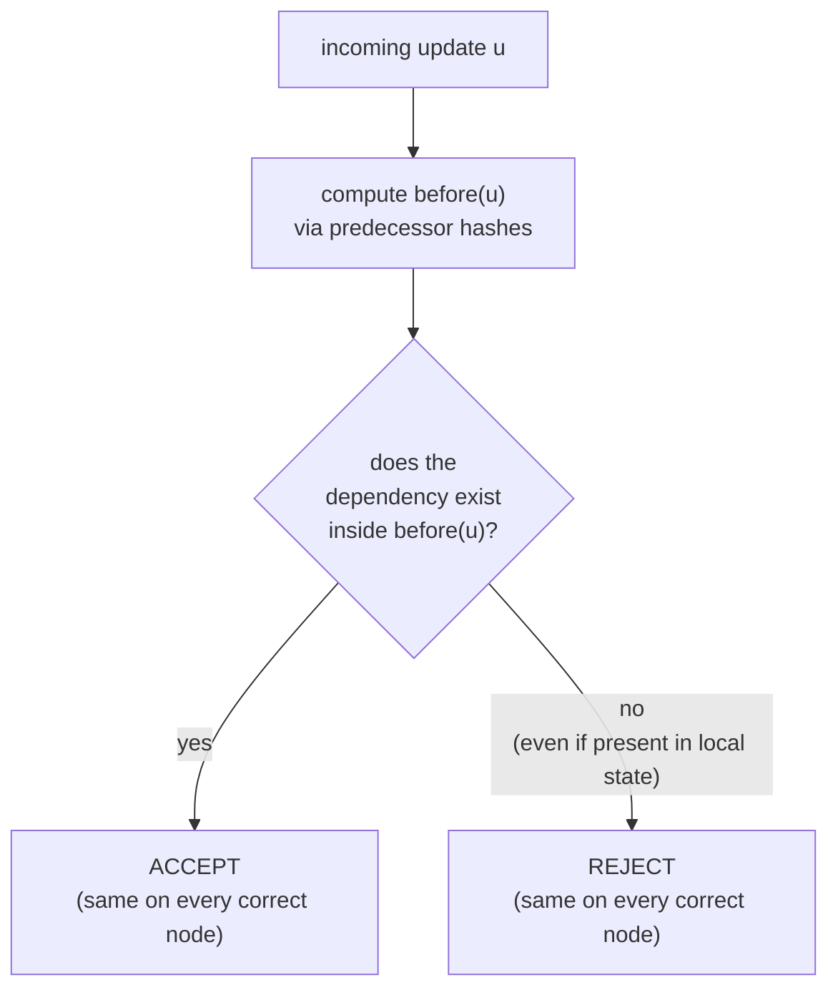

# Making CRDTs Byzantine Fault Tolerant

> **Thesis.** Standard CRDTs guarantee Strong Eventual Consistency only because they *assume every replica honestly follows the protocol*. Replace that assumption with a **hash graph** — operations identified by the cryptographic hash of their content and linked to their causal predecessors by hash — and you can recover the *same* SEC guarantee against **any number** of Byzantine nodes (even a majority), with only modest retrofits to existing op-based algorithms and **no consensus, no quorum, no proof-of-work**.

**Source.** Martin Kleppmann. *Making CRDTs Byzantine Fault Tolerant.* In 9th Workshop on Principles and Practice of Consistency for Distributed Data (PaPoC '22), April 5–8 2022, Rennes, France. ACM. https://doi.org/10.1145/3517209.3524042

This is a short, position-style workshop paper (8 pages). It is not a from-scratch algorithm with proofs; it is a *recipe and a conjecture*: a set of principles for retrofitting Byzantine fault tolerance onto operation-based CRDTs, leaning on the author's prior hash-graph reconciliation work for the heavy formal results. The payoff is conceptual — it shows precisely *where* ordinary CRDTs break under malice and *what minimal machinery* repairs each break.

---

## TL;DR

- **The unstated assumption.** CRDTs are routinely pitched as the way to get consistency in peer-to-peer systems with no central authority — yet almost all CRDT algorithms assume every node correctly follows the protocol. In an open P2P system anyone can run a **Byzantine** (faulty or malicious) node, and then the SEC guarantees silently fail: replicas can diverge *permanently*.
- **The surprising headline.** Unlike Byzantine *consensus* — which needs $> 2/3$ correct nodes and fundamentally different, expensive algorithms — Byzantine *CRDTs* can tolerate **arbitrarily many** Byzantine nodes, even when they outnumber the correct ones. This makes them **immune to Sybil attacks**: no proof-of-work, no proof-of-stake, no admission control needed.
- **Why the gap.** SEC's convergence only requires that two correct replicas with the *same set* of delivered updates reach equivalent state. It does **not** require agreement on *which* set, nor sequence numbers, nor a quorum. Removing the quorum is exactly what lets it tolerate any number of faults.
- **Two things break under Byzantine faults, and each gets a fix:**
  - **Eventual delivery** breaks because identifiers (version vectors) can be forged — a Byzantine node can **equivocate**: send two different updates under the same ID. *Fix:* identify each update by the **hash of its content**, and link updates into a **hash DAG** (Merkle-style). Hashes can't be forged without a collision, so equivocation is harmless.
  - **Convergence** breaks because *validity* of an update can depend on local state, and Byzantine nodes can send updates that one correct node accepts and another rejects. *Fix:* make every validity decision a deterministic function of the update's **causal past only** (the `before(u)` set reachable through predecessor hashes), which all correct nodes compute identically.
- **Unique IDs for free.** Many CRDTs need globally-unique item IDs (usually nodeID + counter — trivially forgeable). Use the **update's hash** as the ID; a Byzantine node cannot mint duplicates without finding a hash collision.
- **What you cannot get.** You cannot force a node to *apply* an operation, and you cannot prevent a Byzantine node from generating its own (valid) operations. BFT here means *correct nodes stay consistent with each other* — not that malice has no effect on the data.
- **Status.** A conjecture with worked principles, not a closed proof. Authentication via signatures is *optional* (needed only to attribute updates, not for SEC).

---

## 1. The setting: CRDTs sold as P2P, deployed among strangers

A defining feature of peer-to-peer systems is that **peers are not under one authority**: open, trustless systems where anybody on the Internet can run a node. The operators cannot be trusted, so some nodes will not correctly follow the protocol — whether through implementation bugs, hardware glitches (cosmic-ray bit-flips, "cores that don't count"), self-interested cheating, or pure vandalism.

> **Definition — Byzantine fault.** A node is **Byzantine-faulty** (or simply *Byzantine*) if it deviates from the specified protocol in *any* way, **regardless of whether the deviation is by accident or by malice**. A Byzantine node may send corrupted, contradictory, or maliciously crafted messages, and may actively try to undermine the system's guarantees. Byzantine behaviour is **not always detectable** by others, because a Byzantine node may try to hide its violations.

Two ways to deal with Byzantine nodes:

| Strategy | What it does | Why it's fragile |
|---|---|---|
| **Detect & exclude** | identify misbehaving nodes, ban them | a banned node can rejoin under a new identity; and the *damage already done* still has to be repaired |
| **Tolerate** | guarantee advertised properties *even while* some nodes are Byzantine | more robust — the system never relied on the bad nodes in the first place |

This paper takes the **tolerate** route.

CRDTs are *ostensibly* aimed at P2P (no central server for concurrency control), and are often cited as the consistency mechanism for P2P collaboration. But the **vast majority of CRDT algorithms do not tolerate Byzantine faults**: they assume all participating nodes follow the protocol. Deploy them with even one Byzantine node and the consistency properties they promise can fail — replicas may end up **permanently inconsistent**.

You can sometimes *justify* the lack of BFT by restricting collaboration to a small, mutually-trusting group (a handful of colleagues editing one document). But as the audience widens to public wikis and as designers chase collaboration at "massive scale", **blindly trusting every collaborator becomes a dangerous assumption.**

> **Key gotcha:** "CRDTs are for peer-to-peer" and "CRDTs assume honest replicas" are *both* true of the standard theory, and they are in direct tension. This paper is about resolving that tension.

### 1.1 Why this is *not* as hard as Byzantine consensus

The natural reflex is to borrow from Byzantine consensus (the engine of blockchains). But that path is bad:

- Byzantine consensus algorithms differ **fundamentally** from their non-Byzantine counterparts and are **significantly more expensive**.
- Byzantine consensus is only possible if **fewer than one third** of nodes are faulty (Dwork–Lynch–Stockmeyer). In an open P2P system, holding the line at $< 1/3$ Byzantine forces you to either centralise admission control or pay for **Sybil countermeasures** like proof-of-work.

The paper's central observation is that **BFT CRDTs are categorically easier than BFT consensus**: you can guarantee the standard CRDT consistency properties even when **arbitrarily many** nodes are Byzantine — including when the Byzantine nodes *outnumber* the correct ones. That immunity to Sybil attacks is what makes them deployable in genuinely open systems "that anybody can join, without requiring proof-of-work or proof of any other resource." And it requires **no redesign** — just modest tweaks to existing op-based algorithms.

---

## 2. System model

A peer-to-peer system in which **all nodes are equal peers**. The node set need not be known; nodes may join and leave at any time. Node fault classes:

- **Crash:** a node may stop, and may later recover.
- **Byzantine:** a node may arbitrarily deviate from the protocol.
- **Correct:** a node that is *neither* crashed *nor* Byzantine.

Crucially: **no node knows whether another node is Byzantine**, and **there is no limit** on the number of crashed or Byzantine nodes.

**Network.** Nodes communicate over **pairwise** links. The network need *not* be complete — not every node can necessarily reach every other. Links are **asynchronous and unreliable** with a **fair-loss** assumption: messages may be lost but are eventually received after finitely many retries. Byzantine nodes may behave arbitrarily on the wire (corrupt, contradict, lie).

> **Key assumption (the one cryptographic crutch):** when **two correct nodes communicate *directly*, their messages are not corrupted.** This is realised by **cryptographically authenticating** point-to-point messages (e.g. an authenticated channel). It does *not* mean updates are signed end-to-end — only that a direct correct-to-correct link can't be silently tampered with.

### 2.1 The correctness target: Strong Eventual Consistency

The standard correctness model for CRDTs is **Strong Eventual Consistency (SEC)**, which demands three properties:

- **Eventual delivery.** An update delivered at a correct replica is *eventually* delivered at *all* correct replicas.
- **Convergence.** Correct replicas that have delivered the **same set of updates** have **equivalent state**.
- **Termination.** All method executions terminate.

Termination is generally easy, so the paper focuses on **eventual delivery** and **convergence** — and shows how each is attacked by Byzantine nodes and how each is repaired.

In the non-Byzantine world these are achieved by: a **reliable broadcast** (e.g. gossip) for eventual delivery; **commutative** operations (op-based CRDTs) for convergence; and optionally **causal delivery** so an update's dependencies arrive first.

> **Mental model:** SEC is deliberately weak about *agreement on the set*. It never says replicas must agree on a global order or a global membership — only that *coincidentally identical sets must yield identical state*. That weakness is a feature: it is exactly the slack that lets us drop quorums and tolerate a Byzantine majority.

---

## 3. Where standard CRDTs break under Byzantine faults

### 3.1 Attack on eventual delivery: communication paths

In a non-Byzantine system, eventual delivery is possible iff every pair of correct nodes can communicate, directly or transitively through other correct nodes. Two permanently-partitioned nodes can never converge.

This generalises: if correct nodes $p$ and $q$ are connected **only via Byzantine intermediaries**, those intermediaries can simply **block** traffic between $p$ and $q$, defeating eventual delivery. So the unavoidable, minimal assumption is:

> **Connectivity assumption:** any two correct nodes can communicate **either directly, or indirectly via other *correct* (non-Byzantine) nodes.**

The paper reduces the general case to **pairwise direct correct-to-correct communication** chained together: if every adjacent correct pair eventually exchanges their updates, transitive delivery follows. The pairwise goal: *if $p$ has delivered update $u$, then $q$ must eventually deliver $u$ too.*

A trivially-correct (but wasteful) anti-entropy protocol: periodically, $p$ sends $q$ every update $q$ hasn't acknowledged, and vice versa. It re-sends much that $q$ already has — but it is **robust to Byzantine nodes**, because correct nodes propagate every update they hold regardless of who originated it.

### 3.2 Attack on eventual delivery: forged identifiers (equivocation)

The wasteful protocol begs for a summary of "what I have." The classic summary is the **version vector**: each node sequentially numbers its own updates, and a node's delivered set is summarised by the highest sequence number seen *from each node*.

**Version vectors are unsafe under Byzantine faults.** A Byzantine node can **equivocate**: generate several *distinct* updates carrying the *same* sequence number, and route them to different nodes.



*(Figure 1 of the paper, adapted.)* Byzantine node $r$ sends two **different** updates $A$ and $B$ under the **same ID** $(r,1)$ — $A$ to $p$, $B$ to $q$. Now $p$ and $q$ hold **identical version vectors** $(p{:}0, q{:}0, r{:}1)$, yet have delivered **different sets** $U_p = \{A\} \ne \{B\} = U_q$. They believe they are in sync; they are not. Eventual delivery silently fails.

> **Key gotcha:** signing the updates does **not** save you here. Even with signatures, nothing stops a node from signing *two* updates with the same sequence number. You might *later* detect the reused number — but detecting it requires an extra protocol layered on top of version vectors, and meanwhile divergence has already happened.

### 3.3 Why Byzantine reliable broadcast is the wrong hammer

There exist **Byzantine reliable broadcast** protocols that *do* make all correct nodes deliver the same set of messages, defeating equivocation. But they over-deliver:

- They provide a **stronger** property than CRDTs need (agreement on a per-sender sequence-numbered message stream).
- To stop an equivocator from making nodes deliver different messages for the same `(sender, seq)`, they require a **quorum vote** — and therefore **more than two thirds of nodes correct**.

That $> 2/3$ requirement is precisely what we are trying to avoid. The CRDT eventual-delivery property is *weaker*: it only asks that two correct replicas eventually deliver the **same set** of messages, with **no limit on the number of messages** and **no sequence numbers**. That subtle weakening **removes the need for quorum votes** — and *that* is what unlocks tolerance of **any number** of Byzantine nodes.

> **Design lesson:** match the mechanism to the property. Reaching for Byzantine *consensus/broadcast* to fix a CRDT is over-engineering that re-imports the very $1/3$ bound you wanted to escape. The right tool is *content-addressing*, which needs no votes.

### 3.4 Attack on convergence: state-dependent validity

Convergence depends on the **update-application logic**. Correct nodes all run the same logic, but Byzantine nodes may feed them **malformed** updates.

- **Structurally malformed** updates are easy: if rejection is a **deterministic function of the update itself** (independent of replica state), every correct node rejects identically — convergence preserved.
- **Dangerous** are updates whose validity depends on the **delivering node's state**. Examples the paper gives:
  - **Duplicate-ID attack.** In sequence CRDTs like **Logoot** and **Treedoc**, each item has a unique ID; two items can't share an ID. A Byzantine node generates $u_1$ and $u_2$ creating two *different* items with the *same* ID. A node that already delivered $u_1$ will **reject** $u_2$; a node that hasn't will **accept** $u_2$. One accepts, one rejects → divergence, *even with eventual delivery*.
  - **Missing-dependency attack.** In **RGA**, an element can be deleted only if it was previously inserted; you can't delete a nonexistent element. With honest nodes, causal-order metadata ensures the insert is delivered first. A Byzantine node may **set that metadata incorrectly**, so some nodes process $u_1$ before $u_2$ (fine) while others try $u_2$ first and **fail** → divergence.
  - **Order-property attack.** In **WOOT** and **YATA**, an insertion must reference predecessor and successor element IDs, and the algorithm depends on the predecessor preceding the successor in the sequence. The order isn't apparent from the IDs alone, so the algorithm must **inspect CRDT state** to validate — and that state differs between nodes.

The common shape: **validity is a predicate over local state, and local states differ**, so correct nodes disagree on accept/reject. That disagreement is divergence.

---

## 4. The fix: a hash graph of operations

The whole repair pivots on one construction.

### 4.1 Content-addressing every update

Let $u$ be any update encoded as a byte string. Identify it by $H(u)$, where $H$ is a **collision-resistant** cryptographic hash (SHA-256, SHA-3):

$$
\text{id}(u) \;=\; H(u), \qquad H \text{ collision-resistant: infeasible to find } x \ne y \text{ with } H(x) = H(y).
$$

Because the ID *is* the content's hash, a Byzantine node **cannot** attach two different contents to the same ID without breaking collision-resistance. Equivocation under a shared ID becomes impossible.

### 4.2 Predecessor hashes → a Merkle DAG

Every update $u$ carries a set of **predecessor hashes**: the hashes of the updates that **causally precede** $u$ (its causal dependencies). This typically includes the hash of the **last update generated by the same node**, plus the hashes of any updates **received from others since** that node's last update. The structure:

- An update with an **empty** predecessor set is the *first* update on some node.
- With **no concurrency**, each update after the first has exactly **one** predecessor — the immediately-prior update.
- When updates are generated **concurrently and later merged**, the next update has **multiple** predecessors.
- **Transitively-reachable** dependencies are *omitted* from the set, keeping it small even in huge histories.
- The **heads** are the updates that are not (yet) a predecessor of any other update.

Updates + predecessor hashes form a **directed acyclic graph (DAG)**, of which each node stores a full local copy of everything it has delivered.



*B and C are concurrent (both name H(A) as their only predecessor). D merges them by naming both H(B) and H(C). The single current head is E.*

The predecessor-hash record for one update looks like:

```text
update D
├── op        : <CRDT operation payload>
├── preds     : [ H(B), H(C) ]          # the two concurrent heads being merged
└── id(D)     = H( encode(op, preds) )  # this update's own content hash
                 ▲
                 └── any change to op OR preds changes id(D)
```

> **Mental model — "Git without merge commits."** The hash graph *resembles a Git commit history* — content-addressed nodes linked to parents by hash. The one difference: because a CRDT **merges concurrent updates automatically**, there is **no merge commit**. After concurrency you simply have a DAG with **multiple heads**, and the next causally-dependent update lists several predecessor hashes. Formally, the graph is the **Hasse diagram of the causal partial order** over updates.

### 4.3 How the hash graph restores eventual delivery

Content-addressing gives several gifts:

1. **Cheap, sound equality check.** If $p$ and $q$ exchange the hashes of their **current heads** and they match, they can be **certain** their *entire* delivered sets match — because a head's hash transitively covers all its ancestors. (Contrast Figure 1, where matching version vectors were a *lie*.)
2. **Efficient reconciliation.** If the heads mismatch, the nodes run a graph traversal to find their common portion and ship each other only the **missing** parts. This is very efficient because the number of heads is typically tiny: with up to three concurrent heads and 256-bit hashes, a node's *entire* delivered set is summarised in **under 100 bytes**, regardless of how many updates or nodes exist. (Optimised reconciliation algorithms are in the author's prior work, Kleppmann & Howard 2020.)
3. **Causal delivery falls out.** On receiving new updates, a node simply ensures each update's predecessors (named by hash) are delivered first. A Byzantine node can put **arbitrary** predecessor hashes on its update — including hashes that resolve to **nothing**. That is *harmless*: such an update simply **never becomes deliverable** at correct nodes (its dependency never arrives), so it is silently excluded rather than causing divergence.

> **Why the Byzantine majority can't break delivery.** Byzantine nodes may add arbitrary vertices/edges to the graph (e.g. fake updates that claim to be ancient). But — *assuming they cannot find hash collisions* — there is **nothing** they can do to stop correct nodes from eventually delivering the **same set** of updates as those correct nodes communicate. (Proof: prior work.) The worst they can do is **performance degradation** — flooding many concurrent updates → many heads, or updates with huge predecessor sets — which never affects **correctness**.

This yields eventual delivery requiring only the unavoidable connectivity assumption of §3.1: every correct node can eventually reach every other correct node directly or via correct intermediaries.

### 4.4 Unique IDs without a trusted authority

Many CRDTs need unique item IDs ("dots"). The usual recipe — *nodeID + per-node counter* — only works with trusted nodes, since a Byzantine node can trivially mint duplicate IDs.

The hash graph hands you forgery-proof IDs for free:

> **The ID of an operation is the hash of the update containing it.** A Byzantine node cannot generate duplicate IDs without finding a hash collision.

Details that make this work:

- The ID is known only *after* the update is encoded — fine, because op-based CRDTs **generate the operation side-effect-free first, then apply it via an effector**; the byte string (and thus the hash) is known by the time the effector runs.
- **Multiple IDs per update:** use the integer $1, 2, 3, \dots$ **concatenated with the update hash**. A Byzantine node can't alter this numbering without changing the hash → still no duplicates.
- **Intra-update references:** if one operation must reference another operation *within the same update*, it uses that **same integer** — it can't use the hash, which isn't known yet at encoding time.
- Where IDs need only **uniqueness**, switching to hash-IDs is easy. Where IDs need extra properties (e.g. an order), add the checks of §4.6.
- **Cost:** hashes need more space than counters. To avoid materialising all hashes, you could design a **compression scheme** that recomputes hashes on demand, storing only what's needed to recompute.

### 4.5 The fix for convergence: decide validity over the causal past only

To keep convergence, all correct nodes must agree on whether a given update is valid (§3.4). Validity may depend on prior updates, and nodes have delivered different prior sets $U_p \ne U_q$. The trick: **don't decide over the full local state — decide over a canonically-shared subset.**

> **Definition — `before(u)`.** $\text{before}(u)$ is the set of updates **transitively reachable** from $u$ through predecessor hashes (its predecessors, their predecessors, and so on). Because that set is pinned by content hashes baked into $u$, **every correct node computes the same** $\text{before}(u)$ — *even if* their overall delivered sets $U_p$ and $U_q$ differ.

So: **decide validity of $u$ using only the updates in $\text{before}(u)$**, ignoring anything outside it. Since all correct nodes see the same $\text{before}(u)$, they make the **same** accept/reject decision → convergence preserved.

Worked example. Suppose $u$ references the ID of an element created by an earlier update, and $u$ is valid only if that element exists. Check whether the creating update is **in $\text{before}(u)$**:

- in $\text{before}(u)$ → **accept**;
- not in $\text{before}(u)$ → **reject**, *even if the element happens to exist at the local replica*. We reject because we can't be sure it will exist at *other* replicas, so rejecting is the safe, deterministic choice.

Updates from **correct** nodes are *always* valid under this scheme — only Byzantine-generated updates may be rejected.



> **Mental model:** local state is a fog that differs per node; `before(u)` is a **shared, tamper-proof lens** carved out of that fog by the hash links. Always judge an update through the shared lens, never through the local fog.

### 4.6 Two refinements to the validity rule

**(a) Delay instead of reject (for monotonic existence).** When the validity criterion is "some element exists," an alternative to rejecting is to **delay** delivering $u$ until the referenced element comes into being. This is safe **as long as existence is logically monotonic** — elements can only be *created*, never destroyed (e.g. by keeping **tombstones** for deletions). Then by eventual delivery every correct node *eventually* delivers the creating update, and *eventually* applies $u$. Convergence holds.

**(b) Ordering constraints (RGA / Lamport timestamps).** RGA requires insertion IDs that are not only unique but obey a **total order consistent with causality** (a Lamport timestamp works). To validate the ID in $u$: take the **maximum ID** appearing in any causal predecessor of $u$, and require $u$'s ID to be exactly **one greater** than that maximum. Again the check reads only the causal past, so it's deterministic across correct nodes.

---

## 5. The BFT-SEC claim, and what it does (and does not) buy

### 5.1 The conjecture

> **Conjecture.** The two techniques — (1) **hash-based unique IDs**, and (2) **deciding validity over `before(u)` so all correct nodes agree** — are **sufficient to guarantee convergence in a Byzantine setting**. Concretely: any update a Byzantine node might produce will **either be rejected by all correct nodes, or produce a legitimate CRDT state update on all correct nodes** (legitimate in the sense that some *non*-Byzantine node could have generated the same update). Moreover, **most operation-based CRDTs can be made Byzantine fault tolerant this way.**

The paper explicitly leaves a **detailed proof in the context of particular CRDT algorithms to future work** — this is a position/principles paper, not a closed theorem. Combining §4.3's eventual-delivery result (proven in prior work) with this convergence conjecture gives **Byzantine-tolerant Strong Eventual Consistency**.

### 5.2 The shape of the guarantee — a comparison

| Property | Non-Byzantine CRDT | This BFT scheme | Byzantine consensus / BRB |
|---|---|---|---|
| Fault model | crash only | crash **+ arbitrary Byzantine** | crash + Byzantine |
| Max Byzantine tolerated | n/a | **any number** (even a majority) | **< 1/3** |
| Sybil-resistant | no | **yes** (no resource proofs) | no (needs PoW / admission) |
| Needs quorum / consensus | no | **no** | yes |
| Algorithm change | — | **modest retrofit** of op-based CRDTs | fundamentally different, more expensive |
| Identifiers | nodeID + counter | **content hash** | per-sender seq numbers |
| Convergence basis | concurrent ops commute | commute **+ validity over `before(u)`** | total agreement on message stream |
| Guarantee | SEC | **SEC among correct nodes** | total order / agreement |

### 5.3 What BFT-SEC does *not* give you

The guarantee is about **agreement among correct nodes**, not about neutralising malice:

- **You cannot force a node to apply an operation.** A node (Byzantine or just offline) can always ignore updates. BFT-SEC ensures *correct* nodes that *do* deliver the same set converge — it cannot compel application.
- **Byzantine nodes can still generate their own valid operations.** Nothing stops a malicious participant from making legitimate edits; the scheme only guarantees that *correct nodes don't diverge*, not that the content reflects only honest intent. (Application-level authorisation is a separate concern.)
- **Authentication is optional, and orthogonal.** If you want to know *which* node produced an update, **sign** updates cryptographically. But signing is **not required** for SEC — eventual delivery and convergence hold without it. Signatures buy attribution/accountability, not consistency.
- **Performance is a real attack surface.** Byzantine nodes can't break correctness but *can* degrade performance (head explosion, oversized predecessor sets). Correctness survives; throughput may not.
- **The connectivity assumption is load-bearing.** If correct nodes are reachable *only* through Byzantine intermediaries, delivery can be blocked. This is unavoidable in any system.

> **Design lesson:** "Byzantine fault tolerant" here is a precise, modest claim — *correct replicas stay strongly eventually consistent with each other no matter how many liars surround them*. It is **not** a claim that the data is protected from bad actors. Knowing which property you're buying is the whole game.

---

## 6. Relationship to existing CRDTs and prior art

### 6.1 It's a retrofit, not a new family

The thesis is deliberately conservative: making CRDTs BFT **does not require redesigning** them. Existing **operation-based** CRDTs (Logoot, Treedoc, RGA, WOOT, YATA, …) get retrofitted by:

1. swapping forgeable IDs for **hash-IDs**,
2. wrapping operations in the **predecessor-hash DAG** for delivery + causal order,
3. rewriting each **validity check** to read only `before(u)`.

The underlying merge semantics — *concurrent operations commute* — is untouched. The op-based **generate-then-effect** structure is actually *convenient*, because the hash (the ID) becomes available exactly between generation and effecting.

### 6.2 Content-addressing and hash graphs are well-trodden

- **Content addressing** (referring to data by the hash of its content): Git, BitTorrent, IPFS.
- **Hash graphs** (Merkle-linked DAGs): Git, Merkle trees, blockchains, IPLD, hash histories.

This paper is novel not in inventing hash graphs but in **applying them to retrofit BFT onto general op-based CRDTs while tolerating an unbounded number of Byzantine nodes**.

### 6.3 How it differs from other BFT-CRDT attempts

| Work | Approach | Limitation vs this paper |
|---|---|---|
| Zhao et al. (Chai & Zhao; Zhao & Babi) | BFT collaborative editing | needs **3f+1** replicas to tolerate **f** Byzantine → not open/Sybil-safe |
| **ASPAS** (Shoker/Yactine/Younes) | builds on BFT state-machine replication (BFT-SMaRt) | again **3f+1** servers → not deployable in open P2P |
| **van der Linde et al.** (Practical Client-side Replication) | untrusted nodes, but goal is correct causal-dependency reporting | relies on **trusted servers**; targets *rational* clients; can exclude provably-faulty replicas but **can't repair damage already done** |
| **Matrix Event Graph** (Jacob et al.) | add-only DAG of vertices/edges, like this hash graph | a *specific* CRDT; this paper gives general principles |
| **Jacob et al.** (CRDTs & equivocation) | argue other CRDTs can tolerate arbitrary Byzantine via hash graphs | **propose no concrete algorithm** |
| **Merkle-CRDTs** (Sanjuán et al.) | CRDTs on hash graphs (Merkle-DAGs) | **do not address** Byzantine nodes creating *invalid operations* |
| **Merkle Search Tree** (Auvolat & Taïani) | **state-based** CRDT for sets, tolerates any number of Byzantine | a state-based **counterpart** to this op-based approach |

The distinguishing feature: this scheme **makes no assumption about the number of Byzantine nodes** and squarely tackles **invalid-operation** attacks via the `before(u)` validity rule.

---

## 7. Limitations & open questions

- **It's a conjecture, not a proof.** The convergence claim is left unproven for specific CRDTs; demonstrating effectiveness, proving correctness, and **measuring the performance impact** of BFT are explicitly future work.
- **"Most" op-based CRDTs, not all.** The retrofit is claimed for *most* operation-based CRDTs; the boundary cases aren't characterised. **State-based** CRDTs are out of scope (see Merkle Search Trees for that side).
- **Storage overhead.** Hash-IDs cost more space than counters; the recompute-on-demand compression is sketched, not built.
- **Performance under attack is unbounded.** Correctness is robust to head/predecessor flooding, but liveness/throughput degradation is real and unquantified.
- **No protection of *content*** — you cannot force application, cannot stop valid-but-malicious edits, and recovery/authorisation are separate problems (signatures give attribution only).
- **Connectivity caveat.** Correct nodes isolated behind purely-Byzantine cut-sets cannot be helped.

### The one-paragraph distillation

Ordinary CRDTs get Strong Eventual Consistency *for free* only by assuming honest replicas; under Byzantine faults, **eventual delivery** breaks (forgeable version-vector IDs let a node **equivocate**) and **convergence** breaks (state-dependent validity makes correct nodes disagree on accept/reject). Fix both with a **hash graph**: identify every update by the **hash of its content**, link each to its causal **predecessors by hash** (a Merkle DAG, "Git without merge commits"), use the **update hash as the unique ID** (unforgeable), and decide every update's validity **only over its hash-pinned causal past `before(u)`** so all correct nodes decide identically. Because the CRDT correctness property merely needs *correct replicas with the same set to converge* — not quorum agreement on *which* set — this tolerates **any number** of Byzantine nodes, is **Sybil-immune**, needs **no consensus or proof-of-work**, and is a **modest retrofit** rather than a redesign of existing operation-based CRDTs.

---

## Glossary & notation

| Term | Meaning |
|---|---|
| **Byzantine fault** | any deviation from the protocol, by accident or malice; not always detectable by others. |
| **Correct node** | a node that is neither crashed nor Byzantine. |
| **Sybil attack** | one adversary spawning many fake identities to gain influence; defeated here by tolerating *any number* of Byzantine nodes. |
| **SEC** | Strong Eventual Consistency: eventual delivery + convergence + termination. |
| **Eventual delivery** | an update delivered at a correct replica is eventually delivered at all correct replicas. |
| **Convergence** | correct replicas with the *same delivered set* have equivalent state. |
| **Equivocation** | a Byzantine node emitting *different* updates under the *same* identifier, sent to different nodes. |
| **Version vector** | per-node highest-sequence-number summary of delivered updates; **unsafe** under Byzantine faults. |
| **Byzantine reliable broadcast (BRB)** | protocol guaranteeing all correct nodes deliver the same messages; needs a **quorum** → tolerates only **< 1/3** Byzantine. |
| **Content addressing** | referring to a data item by the cryptographic hash of its content. |
| $H(u)$ | collision-resistant hash of update $u$ (SHA-256 / SHA-3); used as $u$'s ID. |
| **Collision-resistant** | computationally infeasible to find $x \ne y$ with $H(x) = H(y)$. |
| **Predecessor hashes** | the hashes of $u$'s direct causal dependencies, baked into $u$. |
| **Hash graph / Merkle DAG** | DAG of updates linked by predecessor hashes; the Hasse diagram of the causal order ("Git without merge commits"). |
| **Heads** | updates not yet a predecessor of any other update; summarise the whole delivered set. |
| $U_p$ | the set of updates delivered at node $p$ immediately before delivering $u$. |
| $\text{before}(u)$ | updates transitively reachable from $u$ via predecessor hashes; **identical at all correct nodes**, the basis for deterministic validity. |
| **Dot** | a globally-unique item identifier; here realised as a hash-ID (or integer ∥ hash for multiples). |
| **Tombstone** | a retained marker of a deleted element, making existence *monotonic* so "delay-until-exists" validity stays safe. |
| **Generate / effect** | op-based CRDT's side-effect-free operation generation, then the effector that applies it; the hash-ID is available between the two. |
| **Authentication (signing)** | optional cryptographic attribution of updates to nodes; **not required** for SEC. |
| **Fair-loss link** | unreliable channel where messages may be lost but arrive after finite retries. |
