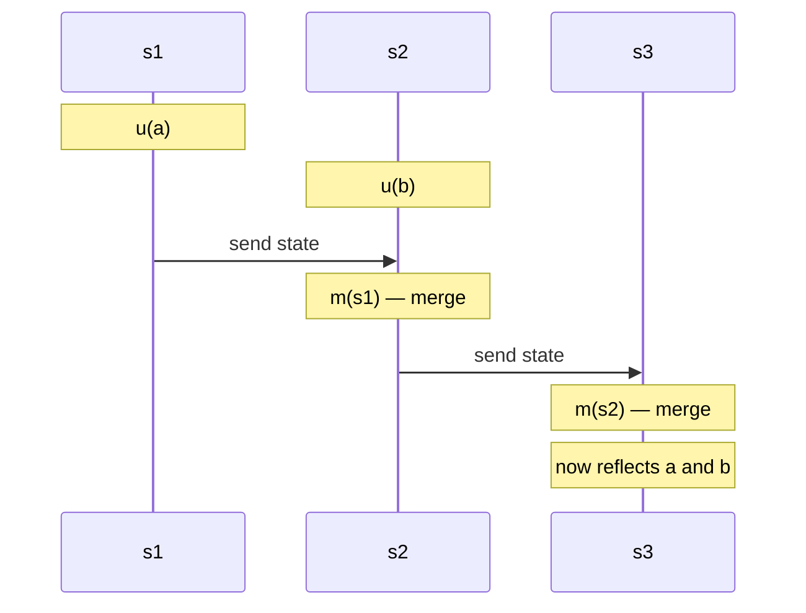

# Conflict-free Replicated Data Types

> **Thesis.** If you constrain a replicated data type so that either (a) its states form a *monotonic semilattice* and merge is the least upper bound, **or** (b) its concurrent operations *commute*, then replicas converge to the same correct state with **no synchronisation, no consensus, and no rollback** — tolerating up to *n − 1* failures.

**Source.** Marc Shapiro, Nuno Preguiça, Carlos Baquero, Marek Zawirski. *Conflict-free Replicated Data Types.* INRIA Research Report RR‑7687, v2, August 2011. (The companion catalogue of designs is the longer RR‑7506, *A Comprehensive Study of Convergent and Commutative Replicated Data Types*.)

This is the paper that gave CRDTs their name and their two-condition theory. It is short and almost entirely definitions + proofs; the payoff is a precise recipe for "design a data type that can't have merge conflicts."

---

## TL;DR

- **The problem.** Eventual consistency (EC) lets any replica accept writes locally and gossip them later — great for availability, but published EC systems resolve concurrent-update *conflicts* ad-hoc, often needing rollback and consensus (e.g. the Amazon shopping-cart anomaly).
- **The fix — SEC.** Define **Strong Eventual Consistency**: EC *plus* the guarantee that any two replicas that have delivered the **same set of updates** are already in **equivalent state** — immediately, with no arbitration. No rollback, no consensus.
- **Two sufficient conditions** for SEC, matching the two replication styles:
  - **State-based (CvRDT):** states form a join-semilattice; `merge = ⊔` (least upper bound); updates only move state *up* the lattice.
  - **Op-based (CmRDT):** ship operations over a *causally-ordered reliable broadcast*; all *concurrent* operations **commute**.
- **They're equivalent.** Each style can emulate the other, so "CvRDT" and "CmRDT" describe the same expressive power.
- **It beats CAP's pessimism.** SEC gives a well-defined consistency guarantee while staying fully Available and Partition-tolerant; it tolerates *n − 1* crashes and needs no consensus. SEC is **incomparable** to sequential consistency (each permits executions the other forbids).
- **Worked designs.** Counters/vector clocks, grow-only and add/remove sets (U-Set), a replicated Log with distributed GC, and a full case study: a **Directed Graph CRDT**.

---

## 1. The problem: eventual consistency without the foot-guns

Strong consistency serialises all updates into one global total order. That is a scalability bottleneck and, by CAP, is incompatible with staying available under network partitions.

**Eventual consistency** relaxes this: an update executes at one replica *without synchronisation*, then propagates asynchronously; all updates eventually reach all replicas, possibly **in different orders**. The catch is concurrent updates that *conflict* — individually valid, jointly invariant-violating:

> A **conflict** is a combination of concurrent updates, each individually correct, that together would violate some invariant.

Classic EC systems handle this by executing optimistically and later *detecting* a conflict, *rolling back*, and *re-arbitrating* — which in general needs consensus to make every replica arbitrate identically. The literature gave little principled guidance, so implementations were "brittle and error-prone."

The paper's move: **engineer conflicts out of existence** using two algebraic properties — monotonicity in a semilattice, and commutativity. The trivial motivating example is a replicated counter: `inc` and `dec` commute, so replicas converge regardless of delivery order (modulo overflow).

---

## 2. System model

A fixed, finite set of processes $\Pi = \{p_0, \dots, p_{n-1}\}$, **non-byzantine**, connected by an **asynchronous** network that may partition and recover. Processes may crash silently and possibly recover with memory intact; a non-crashed process is **correct**. Channels are **fair-lossy** over a fully-connected graph: infinitely often, a correct replica sends its state/ops to another. (This is the standard gossip / anti-entropy setting — it does *not* require consensus.)

One object, one replica per process. Notation used throughout:

| Symbol | Meaning |
|---|---|
| $S,\ s^0$ | payload domain; initial state |
| $q,\ u,\ m$ | query / update / merge methods (state-based) |
| $s_i^k$ | state of replica $i$ after its $k$-th method execution |
| $s \bullet f^k_i(a) = s'$ | applying method $f$ (args $a$) transitions state |
| $s \equiv s'$ | **state equivalence**: every query returns the same on both |
| $K_i(f)$ | the ordinal (1,2,…) at which execution $f$ happened at replica $i$ |

Queries are side-effect-free: $s \bullet q \equiv s$.

### 2.1 Causal history and happened-before

The engine of all the proofs is the **causal history** $C = [c_1, \dots, c_n]$ — the set of updates each replica has "seen." It is a *reasoning device*, not something an implementation must materialise.

For a **state-based** object, after replica $i$'s $k$-th method:

$$
c_i^k =
\begin{cases}
c_i^{k-1} & \text{if it was a query } q\\[2pt]
c_i^{k-1} \cup \{u_i^k(a)\} & \text{if it was an update } u\\[2pt]
c_i^{k-1} \cup c_{i'}^{k'} & \text{if it was a merge of remote state } s_{i'}^{k'}
\end{cases}
$$

An update is **delivered** at a replica once it is in that replica's causal history. From this we get the two relations everything hinges on:

- **happened-before:** $u \rightarrow u' \overset{\text{def}}{=} u \in c_j^{k-1}$, where $u'$ executes at $p_j$ as its $k$-th op. (i.e. $u$ was already delivered when $u'$ ran.)
- **concurrent:** $u \parallel u' \overset{\text{def}}{=} u \not\rightarrow u' \ \wedge\ u' \not\rightarrow u$.

> **Key gotcha the model makes explicit:** "every update eventually reaches every replica" is **necessary but not sufficient** for convergence. If `merge` were a no-op, all updates are delivered yet nothing converges. Delivery is about *messages*; convergence is about *what merge does with them*. The two conditions below are exactly what plugs that gap.

---

## 3. Eventual and Strong Eventual Consistency

**Definition — Eventual Consistency (EC)** (using $\Diamond$ = "eventually", $\Box$ = "henceforth"):

- **Eventual delivery:** an update delivered at a correct replica is eventually delivered to all correct replicas: $\forall i,j:\ f \in c_i \Rightarrow \Diamond f \in c_j$.
- **Convergence:** replicas that delivered the same updates *eventually* reach equivalent state: $\forall i,j:\ \Box\, c_i = c_j \Rightarrow \Diamond \Box\, s_i \equiv s_j$.
- **Termination:** all method executions terminate.

EC's "eventually" still admits the rollback-and-arbitrate machinery. The paper strengthens *convergence* into something instantaneous:

**Definition — Strong Eventual Consistency (SEC).** EC, plus

- **Strong Convergence:** $\forall i,j:\ c_i = c_j \Rightarrow s_i \equiv s_j$.

The single word that changed: "eventually reach" → **"have."** The instant two replicas have seen the same set of updates, they are *already* equivalent — no further communication, arbitration, or rollback can be pending. That is the whole point of "conflict-free."

```
EC  :  same updates delivered  ──eventually──▶  equivalent state
SEC :  same updates delivered  ───already────▶  equivalent state   ◀── no arbitration window
```

A data type guaranteeing SEC is a **CRDT**. The rest of the paper gives two sufficient conditions for SEC.

---

## 4. State-based CRDTs (CvRDT): converge by climbing a semilattice

### 4.1 The replication style

Each replica updates locally; periodically it **ships its whole state** to a peer, who **merges** it in. Indirect propagation is fine — state flows transitively through the gossip graph.


*(Figure 1 of the paper. Updates reach every replica directly or indirectly; merge folds remote state in.)*

### 4.2 The condition: a monotonic join-semilattice

A **join-semilattice** is a partial order $\le$ in which every pair $\{x,y\}$ has a **least upper bound** (LUB / *join*) $x \sqcup y$:

$$
m = x \sqcup y \iff x \le m \,\wedge\, y \le m \,\wedge\, \big(\forall m':\ x \le m' \wedge y \le m' \Rightarrow m \le m'\big)
$$

From this definition alone, the join is automatically:

- **commutative** — $x \sqcup y = y \sqcup x$
- **idempotent** — $x \sqcup x = x$
- **associative** — $(x \sqcup y) \sqcup z = x \sqcup (y \sqcup z)$

These three are precisely the algebraic robustness an EC merge needs: **commutative** ⇒ delivery order doesn't matter; **idempotent** ⇒ receiving the same state twice is harmless (duplicates OK); **associative** ⇒ regrouping/batching merges doesn't matter. *Self-stabilising* convergence falls straight out.

```
   Hasse diagram — the join lattice for a 2-D vector / set:

        x ⊔ y = {a,b}          ← LUB: the merged state
        /          \
   x = {a}        y = {b}       ← two divergent replica states
        \          /
          ⊥ = {}               ← initial state s⁰

   merge(x, y) climbs to the lowest point above BOTH.
```

**Definition — Monotonic semilattice object** $(S, \le, s^0, q, u, m)$ requires:

1. $S$ ordered by $\le$ forms a join-semilattice;
2. merge computes the LUB: $s \bullet m(s') = s \sqcup s'$;
3. updates are **inflationary** (monotonically non-decreasing): $s \le s \bullet u$.

**Theorem (CvRDT).** Assuming eventual delivery + termination, *any* state-based object with the monotonic-semilattice property is **SEC**.

**Why it works (proof intuition).** Definition forbids spontaneous state changes and rollbacks: a replica only moves by an update (which goes *up*) or a merge (which joins to the LUB). Take two replicas with $c_i = c_j$. Whatever interleaving of updates/merges produced their states, the histories are built from the *same* set of updates; because $\sqcup$ is a LUB and is commutative/idempotent/associative, both replicas are pinned to the *same* lattice point — the join of all delivered updates. (The paper case-splits on which history was a subset of which at the last merge; every case collapses to $s_i \equiv s_j$ by LUB properties, then $\sqcup$-transitivity lifts it to all replicas.) A CvRDT thus **converges toward the LUB of the most recent updates**. ∎

> **Mental model:** divergence is two replicas at different points of a lattice; merge is "jump to the lowest common point above both." Because that point is unique and order-independent, there is nothing to arbitrate.

---

## 5. Op-based CRDTs (CmRDT): converge by commuting operations

### 5.1 The replication style

Instead of shipping state, ship the **operations**. An op-based object is $(S, s^0, q, t, u, P)$ with **no merge**. An update is split into two halves:

- **prepare-update** $t$ — side-effect-free, runs only at the **source** replica (where the client invoked it). It may read local state to compute arguments. ($s \bullet t \equiv s$.)
- **effect-update** $u$ — runs **downstream at every replica**, including the source (immediately after $t$).

$P$ is the **delivery precondition**: $u$ becomes enabled at a replica only once $P$ holds there (used to model causal-readiness).

```mermaid
sequenceDiagram
    participant s1 as s1 (source of a)
    participant s2 as s2 (source of b)
    participant s3
    Note over s1: t(a); u(a')  — prepare then local effect
    Note over s2: t(b); u(b')
    s1-)s2: broadcast u(a')
    s1-)s3: broadcast u(a')
    s2-)s1: broadcast u(b')
    s2-)s3: broadcast u(b')
    Note over s1,s3: every replica applies {a', b'} — in any order
```
*(Figure 2. The split is what lets the heavy computation happen once at the source while the cheap effect replays everywhere.)*

### 5.2 The transport assumption: causally-ordered reliable broadcast

CmRDTs **assume** an underlying **reliable, causally-ordered broadcast**: every message delivered to every correct recipient exactly once, in an order consistent with happened-before. This is a *standard* building block — it needs no consensus and tolerates partitions that eventually heal. Consequence:

$$
(t,u) \rightarrow (t',u') \;\Rightarrow\; \forall i,\ K_i(u) < K_i(u')
$$

Causally-related ops apply in the same order everywhere; **concurrent** ops may arrive in any order. That residual freedom is exactly what commutativity must absorb.

### 5.3 The condition: concurrent operations commute

**Definition — Commutativity.** Ops $(t,u)$ and $(t',u')$ commute iff, in any reachable state $s$ where both effects are enabled, each stays enabled after the other and $s \bullet u \bullet u' \equiv s \bullet u' \bullet u$.

**Theorem (CmRDT).** Assuming causal delivery + termination + a delivery precondition satisfiable by causal delivery, any op-based object whose **concurrent** operations all commute is **SEC**.

**Why it works.** Once $c_i = c_j$, take any two ops in the history: if they're causally related, causal broadcast already applied them in the same order at every replica; if they're concurrent, commutativity says either order yields equivalent state. So every replica that delivered the same ops reaches equivalent state. ∎

> **CvRDT vs CmRDT — the practical trade-off the paper names:** state-based merge is more compact and easier to reason about formally (you just need a LUB), and is robust to lossy/duplicating/reordering channels — but shipping whole state is expensive for large objects. Op-based ships small deltas and expresses operation *semantics* naturally — but leans on a stronger transport (exactly-once, causal). The Directed Graph in §8 is op-based precisely because the graph is too big to ship.

---

## 6. The two styles are equivalent

**Theorem 3.1 — a CvRDT can be emulated by a CmRDT.** Make `prepare-update` apply the update to a *copy* of local state, $s' = s \bullet u(a)$, and broadcast an effect $u'(s')$ whose action is $s \bullet u'(s') \overset{\text{def}}{=} s \bullet m(s')$. Since merge is a LUB it always commutes ⇒ the emulating ops commute ⇒ SEC. (Precondition $P$ is unrestricted: state can be delivered anytime, matching the state-based model's lossy/reorderable channels.)

**Theorem 3.2 — a CmRDT can be emulated by a CvRDT.** Carry state $(s_m, M, D)$ where $s_m$ is the embedded op-based state and $M \supseteq D$ are grow-only sets of **known** and **delivered** ops, ordered by $(s_m,M,D) \le (s_m',M',D') \overset{\text{def}}{=} M \subseteq M' \wedge D \subseteq D'$. Merge unions the $M$ sets, then a recursive **deliver** function $d$ applies every still-undelivered op whose precondition now holds:

```text
d(s_m, M, D) =
    if ∃ u(a) ∈ M \ D  with  P(s_m, u(a)) holds:
        d( s_m • u(a),  M,  D ∪ {u(a)} )     # apply it, mark delivered, recurse
    else:
        (s_m, M, D)                          # nothing left to deliver
```

This object is a monotonic semilattice over $S \times U \times U$ (every call/delivery only *grows* $M$/$D$; merge is the union-LUB). It is literally a re-derivation of **epidemic reliable causal broadcast** (cf. Wuu & Bernstein's log, §7).

**Takeaway:** "state-based" and "op-based" are two encodings of one underlying theory. Choose by engineering constraints (message size vs transport strength), not by expressiveness.

---

## 7. Results: CAP, fault-tolerance, and where SEC sits

### 7.1 A constructive answer to CAP

CAP says you can't have Consistency + Availability + Partition-tolerance together; since partitions are unavoidable at scale, you drop C or A, and availability usually wins. Does dropping strong C mean *no* guarantee?

**No — SEC is the sweet spot.** A SEC replica is **always available** for reads and writes regardless of the network. Any communicating subset of replicas converges, even while partitioned from the rest. SEC tolerates up to **n − 1** simultaneous crashes and — the headline — **requires no consensus**. It's weaker than strong consistency but is a *precise, well-defined* guarantee, not "best effort."

### 7.2 SEC is incomparable to sequential consistency

Not weaker, not stronger — **incomparable**. Two directions:

**(a) A SEC object that is NOT sequentially consistent.** Take an **add-wins Set** (concurrent `add(e) ∥ remove(e)` ⇒ `e ∈ S`). Run:

```
 p0:  add(e)        ; remove(e')      ┐
                                       ├─ concurrent
 p1:  add(e')       ; remove(e)       ┘

 p3:  merge(p0, p1)        ⇒  final state:  e ∈ S  ∧  e' ∈ S
```

Each remove ran concurrently with the matching add, so add-wins keeps *both* elements. No sequential (single-total-order) execution can produce that: in any total order one of `remove(e)`/`remove(e')` is last and would win. So this SEC object admits a state sequential consistency forbids.

**(b) The converse.** Absent crashes, a sequentially-consistent object *is* SEC. But sequential consistency in general needs consensus, which is unsolvable under *n − 1* crashes — so SC is not achievable where SEC is.

Hence: **incomparable.** (Note too: a CRDT's *concurrent* semantics are an extra design choice on top of its sequential behaviour — add-wins vs remove-wins vs LWW vs reset-to-⊥ are all valid SEC choices; you pick per application.)

---

## 8. Example CRDTs

### 8.1 Counters and vector clocks

State-based vector-of-integers $(\mathbb{N}^n, [0,\dots], \le_n, \mathbf{0}, \text{value}, \text{inc}, \max_n)$:

- order: $v \le_n v' \iff \forall j,\ v[j] \le v'[j]$ (componentwise)
- `inc(i)`: $+1$ at index $i$
- **merge = per-index max** — the LUB of the product order

Restrict each $p_i$ to only `inc(i)` and you have exactly the classic **vector clock**. An increment-only counter is the same with `value() = Σⱼ v[j]`. A **PN-counter** (inc *and* dec) pairs two increment-only counters $I,D$ with `value() = |I| − |D|`, ordered $(I,D) \le (I',D') \iff I \le_n I' \wedge D \le_n D'$. The trick — *"can't decrement a monotone counter, so keep a separate monotone counter for decrements"* — recurs throughout CRDT design.

### 8.2 Sets: G-Set, U-Set, and the tombstone idea

- **Grow-only set (G-Set):** payload any set, order ⊆, `add(e) = s ∪ {e}`, **merge = ∪**. Sets under ⊆ are a semilattice with ∪ as LUB; `add` is monotone ⇒ CRDT. Simple, but **remove is impossible** (it would move *down* the lattice).
- **U-Set** (Wuu & Bernstein, "2P-set" style): two grow-only sets $A$ (added) and $R$ (removed, the **tombstone** set). `add → A`, `remove → R`, `value() = A \ R`. Constraints: every element unique and added once; you may only remove an element currently in $A$. Dictionaries follow trivially (U-Set of key-value pairs).

The tombstone pattern — *model removal as a second grow-only structure rather than an in-place deletion* — is the canonical way to get deletion into a monotone framework. Its cost is unbounded growth, motivating GC:

### 8.3 Replicated Log + distributed GC

Payload: a grow-only set of `(event, vector-timestamp)` pairs; each process stamps events with its vector clock so entries are unique; merge = ∪.

To bound growth without consensus: a replica keeps every peer's latest vector clock (per-site max). Since $v_i[j] = k$ means "$i$ has delivered $j$'s first $k$ events," an entry may be **discarded once its timestamp is below every replica's vector clock** — i.e. everyone has it. This GC is **safe always**, but **live only if no process is crashed** (one permanently-crashed peer stalls collection). That's acceptable: GC liveness doesn't affect *correctness* of the main object. The same technique reclaims U-Set tombstones.

> **Design lesson:** tombstones/log entries are safe to reclaim only once *causally stable* — known to all replicas. This "wait until everyone has seen it" is the recurring price of consensus-free deletion.

---

## 9. Case study: a Directed Graph CRDT

The paper's flagship worked example — designing a non-trivial CRDT from scratch.

### 9.1 Motivation (the web-crawler thought experiment)

A search engine maintains a directed graph of the web (for, e.g., PageRank). Crawling is huge, incremental, and should run **without synchronisation**: pull a URL from a set, download it, `addVertex` the page, diff its links to `addArc`/`removeArc`, push newly-found URLs back. Pages may link to not-yet-crawled (or nonexistent) targets — so the graph must tolerate **dangling arcs**, exactly like the real web. Because the graph is enormous, shipping state is infeasible ⇒ **op-based**.

### 9.2 The invariant and its hard case

A directed graph $(V, A)$ with $A \subseteq V \times V$. Invariant: an arc's endpoints exist. So `addArc` *prepares* with the precondition that its head vertex exists, and `removeVertex` *prepares* with the precondition that the vertex heads no arc. The dangerous concurrency is:

$$
\text{addArc}(v', v'') \ \parallel\ \text{removeVertex}(v')
$$

Three ways to resolve it — **there is no perfect choice**:

| Option | Rule | Cost |
|---|---|---|
| (i) **removeVertex wins** | drop/hide all arcs touching the removed vertex | easy; arcs to a dead vertex are simply masked |
| (ii) **addArc wins** | resurrect the removed vertex | must un-delete explicitly deleted nodes |
| (iii) delay removeVertex | wait for concurrent addArcs | needs **synchronisation** — violates the goals |

The paper picks **(i)**.

### 9.3 Specification (op-based)

Each vertex/arc carries a **unique tag** $w$ minted by `prepare`, so two concurrent adds of "the same" vertex are distinct internally and a `lookup` masks duplicates. **Remove collects exactly the tagged copies the source has observed** — so a concurrent add (fresh tag, unobserved) **survives** a concurrent remove.

```text
payload  V, A : sets of pairs { (element, unique-tag w), … }     # V: vertices, A: arcs
initial  ∅, ∅

query lookup(vertex v) : bool
    ∃w : (v, w) ∈ V

query lookup(arc (v', v'')) : bool
    lookup(v') ∧ lookup(v'') ∧ ∃w : ((v',v''), w) ∈ A          # both endpoints must be live

update addVertex(v)
    prepare(v):        w = unique()                            # fresh tag
    effect(v, w):      V := V ∪ {(v, w)}

update removeVertex(v)
    prepare(v):        pre lookup(v)                           # must be observed
                       pre ∄v' : lookup((v, v'))               # v heads no arc
                       R = { (v, w) | (v, w) ∈ V }             # all observed copies of v
    effect(R):         V := V \ R

update addArc(v', v'')
    prepare(v', v''):  pre lookup(v')                          # head must exist (tail may not!)
                       w = unique()
    effect(v', v'', w): A := A ∪ {((v', v''), w)}

update removeArc(v', v'')
    prepare(v', v''):  pre lookup((v', v''))
                       R = { ((v',v''), w) | … ∈ A }
    effect(R):         A := A \ R
```
*(Figure 3.)* Two subtleties that make it correct and web-like:

- **No tombstones needed** (unlike the state-based U-Set): causal delivery guarantees that when a remove's effect runs, the matching adds it collected have already run everywhere — so removing the collected set $R$ suffices.
- **Dangling arcs are a feature.** `addArc` checks only the *head*, not the tail; `lookup(arc)` masks an arc whose tail is missing — and the arc *re-appears* automatically if the tail is later added. Same masking hides arcs whose head was concurrently removed (Option (i)).

### 9.4 Proof it's a CmRDT

Effect-updates are always enabled and every method terminates ⇒ termination. For convergence, show all concurrent op pairs commute:

- **addVertex(v′) ∥ addVertex(v″)** — distinct fresh tags $u', u''$ ⇒ final $V$ is the same union either order.
- **removeVertex(v′) ∥ removeVertex(v″)** — each removes a *precomputed* set $R', R''$; set difference is order-independent: $V \setminus R' \setminus R'' = V \setminus R'' \setminus R'$.
- **addVertex(v′) ∥ removeVertex(v″)** — the add's fresh tag $u' \notin R''$ (the remove collected only *observed* copies), so the two touch disjoint elements and commute. **This is exactly why add-wins emerges**: a concurrent add is invisible to the concurrent remove's prepared set.
- Arc ops: symmetric. Vertex ops vs arc ops: they mutate **disjoint** internal sets $V$ and $A$ ⇒ trivially commute.

All concurrent pairs commute ⇒ by the CmRDT theorem the spec is a CRDT. ∎

> **The reusable trick:** mint a **unique tag per add**, and make **remove operate on the set of tags the source has actually observed**. Concurrency-safety and add-wins semantics both fall out, with no tombstones under causal delivery. This "observed-remove" idea is the seed of the well-known **OR-Set**.

---

## 10. Where CRDTs sit relative to prior work

- **LWW-Register** (Johnson & Thomas, 1976): last-writer-wins gives a total order cheaply but **discards concurrent updates**. A valid (if lossy) CRDT semantics.
- **Operational Transformation** (Ellis & Gibbs): local op runs immediately; received ops are *transformed* against concurrent ones to fix up the result. Ops are **not** designed to commute. Many decentralised OT transform functions were later shown incorrect (Oster et al.). CRDTs argue: **design for commutativity from the start** — cleaner and provable.
- **Lineage:** CvRDT foundations are due to Baquero & Moura; this paper adds CmRDTs + the equivalence + the CAP/SC results. The CRDT idea itself was born in **Treedoc**, a sequence CRDT for collaborative editing — the direct ancestor of the whole collaborative-text-CRDT line.
- Also related: Concurrent Revisions (fork/3-way-merge for Abelian-group ADTs), Replicated Abstract Data Types (generalising LWW to a partial order), and self-stabilisation's *r*-operators (which, unlike CvRDTs, require a *total* order).

---

## 11. Limitations & things to carry forward

- **Non-byzantine only.** The model assumes honest replicas; malicious state/ops break everything. (Byzantine-fault-tolerant CRDTs are later work.)
- **Tombstone/metadata growth.** Consensus-free deletion costs unbounded metadata; GC is only *live* when all replicas are up.
- **Causal delivery is assumed, not built.** Op-based correctness rents a reliable causally-ordered broadcast; implementing *that* is its own problem.
- **Convergence ≠ "the right answer."** SEC guarantees replicas *agree*; whether add-wins (or remove-wins, or LWW) is the *desired* semantics is an application choice the theory doesn't make for you. There is genuinely "no perfect choice" (cf. the graph's arc/vertex race).
- **Invariants across objects** (e.g. a global numeric bound) generally still need synchronisation — CRDTs give per-object convergence, not arbitrary cross-object invariants.

### The one-paragraph distillation

To make a data type conflict-free, pick a style and satisfy its condition. **State-based:** design states as a join-semilattice, make every update inflationary, and define `merge` as the least upper bound — convergence is "everybody climbs to the same join." **Op-based:** ship operations over causal reliable broadcast and make all concurrent operations commute — convergence is "order doesn't matter where it isn't forced." Both yield Strong Eventual Consistency: same updates ⇒ identical state, instantly, with no consensus and tolerance of *n − 1* failures.

---

## Glossary & notation

| Term | Meaning |
|---|---|
| **EC** | Eventual Consistency: updates propagate asynchronously; replicas *eventually* converge. |
| **SEC** | Strong Eventual Consistency: same delivered updates ⇒ *already* equivalent state (no arbitration). |
| **CRDT** | A data type guaranteeing SEC. |
| **CvRDT** | Convergent (state-based) CRDT — ships state, merges via LUB. |
| **CmRDT** | Commutative (op-based) CRDT — ships ops, concurrent ops commute. |
| **Causal history** $c_i$ | The set of updates replica $i$ has delivered (a proof device). |
| **happened-before** $u \to u'$ | $u$ was delivered before $u'$ executed. |
| **concurrent** $u \parallel u'$ | neither happened-before the other. |
| **Join-semilattice** | partial order where every pair has a least upper bound $\sqcup$. |
| **LUB / join** $\sqcup$ | least element above both operands; commutative, idempotent, associative. |
| **Inflationary update** | $s \le s \bullet u$ — updates only move state *up* the lattice. |
| **prepare-update** $t$ / **effect-update** $u$ | source-only arg computation / everywhere-replayed mutation (op-based). |
| **Delivery precondition** $P$ | gate that enables an effect-update once causal-readiness holds. |
| **Tombstone** | a grow-only record marking a removed element (enables deletion in a monotone world). |
| **Observed-remove** | remove only the (uniquely-tagged) copies the source has actually seen ⇒ add-wins, no tombstones under causal delivery. |
| $\bullet$ | "apply method": $s \bullet f = s'$. |
| $\equiv$ | state equivalence (all queries agree). |
