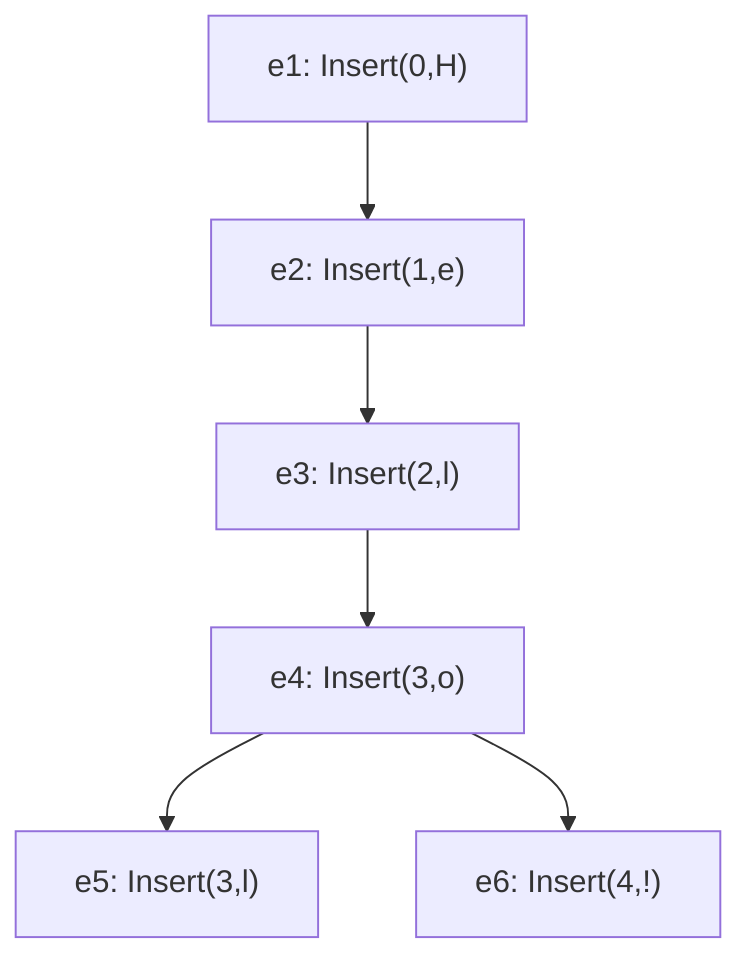
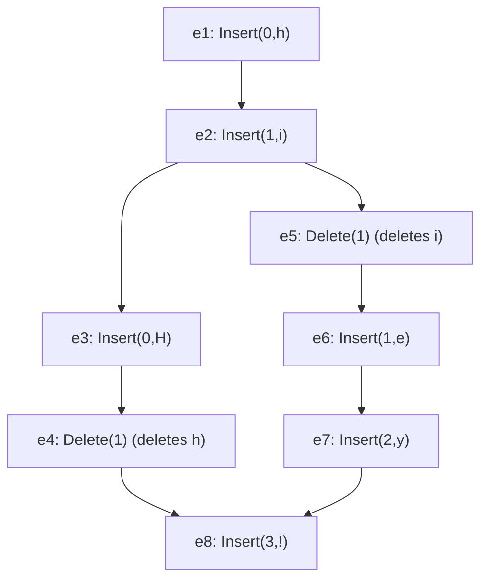
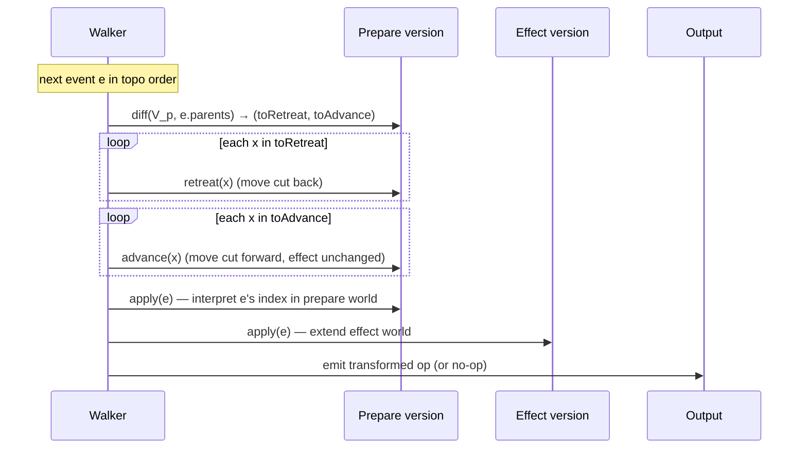

# Collaborative Text Editing with Eg-walker

> **Thesis.** You do *not* have to choose between OT's quadratic merge blow-up and CRDTs' permanent per-character metadata. Record edits as an immutable **event graph** (a DAG of operations in their *original index-based form*), and merge by *replaying* the graph through a **transient** CRDT that is built up only when concurrency is present and **thrown away** the moment a critical version is reached. The result loads like a plain-text file, uses an order of magnitude less memory than CRDTs in steady state, and merges long-running branches in $O(n \log n)$ instead of $O(n^2)$.

**Source.** Joseph Gentle and Martin Kleppmann. *Collaborative Text Editing with Eg-walker: Better, Faster, Smaller.* In *Twentieth European Conference on Computer Systems (EuroSys '25)*, March 30–April 3, 2025, Rotterdam, Netherlands. ACM, 25 pages. DOI 10.1145/3689031.3696076. (Reference implementations: *eg-walker-reference* in TypeScript and *Diamond Types* in Rust.)

Eg-walker = **Event Graph Walker**. It is a *hybrid* of OT and CRDT: like OT it uses integer indexes and transforms them; like a (pure operation-based) CRDT it can merge arbitrary DAGs and is provably convergent. It is the first practical text CRDT to match centralised server-based OT on the common case (sequential editing) while keeping CRDT-grade peer-to-peer merge semantics.

---

## TL;DR

- **The two-sided problem.** *OT* merges concurrent edits by transforming one operation against another; merging two branches of $n$ ops each costs $\Theta(n^2)$ (sometimes cubic). A real document in the paper takes **1 hour** to merge under OT. *CRDTs* avoid transformation by tagging every character with a unique ID, but those IDs (plus tombstones for deletions) must be **persisted, loaded into memory, and shipped over the network** for the lifetime of the document — so even the best CRDTs use **>10×** the memory of OT and are slow to load.
- **The Eg-walker move.** Store history as an **event graph**: a DAG whose nodes are the *original* `Insert(pos,char)` / `Delete(pos)` operations with index positions, each carrying a unique ID and a set of parent IDs. The document state is a pure function `replay(G)` of the graph. *No per-character ID is persisted in the document; the IDs live only inside a temporary structure during merge.*
- **The walk.** `replay` topologically sorts the graph and processes events one at a time, maintaining an internal CRDT that simultaneously tracks **two** versions of each character: the **prepare version** (the version in which the current event was *generated*, used to interpret its index) and the **effect version** (everything applied so far, used to compute the *output* index). Three primitives drive it: `apply`, `retreat`, `advance`.
- **Retreat / advance.** To interpret an event whose parents differ from the current prepare version, the walker *retreats* (un-applies) concurrent events from the prepare version and *advances* (re-applies) ancestor events — moving the prepare version backwards and forwards along the DAG while the effect version only moves forwards.
- **Critical versions = free state clearing.** A version that *every* event is either ≤ or after is a **critical version**; it partitions the graph so that events before it can never affect the transform of events after it. At a critical version Eg-walker **discards its entire internal state**, and across a stretch of critical versions it emits events untransformed. Since most real editing histories are mostly sequential (single author, or authors taking turns), this is the common case and it is nearly free.
- **Partial replay.** To merge a new branch you do *not* replay from the start: find the most recent critical version before the new events, seed the internal state with a single **placeholder** standing for "all the document at that point", and replay only the events since then.
- **The numbers (better, faster, smaller).** Steady-state RAM **1–2 orders of magnitude** below the best CRDTs (e.g. 233 KiB vs 30 MiB); document load **orders of magnitude faster** (it loads a cached plain-text file); merging the worst asynchronous trace **24 ms vs 61 minutes for OT (~160,000×)**; file sizes competitive with or smaller than Yjs/Automerge. Worst case is *comparable* to the best CRDTs, never dramatically worse.
- **Correctness.** Proven to satisfy Attiya et al.'s **strong list specification** (convergence + correct relative placement), and *maximally non-interleaving* with a suitable insertion-ordering CRDT.

---

## 1. The problem: OT is slow to merge, CRDTs are slow to load

### 1.1 The canonical conflict

Two users share the document `Helo`. User 1 inserts a second `l` at index 3; concurrently user 2 inserts `!` at index 4.

```
            User 1                    User 2
state:      Helo                      Helo
op:         Insert(3, "l")            Insert(4, "!")
local:      Hello                     Helo!

  now they exchange operations:

  User 2 receives Insert(3,"l")  → applies as-is → Hello!      ✓
  User 1 receives Insert(4,"!")  → applies as-is → Hell!o      ✗  WRONG
                                    must shift to Insert(5,"!") → Hello!  ✓
```

The exclamation mark's index must change from 4 to 5 because of a *concurrent* insertion at an earlier index. This index shifting is the entire job of a collaborative editing algorithm.

> **Mental model:** every collaborative-editing algorithm — OT or CRDT — boils down to one **incremental update** primitive: *given a new event to add to an existing graph, return the (index-based) operation to apply to the current document so the result equals replaying the whole graph including the new event.* OT and CRDT are just two ways to compute that index.

### 1.2 Why OT is $O(n^2)$

OT solves the example by **transforming** `Insert(4,"!")` against the concurrent `Insert(3,"l")`, bumping the index. OT is old (1989) and battle-tested — Google Docs uses the *Jupiter* OT algorithm. It is simple and fast when each user did **one** op since the last common version.

But if two users each performed $n$ operations since their last common version, merging requires transforming each of one user's ops against *all* of the other's, costing at least $O(n^2)$; some OT control algorithms are cubic or worse. Online collaboration keeps $n$ small, so this is tolerable. **Offline editing, explicit branches, and Git-style workflows make $n$ large**, and $O(n^2)$ becomes hours.

### 1.3 Why CRDTs are heavy

Text CRDTs (the first appeared in 2006; a dozen-plus exist) avoid transformation by giving **each character a unique ID** and addressing insertions/deletions by ID rather than index — IDs are immune to concurrent operations. The cost:

- IDs must be **loaded from disk** when a document opens and **held in memory** while editing.
- Many CRDTs keep IDs of *deleted* characters too (**tombstones**).
- Early CRDTs used hundreds of bytes per character. Even the best modern CRDTs use **>10×** OT's memory just to *view and edit*.

So production apps (Google Docs, Microsoft Office, Overleaf) stick with OT and accept slow offline merges. The field presented a forced trade-off: **OT (slow merges) vs CRDT (heavy memory)**. Eg-walker dissolves it.

> **Key gotcha CRDTs pay for:** the unique-ID metadata is needed *even when there is no concurrency at all*. A single-author document still pays the full CRDT tax on every load and every keystroke. Eg-walker's central bet is that this tax should only be paid *during* a concurrent merge, and refunded the instant the merge is done.

---

## 2. Background: the event graph

### 2.1 Operations and replicas

The document is a linear sequence of characters. An edit is an **operation**:

- $\text{Insert}(i, c)$ — insert character $c$ at index $i$ (zero-based).
- $\text{Delete}(i)$ — delete the character at index $i$.

(The implementation run-length-encodes consecutive insertions/deletions; the algorithm is described per single character.)

Each editing device is a **replica** storing the *full editing history*. A local edit is applied immediately, then broadcast asynchronously. The transport assumption is minimal: a **reliable broadcast** (lost messages retransmitted) over a **non-Byzantine** network with arbitrary delay — a relay-and-forward server, or peer-to-peer gossip, both work. The guarantee is **convergence**: any two replicas that have seen the same operations have the same document, regardless of arrival order. With eventual delivery this is **strong eventual consistency**.

### 2.2 The DAG

> **Definition — event graph.** A directed acyclic graph $G$ in which every node is an **event** = (an operation, a unique ID, a set of parent event IDs). The graph is transitively reduced (no redundant edges). If there is a directed path from $a$ to $b$ we say $a$ **happened before** $b$, written $a \to b$ (Lamport). $\to$ is a strict partial order. Two events are **concurrent**, $a \parallel b$, iff both are in the graph, $a \ne b$, and $a \not\to b \wedge b \not\to a$.

The **frontier** is the set of events with no children. When a user performs an op, the current frontier becomes the new event's parents; the event is broadcast and added to every replica's graph (waiting for missing parents — a simple causal broadcast). Two replicas merge graphs by *unioning their event sets*.

Events are **immutable**: they store the operation *as originally generated*, never as a result of any transformation. The graph grows monotonically; a new event is always a child of existing events, never re-parented.

Here is the graph for the `Helo` → `Hello!` example. Events $e_5$ and $e_6$ are concurrent; the frontier is $\{e_5, e_6\}$.



A substantial document (a research paper) may have **hundreds of thousands** of events, yet stores compactly: humans insert/delete in consecutive *runs*, so most of the graph is **linear** — long chains of one-parent / one-child events (see §6 for the storage format).

### 2.3 Versions: a frontier is a logical clock

Because replicas with the same event set are in the same state, the document is $\text{replay}(G)$ for a pure (deterministic, non-mutating) `replay`. To interpret $\text{Delete}(i)$ correctly we must know *which character was at index $i$ when the event was generated* — i.e. the state $\text{replay}(G_i)$ where $G_i$ is exactly the set of events known to the generating replica then. By construction **the parents of an event are the frontier of $G_i$**, so the parents unambiguously fix the interpreting state.

Formally the **version** of a graph is its frontier:

$$
\text{Version}(G) = \{\, e_1 \in G \mid \nexists\, e_2 \in G : e_1 \to e_2 \,\}
$$

and a version $V$ reconstructs its event set:

$$
\text{Events}(V) = V \cup \{\, e_1 \mid \exists\, e_2 \in V : e_1 \to e_2 \,\}
$$

There is a one-to-one correspondence: $\text{Events}(\text{Version}(G)) = G$. A version is a **logical clock**. In practice a version rarely has more than two events — a version with $k$ events occurs only when $k$ mutually concurrent events are merged with nothing generated in between.

> **Mental model:** a *version* is a cut across the DAG. The "prepare version" of an event is the cut its parents define — the world the author saw. Everything Eg-walker does is move a cut backwards and forwards across the DAG so that, when it applies an event, the cut matches that author's world.

### 2.4 Replay as a pure function, and the incremental-update need

Reframing collaborative editing as a pure function $\text{replay}(G)$ separates *replicating the graph* from *the convergence algorithm*. This is exactly how **pure operation-based CRDTs** are formulated (Baquero–Almeida–Shoker): capture the DAG of operations as-generated and define state as a query over it. Eg-walker adds a *list/text* datatype to that family.

But re-running `replay` over the whole graph for every new remote event is wasteful. We need an **incremental update**: given graph $G$ + document $\text{doc} = \text{replay}(G)$, and a new event $e$, efficiently compute the operation to apply to `doc` to get $\text{replay}(G \cup \{e\})$. That operation is again an index-based insert/delete — but the index may differ from the original (concurrent ops), and a delete may collapse to a **no-op** (the character was already deleted concurrently).

### 2.5 Warm-up: implementing OT *using* a CRDT

A naïve `replay` could **simulate a network of CRDT replicas in one process** — one simulated replica per branch of the DAG, plus a merging replica that applies every operation in some topological order.

```
   event graph (left)             one topological sort (right)
   eA1..eA6   eB1..eB4   eC1..eC3      eA1 eA2 eA3 eA4   eB1 eB2 eB3 eB4
                                       eC1 eC2 eC3   eA5 eA6
```

Each simulated replica converts index-based ops into ID-based CRDT ops; the merging replica applies them and converts back to an index using *its* document version. **That round-trip — index → ID on one replica, ID → index on another — is exactly an OT transformation.** But it is slow: it runs the CRDT even where there is no concurrency, and it needs a *separate CRDT copy per branch* (lots of memory).

Eg-walker's refinement: use only **two** simulated replicas (one that generates, one that applies — in fact stored in *one* data structure), and handle the non-total order by **retreating** events when switching to another branch and **advancing** them again when branches merge. That is the whole idea, made efficient.

---

## 3. The Eg-walker algorithm

A replica's state has three parts:

1. **Event graph** — stored on disk in a compact columnar format (§6). Most of the time it stays on disk.
2. **Document state** — the current character sequence, *with no metadata*. On disk a plain text file; in memory a rope / piece-table for efficient edits.
3. **Internal state** — a *temporary* CRDT structure used only to merge concurrent edits. **Never persisted, never replicated, discarded when the algorithm finishes.**

`replay` topologically sorts the graph, then transforms each event so the transformed ops, applied in order from an empty document, reproduce the document. *In Git parlance, it rebases a DAG of operations into a linear history with the same effect.* Different sort orders all yield the same final document (proven in §7); the order only affects performance.

### 3.1 What Eg-walker guarantees

- **Strong list specification** (Attiya et al.): replicas converge, and inserted characters land in the right place relative to their neighbours at insertion time.
- **Maximally non-interleaving** (Weidner–Kleppmann): concurrent runs of insertions at the same spot are placed *one after another*, not interleaved.
- When generating a new event, or adding an event that happened *after* all existing events, **only the current document state is needed** — the event graph stays on disk, the internal state stays empty/discarded. Graph + internal state are needed *only* for concurrency, and even then only the slice since the last common critical version is replayed.

### 3.2 Walking the graph: prepare vs effect, and the three primitives

Topologically sort the graph keeping same-branch events **consecutive** (depth-first from the oldest event; a heuristic visits smaller branches first to improve performance — counting how many events happened after each event to estimate branch size). Avoid alternating between branches.

Process events one at a time. The internal state captures the document at **two** versions simultaneously:

- **prepare version** $V_p$ — the version in which the current event was *generated* (used to interpret its *input* index). Can move **backwards and forwards**.
- **effect version** — everything applied so far (used to compute the *output* index). Moves **forwards only**.

If $V_p$ = effect version, the transformed op equals the original. In general $V_p$ is a *subset* of the effect version's events. Three methods update the internal state:

- $\text{apply}(e)$ — updates **both** prepare and effect versions to include $e$, assuming $V_p$ currently equals $e.\text{parents}$ and $e$ is not yet applied. Interprets $e$ in the prepare context and **outputs** the transformed op.
- $\text{retreat}(e)$ — removes $e$ from the prepare version (it was previously included). Moves $V_p$ *backwards*.
- $\text{advance}(e)$ — adds $e$ to the prepare version, assuming the prepare version did *not* include $e$ but the effect version *did*. Moves $V_p$ *forwards* without re-applying to the effect version.

Worked example. Graph: start `hi`; one user changes `hi`→`hey` ($e_5,e_6,e_7$), another concurrently capitalises `h`→`H` ($e_3,e_4$); after merging to `Hey` someone appends `!` ($e_8$).



Traversing in subscript order $e_1 \dots e_8$:

```text
1. apply(e1), apply(e2), apply(e3), apply(e4)
   — valid: each event's parent version equals the previously applied event.
2. before apply(e5): its parent is {e2}, so rewind the prepare version:
   retreat(e4), retreat(e3)
3. apply(e5), apply(e6), apply(e7)
4. before apply(e8): parents are {e4, e7}; re-add e3, e4 to the prepare state:
   advance(e3), advance(e4)
   — NOT retreat(e5..e7): e3,e4 were already in the EFFECT version (step 1),
     so we are advancing them, which needs no retreat of concurrent events.
5. apply(e8)
```

The general rule, before applying the next event $e$:

```text
old = Events(V_p)                  # current prepare version's event set
new = Events(e.parents)            # the world e was generated in
for x in (old \ new), reverse topo order:  retreat(x)
for x in (new \ old), topo order:          advance(x)
apply(e)
```

Computing $\text{old} \setminus \text{new}$ and $\text{new} \setminus \text{old}$ efficiently is a **bounded graph diff**: push the topo-sort indexes of the events in $V_p$ and $V_p'$ into a max-priority-queue tagged old/new; repeatedly pop the greatest index, enqueue its parents with the same tag, and stop once every queue entry is a *common ancestor* of both. Events reached from only one side are the ones to retreat/advance.



### 3.3 The internal CRDT state: $s_p$ and $s_e$

The internal state is a **linear sequence of records, one per character ever inserted** (including tombstones for deletes). Runs with consecutive IDs and identical properties are run-length encoded. A record is created by `apply` of an insertion; deletes and retreat/advance modify properties; records are **never removed or reordered** once inserted.

When two insertions are concurrent, a list-CRDT ordering rule places records consistently regardless of traversal order — **RGA** or **YATA** would work; the implementation uses a **Yjs/YATA variant** conjectured maximally non-interleaving. Each record holds:

```text
record {
    id            : the event ID that inserted this character
    originLeft,
    originRight   : neighbour IDs used by the list-CRDT to order concurrent inserts
    s_p ∈ {NotInsertedYet, Ins, Del 1, Del 2, …}   # state in the PREPARE version
    s_e ∈ {Ins, Del}                                # state in the EFFECT version
}
```

Update rules:

- **insert** $\text{apply}(e)$: new record with $s_p = s_e = \text{Ins}$.
- **delete** $\text{apply}(e)$: set $s_e = \text{Del}$ on the target. For $s_p$: if it was $\text{Ins}$ → $\text{Del 1}$; if $\text{Del}\,n$ → $\text{Del}\,(n{+}1)$.
- $\text{retreat}$ of an *insert*: $s_p$ must be $\text{Ins}$ → set $\text{NotInsertedYet}$.  $\text{advance}$: $\text{NotInsertedYet} \to \text{Ins}$.
- $\text{retreat}$ of a *delete*: $s_p = \text{Del}\,n$ → $\text{Del}\,(n{-}1)$ if $n>1$, else $\text{Ins}$.  $\text{advance}$: the reverse.

```text
prepare-state machine  (s_p):

  NotInsertedYet  --Insert-->  Ins  --Delete-->  Del 1  --Delete-->  Del 2  --> …
  NotInsertedYet  <-Insert--   Ins  <-Delete--   Del 1  <-Delete--   Del 2  <-- …
       (advance moves right, retreat moves left)
```

So: $s_p = \text{Ins}$ ⇔ visible in the prepare version; $s_p = \text{Del}\,n$ ⇔ deleted by $n$ concurrent deletes in the prepare version; $s_p = \text{NotInsertedYet}$ ⇔ its insertion is currently retreated. The effect state $s_e$ does **not** count deletions and has **no** NotInsertedYet state — we never remove an effect.

ASCII of the internal state for the `hi`/`hey`/`H` example. After `apply(e1..e4)` (left), then `retreat(e4); retreat(e3)` (right) — note the *effect* state is unchanged:

```text
after apply(e1..e4):                 after retreat(e4), retreat(e3):
  char  H      h        i              char  H      h      i
  id    3      1        2              id    3      1      2
  s_p   Ins    Del 1    Ins            s_p   NIY    Ins    Ins
  s_e   Ins    Del      Ins            s_e   Ins    Del    Ins
                                       (H marked NotInsertedYet;
                                        deletion of h is undone in prepare)
```

After replaying *all* of the events:

```text
  char  H      h        e      y      !      i
  id    3      1        6      7      8      2
  s_p   Ins    Del 1    Ins    Ins    Ins    Del 1
  s_e   Ins    Del      Ins    Ins    Ins    Del
  (e,y inserted after h; e3,e4 advanced again; ! after y; i now deleted)
```

> **Key gotcha:** the records include the character only for readability — **Eg-walker does not store text content in its internal state**. The internal state is pure positional bookkeeping; the actual characters live in the document rope and in the event graph's content column.

### 3.4 Mapping indexes ↔ records in $O(\log n)$

`apply` must map the event's *input* index to a record using $s_p$ (the prepare world), then map that record's position to an *output* index using $s_e$ (the effect world). Naïvely, to apply $\text{Delete}(i)$ you scan for the $i$-th record with $s_p = \text{Ins}$ — $O(n)$.

To get $O(\log n)$, store the record sequence as the leaves of a B-tree extended into an **order-statistic tree**: each node carries two counts — number of records with $s_p = \text{Ins}$ and number with $s_e = \text{Ins}$ in its subtree. Updating $s_p$ or $s_e$ updates the counts on the root path in $O(\log n)$.

- Find the $i$-th $s_p = \text{Ins}$ record: descend from the root summing skipped subtrees.
- Map a record to its effect index: walk *up* to the root summing $s_e = \text{Ins}$ records in left subtrees. If the target has $s_e = \text{Del}$, the transformed op is a **no-op**.

But `retreat`/`advance` can't look up a record by index. So keep a **second B-tree** mapping event ID → record:

- delete events store the **ID of the deleted character**;
- insert events store a **pointer to the leaf** in the first B-tree (updated when leaves split).

Every `apply` updates this map; since retreat/advance only ever touch already-applied events, their IDs are present, giving $O(\log n)$ retreat/advance.

### 3.5 Critical versions: discard the internal state

> **Definition — critical version.** A version $V$ is **critical** iff it partitions the graph into $G_1 = \text{Events}(V)$ and $G_2 = G \setminus G_1$ with *every* event in $G_1$ happening before *every* event in $G_2$:
> $$\forall e_1 \in G_1, \forall e_2 \in G_2 : e_1 \to e_2$$
> Equivalently, every event is in $V$, or an ancestor of some event in $V$, or happened after **all** of $V$.

A critical version can later *become* non-critical when a concurrent event is added. The design insight:

> **Design lesson:** critical versions partition the graph into independently-processable sections. **Events at or before a critical version cannot affect how any event after it is transformed.** Two consequences:
> 1. Whenever the processed-so-far version is critical, **discard the entire internal state** (both B-trees, all $s_p$/$s_e$) and replace it with a placeholder.
> 2. If both an event's version *and* its parent version are critical, skip the B-trees entirely — the transformed event equals the original and is emitted as-is.

This is why mostly-sequential documents are nearly free: a single-author (or take-turns) history is a **linear chain of critical versions**, so almost every event is emitted untransformed with no CRDT work at all. The internal state can be discarded after replay completes, or retained to transform future events.

If a replica later receives events concurrent with ones whose internal state it already discarded, it **rebuilds only what it needs**: find the most recent critical version before the new events, replay the existing events after it, then apply the new ones. Events before that critical version are never replayed. Worst case (no critical versions, e.g. trace A2) it replays everything.

### 3.6 Partial replay with placeholders

To add $e_\text{new}$ where $V_\text{curr} = \text{Version}(G)$ is the current version (all events except $e_\text{new}$) and $V_\text{crit}$ is the latest critical version before *both* $e_\text{new}$ and $V_\text{curr}$, with the internal state already discarded:

We don't know the document at $V_\text{crit}$ — and we don't need it. We need just enough state to transform $e_\text{new}$ onto the document at $V_\text{curr}$.

```text
1. Initialise an internal state for version V_crit:
   a SINGLE placeholder record standing for the unknown document content
   (range [0, ∞), counted by its length in the order-statistic tree;
    same length in prepare and effect versions).
2. Replay events from V_crit to V_curr, updating internal state but
   NOT emitting transformed operations.
3. Apply e_new (or a topologically-sorted batch) and emit transformed ops.
```

Applying events against a placeholder for range $[j, k]$:

- **insert at index $i$**: create a record ($s_p = s_e = \text{Ins}$); if $i$ falls inside the placeholder, split it into placeholder $[j, i{-}1]$, the new record, placeholder $[i, k]$ (empty placeholders dropped).
- **delete of a char inserted before $V_\text{crit}$**: index falls in a placeholder; split into $[j, i{-}1]$, a new record with $s_p = \text{Del 1}, s_e = \text{Del}$, placeholder $[i{+}1, k]$. The record gets a **placeholder ID** that need only be locally unique, *not* consistent across replicas.
- **delete of a char inserted since $V_\text{crit}$**: just updates the record from its insertion.

Retreat/advance never touch events before $V_\text{crit}$, so every retreated/advanced ID exists in the second B-tree. Concurrent same-position inserts are always after $V_\text{crit}$, hence present as explicit records — when seeking an insertion position **you never seek past a placeholder** (placeholders represent pre-critical, hence non-concurrent, characters).

> **Mental model:** a placeholder is "the document I'm not going to look at." Critical versions guarantee that the merge only ever needs to *reason about* the slice of history since the last shared checkpoint; everything older collapses into one opaque block of indexes.

### 3.7 Complexity

Two users edit offline, producing $a$ and $b$ events. On merge, the latest critical version is just before the branch point. If the $a$-branch is sorted first, replay applies $a$, retreats $a$, applies $b$, advances $a$ — $O(a + b)$ apply/retreat/advance calls regardless of order (and faster in practice if $a < b$, since no retreat/advance on the last-visited branch). Each call does one or two first-B-tree traversals plus at most one second-B-tree traversal; the trees hold $\le 2(a+b)+1$ entries (each event makes at most one record + one placeholder split), each traversal $O(\log(a+b))$.

$$
\boxed{\text{merge cost} = O\big((a+b)\log(a+b)\big)}
$$

For an arbitrary graph of $n$ events: each event applied once, and before each event each prior event retreated/advanced at most once at $O(\log n)$:

$$
\text{worst case} = O(n^2 \log n) \quad\text{(unlikely in practice)}
$$

| Algorithm | Merge two $n$-event branches | Per-character metadata persisted? | Load from disk |
|---|---|---|---|
| **Eg-walker** | $O(n \log n)$ (worst $O(n^2 \log n)$) | **No** — IDs are transient | Plain-text-file fast |
| OT | $\ge O(n^2)$, some cubic | No | Plain-text-file fast |
| Traditional CRDT (RGA/YATA/Yjs/Automerge) | comparable to Eg-walker worst case | **Yes** — IDs + tombstones forever | Slow: same cost as merging the whole trace |

---

## 4. Storing the event graph

A compression scheme tuned to how humans type: consecutive runs of inserts/deletes, occasional backspaces or cursor jumps. Inspired by **Automerge**'s columnar format (itself from column-oriented databases) plus **Yjs** bit-packing. Topologically sort, identify each event by its index in that order, then store fields in separate **columns** combined into one file with a header:

- **Event type, start position, run length** — e.g. "23 inserts at consecutive indexes from 0", "10 deletes from index 7" — using a variable-length integer encoding (small numbers in one byte).
- **Inserted content** — concatenated UTF-8 of inserted characters (deletes contribute none), LZ4-compressed.
- **Parents** — default assumption: each event's only parent is its predecessor in the topo sort. Only *exceptions* are listed (e.g. "event 0 has zero parents; event 152 has parents {31, 152}").
- **Event IDs** — each event is (replica ID, per-replica sequence number); store as runs ("first 1085 events from replica X starting at seq 0; next 595 from Y…").

Replicas may *also* store a copy of the final document state, enabling load **without replaying**. The same format goes over the network; for a single event, out-of-subset parents are encoded as full (replicaID, seqNo).

> **Design lesson:** the event graph is *not* Eg-walker-specific. It is a neutral, application-agnostic record of history — so the same on-disk format can back future algorithms, plus history visualisation and "restore an arbitrary past version" by replaying subsets.

---

## 5. Evaluation: better, faster, smaller

Two implementations: a readable **TypeScript** reference (omits run-length internal state, B-trees, topo heuristics) and a production **Rust** version (*Diamond Types*). Correctness via the §7 proof plus randomised property testing (checking convergence). Baselines: **Automerge** v0.5.9 and **Yjs** v13.6.10; a hand-written **reference CRDT** sharing most code with the Rust Eg-walker (apples-to-apples; it *beats* Yjs and Automerge); and a reference **OT** (TTF algorithm — Jupiter/ShareDB can't express the branching in the async traces). Hardware: Ryzen 7950x, 64 GB RAM; means of ≥100 iterations; stddev <1.2% (Yjs <6%).

### 5.1 The benchmark traces

Real keystroke-level editing traces, published as a reusable benchmark. Normalised to ~500k inserted characters (S3 ~2×).

| Name | Type | Events (k) | Avg concurrency | Graph runs | Authors | Chars remaining | Final size |
|---|---|---|---|---|---|---|---|
| **S1** | sequential | 779 | 0.00 | 1 | 2 (took turns) | 57.5% | 307.2 kB |
| **S2** | sequential | 1105 | 0.00 | 1 | 1 | 26.7% | 166.3 kB |
| **S3** | sequential | 2339 | 0.00 | 1 | 2 | 9.9% | 119.5 kB |
| **C1** | concurrent | 652 | 0.43 | 92,101 | 2 | 90.1% | 521.5 kB |
| **C2** | concurrent | 608 | 0.44 | 133,626 | 2 | 93.0% | 516.3 kB |
| **A1** | asynchronous | 947 | 0.10 | 101 | 194 | 7.8% | 37.2 kB |
| **A2** | asynchronous | 698 | **6.11** | 2,430 | 299 | 49.6% | 222.0 kB |

S* = no concurrency (one author or take-turns; the *common case in practice*). C* = many *short-lived* branches (concurrency artificially raised by injecting 0.5–1 s latency). A* = reconstructed from **Git** histories (commit branching/merging; minimal edits per commit diff): A1 = Node.js `src/node.cc`, A2 = Git's own `Makefile`. A2 has extreme concurrency and **no critical versions** — Eg-walker's pathological case.

### 5.2 Merge & load time (CPU, ms)

Worst-case merge = replay an entire trace into an empty document. *In the tested CRDTs, loading a document from disk costs the same as merging the whole trace* — so they have no separate load advantage.

| Trace | Eg-walker merge | Eg-walker cached load | OT merge | Ref CRDT merge=load | Automerge | Yjs |
|---|---|---|---|---|---|---|
| S1 | 1.8 ms | 0.07 ms | 2.4 ms | 17.9 ms | 620 ms | 57.4 ms |
| S2 | 2.7 ms | 0.04 ms | 2.8 ms | 19.1 ms | 747 ms | 85.2 ms |
| S3 | 3.6 ms | 0.03 ms | 3.8 ms | 26.9 ms | 1.4 s | 79.9 ms |
| C1 | 56.1 ms | 0.12 ms | 365 ms | 52.5 ms | 11.8 s | 84.1 ms |
| C2 | 82.6 ms | 0.11 ms | 378 ms | 64.2 ms | 24.6 s | 55.2 ms |
| A1 | 8.9 ms | 0.01 ms | **6.3 s** | 42.7 ms | 485 ms | 88.4 ms |
| A2 | 23.5 ms | 0.05 ms | **61.1 min** | 26.2 ms | 520 ms | 74.2 ms |

Highlights:

- **OT collapses on async traces**: A1 = 6.3 s, **A2 = 61 minutes** (quadratic). Eg-walker does A2 in **23.5 ms — ~160,000× faster**.
- **Cached load is orders of magnitude faster than any CRDT**: Eg-walker/OT load a plain-text file (0.01–0.12 ms) vs CRDTs needing the full metadata in memory before *any* edit.
- **On sequential traces Eg-walker beats the reference CRDT by ~7–10×** (and far more vs Yjs/Automerge) — thanks to state clearing on critical versions (§3.5).
- **On concurrent/A2, Eg-walker ≈ reference CRDT** (similar work), both well ahead of Yjs/Automerge (an *implementation*, not algorithmic, gap).
- **State-clearing ablation** (opt on vs off): big wins on S1/S2/S3 and A1 (e.g. S1 1.8 ms → 9.8 ms with opt off), negligible on C1/C2/A2 (**A2 has no critical versions**).
- **Traversal order matters under high concurrency**: a poor order can make A2 up to **8× slower**; the §3.2 topo heuristic avoids the pathological case.

### 5.3 RAM (retained heap)

| Trace | Eg-walker peak | Eg-walker steady | OT peak | OT steady | Ref CRDT | Yjs | Automerge |
|---|---|---|---|---|---|---|---|
| S1 | 4.7 MiB | **597 KiB** | 49 MiB | 597 KiB | 11.7 MiB | 19.5 MiB | 294 MiB |
| S2 | 7.4 MiB | **324 KiB** | 24.8 MiB | 324 KiB | 8.5 MiB | 25.7 MiB | 426 MiB |
| S3 | 14.9 MiB | **233 KiB** | 25.3 MiB | 233 KiB | 13 MiB | 30.3 MiB | 848 MiB |
| C1 | 68.5 MiB | 1 MiB | 337 MiB | 1 MiB | 30.9 MiB | 27 MiB | 462 MiB |
| C2 | 79.5 MiB | 1 MiB | 338 MiB | 1 MiB | 34 MiB | 19.8 MiB | 511 MiB |
| A1 | 7.7 MiB | **72.9 KiB** | 34.9 MiB | 72.9 KiB | 10.3 MiB | 30.2 MiB | 241 MiB |
| A2 | 8 MiB | 432 KiB | **6.8 GiB** | 429 KiB | 6.5 MiB | 24.9 MiB | 271 MiB |

- **Steady-state RAM is 1–2 orders of magnitude below the best CRDT** (e.g. S3: 233 KiB vs Ref CRDT 13 MiB vs Yjs 30 MiB vs Automerge 848 MiB). Steady state is what matters during normal editing — Eg-walker holds only the document text then.
- **Eg-walker's *peak* ≈ a CRDT's *steady state***: slightly below on sequential, ~2× on concurrent. Peak is hit only when replaying a *whole* trace.
- **OT's peak is huge** (A2 = 6.8 GiB) because the reference OT memoizes intermediate transformed operations (a time/memory trade-off).

### 5.4 File size

Disabling Eg-walker's LZ4 and Automerge's gzip for like-for-like (enabling them shrinks further). The lightly-shaded lower bound is the concatenated stored text / final document.

*vs Automerge (both store full history; "+cache" adds a final-document copy for fast loads):*

| Trace | Eg-walker | Eg-walker +cached doc | Automerge |
|---|---|---|---|
| S1 | 611 KiB | 925 KiB | 640 KiB |
| S2 | 753 KiB | 923 KiB | 789 KiB |
| S3 | 1.4 MiB | 1.5 MiB | 878 KiB |
| C1 | 1 MiB | 1.6 MiB | 1.2 MiB |
| C2 | 1.2 MiB | 1.8 MiB | 1.9 MiB |
| A1 | 602 KiB | 640 KiB | 1.6 MiB |
| A2 | 561 KiB | 789 KiB | 1.7 MiB |

*vs Yjs (Yjs stores only final text + merge data, no deleted chars, no happened-before) — Eg-walker configured to also drop deleted content:*

| Trace | Eg-walker (final-doc only) | Yjs |
|---|---|---|
| S1 | 378 KiB | 480 KiB |
| S2 | 285 KiB | 406 KiB |
| S3 | 268 KiB | 318 KiB |
| C1 | 981 KiB | 845 KiB |
| C2 | 1.2 MiB | 726 KiB |
| A1 | 151 KiB | 308 KiB |
| A2 | 330 KiB | 506 KiB |

Eg-walker's encoding beats Yjs on sequential and async traces, loses on the *concurrent* ones (the DAG edges cost space there). Overall the event-graph overhead is **20% to 3×** the plain-text file size.

> **Design lesson (artifact authors' caveat):** collaborative-editing performance varies by *orders of magnitude* with implementation quality, and those tricks are poorly documented. The paper deliberately ships its own reference CRDT and OT in the *same* style as its Rust Eg-walker so the comparison isolates *algorithm* from *implementation*.

---

## 6. Pseudocode (simplified core)

The simplified version replays the *whole* graph without state clearing or B-trees (those are §3.4–3.6 optimisations). `prepare_state` here folds NotInsertedYet=0, Ins=1, and "deleted $n$ times" = $1+n$.

```rust
enum PREPARE_STATE { NOT_YET_INSERTED = 0, INSERTED = 1 }  // ≥2 ⇒ concurrently deleted

type AugmentedCRDTItem {
    id, originLeft, originRight,   // list-CRDT ordering fields
    ever_deleted: bool,            // EFFECT state (Ins vs Ins-then-Del)
    prepare_state: uint,           // PREPARE state (moved by retreat/advance)
}

fn space_in_prepare_state(it) { if it.prepare_state == INSERTED { 1 } else { 0 } }
fn space_in_effect_state(it)  { if !it.ever_deleted            { 1 } else { 0 } }

// transitive-expansion set difference of two versions
fn diff(v1, v2) -> (only_in_v1, only_in_v2) { … }

fn generateDocument(events) {
    let cur_version = {}          // frontier
    let crdt = []                 // list of AugmentedCRDTItem (could be an RGA tree)
    let resulting_doc = ""

    for e in events.iter_in_causal_order() {
        // Step 1: PREPARE — move prepare version to e.parent_version
        let (a, b) = diff(cur_version, e.parent_version)
        for x in a {                                    // retreat
            let item = crdt.find_item_by_id(x.id); item.prepare_state -= 1
        }
        for x in b {                                    // advance
            let item = crdt.find_item_by_id(x.id); item.prepare_state += 1
        }

        // Step 2: APPLY
        if e.type == Insert {
            let ins_pos = idx_of(crdt, e.pos, PREPARE_STATE)        // seek by prepare state
            let origin_left  = prev_item(ins_pos).id or START
            let origin_right = next_item(crdt, ins_pos,
                                   it => it.prepare_state >= INSERTED).id or END
            crdt_integrate(crdt, { id: e.id, origin_left, origin_right,
                                   ever_deleted: false, prepare_state: 1 })
            let effect_pos = crdt[0..ins_pos].map(space_in_effect_state).sum()
            resulting_doc.splice_in(effect_pos, e.contents)
        } else { // Delete
            let idx = idx_of(crdt, e.pos, PREPARE_STATE)
            while crdt[idx].prepare_state != INSERTED { idx += 1 }   // skip not-yet-inserted
            crdt[idx].ever_deleted = true
            crdt[idx].prepare_state += 1
            let effect_pos = crdt[0..idx].map(space_in_effect_state).sum()
            resulting_doc.delete_at(effect_pos)
        }
        cur_version = { e.id }
    }
    return resulting_doc
}
```

The two index mappings are visible: `idx_of(…, PREPARE_STATE)` seeks using $s_p$ (the author's world), and `space_in_effect_state().sum()` re-maps the chosen record to an *output* index using $s_e$. A delete whose target already has `ever_deleted` becomes a no-op in the effect mapping.

---

## 7. Correctness: satisfying the strong list specification

The proof shows Eg-walker meets Attiya et al.'s **strong list specification** — stronger than strong eventual consistency: replicas converge, the document contains exactly inserted-but-not-deleted characters, and each character sits correctly relative to its insertion-time neighbours.

**Setup.** A valid event graph requires unique IDs, parents that exist, acyclicity, and in-range indexes. `replay(G)` returns a sequence of $(\text{id}, c)$ pairs (the id distinguishes equal characters). The spec demands a **list order** $<_{lo}$ over IDs that is transitive, irreflexive, total, and consistent with every document any prefix produces.

**Convergence = concurrent operations commute.** The crux is that any two topological sorts differ only by swaps of *adjacent concurrent* events, so it suffices to show swapping two concurrent events leaves both the document and internal state unchanged.

- **Lemma C.3** — right before applying $\text{Delete}(i)$, the target record has $s_p = \text{Ins}$ (or is inside a placeholder). It can't be NotInsertedYet (insertion happens-before deletion) nor already-Del (a prior delete would forbid generating this one).
- **Lemma C.4 (the placeholder/critical-version lever)** — if you take a state, then either (i) just retreat/advance to $b$'s parents, or (ii) first replay a concurrent $a$ then retreat/advance to $b$'s parents, the two results differ *only* in the one record $a$ inserted/updated. The $s_p$ values depend only on $b.\text{parents}$, not on $a$, because every event concurrent with $a$ or $b$ lies *after* the last critical version and is therefore an explicit record (never folded into a placeholder).
- **Lemmas C.5–C.7** — case analysis that insert∥insert, insert∥delete, delete∥delete each **commute**. The mechanism is always the same: a freshly-applied-then-retreated record sits at $s_p = \text{NotInsertedYet}, s_e = \text{Ins}$, so it is **not counted** when mapping the *other* event's input index (prepare world) but **is counted** when mapping back to an output index (effect world) — which is exactly the $+1/-1$ index shift OT would compute, and it is symmetric.
- **Lemma C.8** — `replay(G)` is therefore deterministic: every topological order yields the same document *and* the same internal state.

**Building the list order.** Records are only ever *inserted* into the internal sequence or have $s_p/s_e$ updated — never reordered — so a once-established relative order of two IDs is permanent. Define $<_{lo}$ as the order of IDs in the internal state after replaying *all* of $G$ with a no-clearing variant (Lemma C.8 makes it unique). Lemma C.9 (induction over events) shows the $i$-th document element corresponds to the $i$-th $s_e = \text{Ins}$ record (placeholders count as Ins) and that the document holds exactly inserted-not-deleted characters — and that clearing at a critical version is sound, because every still-live record then has $s_p = s_e = \text{Ins}$ and will never need to be retreated/advanced again, so it collapses safely into a placeholder.

**Theorem C.10.** Eg-walker satisfies the strong list specification. The list-order, the "exactly inserted-but-not-deleted" content, and the "inserted at the specified position" requirement all follow; for the last, note that in $G_e = \{e\} \cup \text{Events}(e.\text{parents})$ there is *no* event concurrent with $e$, so $s_p = \text{Ins} \Leftrightarrow s_e = \text{Ins}$ for every record — input and output index mappings count the same records, so $e$'s transformed index equals its original index. ∎

> **Mental model of the proof:** "retreat then look up by prepare-state, apply, then re-map by effect-state" *is* an operational transformation — but performed against a CRDT-ordered internal sequence rather than against each individual concurrent op. The CRDT ordering guarantees the *same* final sequence regardless of traversal, which is precisely what makes concurrent operations commute and the whole thing converge.

---

## 8. Where Eg-walker sits relative to prior work

- **Pure operation-based CRDTs** (Baquero–Almeida–Shoker; Bauwens–Gonzalez Boix): capture a DAG/partially-ordered log of ops as-generated, define state as a query over it. Prior work gave maps, sets, registers; **Eg-walker contributes the list/text datatype** to this family.
- **MRDTs** (Soundarapandian et al.): also DAG-based, merging two branches with a three-way merge at the lowest common ancestor (recursive if the LCA isn't unique). No MRDT offers arbitrary text insert/delete yet.
- **Toomim's "time machines"**: the same conceptual foundation — traverse an event graph, transform ops into topologically-applicable form, and note CRDTs can implement that transform. **Eg-walker is a concrete, optimised time machine**; its novel parts are prepare-version retreat/advance, internal-state clearing, and partial replay.
- **OT** (Ellis–Gibbs 1989 onward; Jupiter, etc.): all classical OT = *transformation functions* (op vs op) + a *control algorithm* traversing history. That architecture forces $\ge O(n^2)$ merges (sometimes cubic). Eg-walker **abandons the transform-function/control-algorithm split**, transforming via an internal CRDT instead → $O(n\log n)$ typical. Eg-walker also handles *arbitrary* DAGs, whereas server-based OT only handles a single main branch.
- **ID-based text CRDTs** (RGA, YATA, Logoot, Fugue, Yjs, Automerge): assign every character a unique ID, held in memory + persisted + replicated forever. **Eg-walker uses IDs only transiently** during replay and frees its state at every critical version.
- Others: Gu et al.'s *mark & retrace* builds a CRDT-like structure over the entire history (not just the merged slice); *differential synchronization* uses similarity heuristics that aren't guaranteed to converge. Version-control systems (Git, Pijul, Darcs) track history but are **line-based** and **not real-time**; Git's three-way merge is unreliable on repeated text, Darcs merges can be exponential, Pijul assigns a CRDT ID per line.

---

## 9. Limitations & things to carry forward

- **Worst case is still $O(n^2 \log n)$**, hit when there are *no critical versions* (trace A2). Then Eg-walker degrades to "as good as the best CRDT", not better, and is sensitive to traversal order (up to 8× swing).
- **Concurrent traces cost more file space**: the DAG edges make Eg-walker larger than Yjs on highly-concurrent histories (event-graph overhead 20%–3× of plain text).
- **The insertion-ordering CRDT is assumed, not derived**: maximal non-interleaving relies on a YATA/Yjs-variant whose detailed analysis (and the non-interleaving proof) is left to future work.
- **Plain text only**, though the authors argue the framework generalises to rich text, spreadsheets, graphics, CAD, etc.
- **Reliable broadcast is rented**, not built; replication is delegated and out of scope, and the evaluation is single-node (CPU/RAM/file-size), so real distributed performance depends on the online/offline pattern.
- **Peak memory during merge is real**: steady state is tiny, but a full-trace replay still spikes (e.g. A2 concurrent traces ~2× the reference CRDT's steady state). The win is that you only pay it *during* a big merge, not continuously.

### The one-paragraph distillation

Treat collaborative editing as a **pure replay of an immutable event-graph of original index-based operations**. To merge, **walk** the graph in topological order while a *temporary* CRDT tracks each character in two worlds — the **prepare** world (the author's, used to read an op's index) and the **effect** world (everyone's, used to write the resulting index) — moving the prepare cut backwards (`retreat`) and forwards (`advance`) to match each event's parents. Use **critical versions** to throw the entire CRDT away whenever history funnels through a single shared point, and **placeholders** to replay only the slice since the last such point. The payoff is OT's lightweight steady state (plain-text load, no persisted IDs) with CRDT's arbitrary-DAG mergeability and provable convergence — "better, faster, smaller" all at once, and a path to peer-to-peer collaboration that competes with centralised servers.

---

## Glossary & notation

| Term | Meaning |
|---|---|
| **Eg-walker** | Event Graph Walker: a hybrid OT/CRDT text-editing algorithm that replays an event graph through a transient CRDT. |
| **Event** | (operation, unique ID, set of parent IDs); an immutable node of the DAG, storing the op *as originally generated*. |
| **Event graph** $G$ | A DAG of events; merge = union of event sets; grows monotonically. |
| **happened-before** $a \to b$ | a directed path from $a$ to $b$; a strict partial order. |
| **concurrent** $a \parallel b$ | $a \not\to b \wedge b \not\to a$ (and $a \ne b$). |
| **Frontier** | events with no children. |
| **Version** $V$ | the frontier set; a logical clock; one-to-one with the graph via $\text{Events}(V)$. |
| **replay$(G)$** | pure deterministic function returning the document (or $(\text{id},c)$ sequence) for $G$. |
| **Incremental update** | given $G$, $\text{doc}=\text{replay}(G)$, and new event $e$, the index-based op to apply to reach $\text{replay}(G\cup\{e\})$. |
| **prepare version** $V_p$ | the version an event was *generated* in (interprets its input index); moves both directions. |
| **effect version** | all events applied so far (computes the output index); moves forward only. |
| **apply$(e)$** | add $e$ to prepare *and* effect versions; output the transformed op. |
| **retreat$(e)$** | remove $e$ from the prepare version (move the cut back). |
| **advance$(e)$** | add $e$ to the prepare version when the effect version already has it (move the cut forward). |
| **Internal state** | the transient CRDT: a sequence of one record per inserted character; never persisted/replicated; discarded at critical versions. |
| $s_p$ | prepare-version record state $\in\{\text{NotInsertedYet}, \text{Ins}, \text{Del }1, \text{Del }2, \dots\}$. |
| $s_e$ | effect-version record state $\in\{\text{Ins}, \text{Del}\}$ (no NotInsertedYet, no count). |
| **Tombstone** | a record for a deleted character, kept in the internal state during merge. |
| **Order-statistic tree** | B-tree over records with per-subtree counts of $s_p{=}\text{Ins}$ and $s_e{=}\text{Ins}$, giving $O(\log n)$ index↔record. |
| **Critical version** | a version $V$ such that every event is $\le V$ or after *all* of $V$; partitions the graph; lets Eg-walker discard internal state. |
| **Placeholder** | a record standing for a contiguous range of pre-critical-version characters, so partial replay needn't know their content. |
| **Partial replay** | rebuild only the state since the latest critical version before the new events, seeded by a placeholder. |
| **Strong list specification** | Attiya et al.'s correctness criterion (convergence + correct relative placement); stronger than SEC. |
| **Maximal non-interleaving** | concurrent same-position insertion runs are placed contiguously, not interleaved. |
| **Pure op-based CRDT** | family that records a DAG of ops as-generated and defines state as a query over it; Eg-walker adds text to it. |
| $a, b$ / $n$ | branch sizes / total event count, for complexity bounds. |
