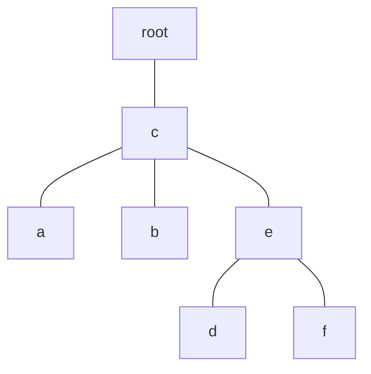

# The Art of the Fugue: Minimizing Interleaving

> **Thesis.** Almost every replicated-list algorithm used for collaborative text can *interleave* the characters of two concurrent insertions into garbage — and the existing formal spec permits it. By organising list elements into a **tree** whose order is a depth-first traversal, you can guarantee that independently-composed passages stay contiguous when merged. Two algorithms deliver this: **Fugue** (simple) and **FugueMax** (provably *maximal* non-interleaving), at performance on par with state-of-the-art CRDTs.

**Source.** Matthew Weidner (Carnegie Mellon University) and Martin Kleppmann (University of Cambridge). *The Art of the Fugue: Minimizing Interleaving in Collaborative Text Editing.* arXiv:2305.00583v3 [cs.DC], 21 Oct 2025.

This paper isolates a correctness property — *non-interleaving* — that the standard "strong list specification" overlooks, proves the obvious definition is impossible to satisfy, repairs it into *maximal* non-interleaving, and then designs a tree-based list CRDT that meets it. The core idea is small and elegant; most of the paper is the careful definitional and proof work needed to make "don't shuffle my words together" precise.

---

## TL;DR

- **The problem.** When two users concurrently insert text at the *same position*, many replicated-list algorithms (CRDTs *and* OT) merge the two passages by **interleaving** their characters — e.g. concurrent "eggs" and "bread" merge to "ebgrgesad". The character-level version is catastrophic; even an element-level version (one user's "apples, bananas" mixed into another's "Bakery") is illogical.
- **It's pervasive and undocumented.** Nearly every surveyed algorithm interleaves in some case (Table 1). The anomaly went unmentioned in the research literature until 2018, and the standard *strong list specification* (Attiya et al. 2016) **permits** it.
- **The naïve fix is impossible.** Define non-interleaving as "concurrent same-position passages $X$, $Y$ end up fully separated." A 4-element counterexample ($X=\{a,c\}$, $Y=\{b,d\}$, final order $abcd$) shows **no algorithm** can always satisfy it.
- **The repaired property — maximal non-interleaving.** Forbid interleaving *to the maximum possible extent*: always honour **forward** non-interleaving (left-to-right writing), honour **backward** non-interleaving (prepending) *except* where forward forces a violation, and break the last remaining freedom by element ID.
- **The data structure — a tree.** Each list element is a tree node tagged with a unique ID; the list order is a **depth-first in-order traversal**. Concurrent insertions at the same spot land in **separate subtrees**, so the traversal visits one entirely before the other — no interleaving.
- **Left/right origins.** Insert as the **right child of the left origin** (the element before you), or — if it already has a right child — as the **left child of the right origin**. This places you immediately after your predecessor in the traversal.
- **Fugue vs FugueMax.** Fugue orders same-side siblings by ID (simple). FugueMax orders right-side siblings by *reverse right-origin* (a trick borrowed from Gentle's "YjsMod"), buying it the *maximal* guarantee. They differ only in rare multi-concurrent cases; Fugue interleaves at most one extra pair.
- **It's practical.** An optimized TypeScript Fugue matches Yjs on save size, load time, throughput (≈94k ops/sec), and memory (≈23 bytes/char) on a 260k-operation real editing trace.

---

## 1. The interleaving problem

A *replicated list* lets several users each hold a local copy of an ordered sequence (characters, to-do items, spreadsheet rows) and edit it concurrently; the algorithm must guarantee **convergence** — replicas that processed the same operations reach the same state, regardless of delivery order. CRDTs and OT both solve convergence. The paper's claim is that convergence is *not enough*: there is a second property, **non-interleaving**, that practical editors need and almost everyone got wrong.

### 1.1 Two flavours of the anomaly

**Character-level (Figure 1).** A document holds `milk\n`. Offline, User A inserts a line break and "eggs"; User B inserts a line break and "bread". A merge that is correct by the standard spec may produce:

```
User A:    m i l k \n e g g s \n          (inserted "\neggs")
User B:    m i l k \n b r e a d \n        (inserted "\nbread")

merged:    m i l k \n \n e b g r g e s a d \n
                       └──────┬──────┘
                      "ebgrgesad" — the two words interleaved character-by-character
```

Why "ebgrgesad" specifically? In a path-labelled CRDT like Treedoc, the 'e' of "eggs" and the 'b' of "bread" take the *same* path in the ID tree (both are the first character inserted at that spot), as do 'g'/'r', 'g'/'e', 's'/'a', and so on. The traversal then alternates between the two words letter by letter.

**Element-level (Figure 2).** Two users each *prepend* items to a shared shopping list (a plausible backward-insertion pattern), each finally adding a category header:

```
        Shopping                 Shopping
User A: • apples       User B:   • bread
        • bananas                • cake
   (header "Fruit")          (header "Bakery")

merged (interleaving backward insertions):
        Shopping
        Bakery:
        Fruit:
        • bread      ← "bread" listed under "Fruit": illogical
        • apples
        • cake
        • bananas
```

Less violent than character soup, but still wrong: "bread" is filed under "Fruit". The lesson is that whenever passages are *composed independently*, the merge should place them **one after another**, never intermingled.

> **Mental model:** Two people writing in the same blank line, offline. Correct convergence says "everyone agrees on the final string." Non-interleaving adds: "and that string contains *Alice's words, then Bob's words* (or vice-versa) — not a shuffle of the two."

### 1.2 Forward vs backward insertion

The direction a user *types* matters:

- **Forward insertion** — normal writing. "bread" is typed as `b, r, e, a, d`; each new character's *left origin* (the element it sits after) is the previous character.
- **Backward insertion** — prepending. Hitting backspace then retyping, or repeatedly inserting at the top of a list. Each new element's *right origin* (the element it sits before) is the previous one.

An algorithm can be vulnerable to one, the other, or both. Table 1 of the paper classifies every surveyed algorithm. The headline rows:

| Family | Algorithm | Forward interleave | Backward (1 replica) | Backward (multi-replica) |
|---|---|:---:|:---:|:---:|
| OT | adOPTed, Jupiter, GOT, SOCT2, TTF | ● | ○ / ● | ● / ○ |
| CRDT | WOOT | ● | ○ | ○ |
| CRDT | **Logoot, LSEQ, Treedoc** | ● | ● | ● |
| CRDT | RGA | ○✓ | ● | ● |
| CRDT | Yjs (YATA) | ○✓ | ○ | ● |
| CRDT | Sync9, YjsMod | ○ | ○ | ○ |
| CRDT | **Fugue** | ○✓ | ○✓ | ○✓ |
| CRDT | **FugueMax** | ○✓ | ○✓ | ○✓ |

`●` = interleaving can occur; `○` = no example found (conjectured safe); `○✓` = *proven* not to interleave. Only **Fugue** and **FugueMax** are proven non-interleaving on all three axes. (GOT additionally has a worse anomaly — it can *reorder* characters against the user's typed order, violating even the basic spec.)

> **Key gotcha:** *Multi-replica* interleaving needs at least three replicas to manifest — e.g. you start editing on a laptop, continue on a phone (an editing session spanning two replica IDs), while a collaborator works offline on a third. Systems that mint a fresh replica ID per browser tab are especially exposed. This is why the column matters even for "single-user" usage.

---

## 2. System model

Each user session is a **replica** holding a local copy of the list. Local edits (`insert`, `delete`) apply *immediately* — no network round-trip — for responsive, offline-capable editing. Operations propagate over a **causal broadcast** protocol: reliable, exactly-once, delivered in an order consistent with happened-before. Causal broadcast needs **no central server and no consensus** (peer-to-peer-friendly) and handles retransmission of messages missed while offline. The minimum correctness bar is **convergence**: replicas that processed the same operation set reach the same state.

Some key relational vocabulary used throughout:

- If element $A$ was already inserted when $B$ was inserted, $A$ is **causally prior** to $B$ and $B$ is **causally later** than $A$ (regardless of later deletions). An element's left and right origins are always causally prior to it.
- If neither is causally prior to the other, $A$ and $B$ are **concurrent**. Causal broadcast delivers insertions in a linear extension of this partial order.

---

## 3. Formalizing non-interleaving

### 3.1 The strong list specification (what convergence alone guarantees)

Attiya et al.'s *strong list specification* says: there is a single global total order $\prec$ over all list elements (across all replicas and time) such that

- **(a)** `values()` at any replica returns exactly its inserted-but-not-deleted elements, in $\prec$ order; and
- **(b)** an `insert(i, x)` issued when the local list is $[a_0, \dots, a_{n-1}]$ places the new element $e$ so that $a_0, \dots, a_{i-1} \prec e \prec a_i, \dots, a_{n-1}$.

This pins down *where* an insertion goes relative to elements the inserter could see, but says **nothing** about how two concurrent insertions at the same spot are ordered relative to *each other* — which is exactly where interleaving hides.

### 3.2 The impossible definition

The natural definition (Kleppmann et al. 2017, paraphrased): given two element sets $X$, $Y$ all pairwise inserted concurrently and ending up *contiguous* at the same location, either $\forall x\in X, y\in Y:\ x \prec y$ or $\forall:\ y \prec x$. I.e. one block entirely precedes the other.

**This cannot be satisfied by any algorithm.** Counterexample: from an empty list, four replicas each concurrently insert one element. The merged order is *some* permutation of the four — say $abcd$. Now take

$$
X = \{a, c\}, \qquad Y = \{b, d\}.
$$

Both hypotheses hold (all four were inserted concurrently and are contiguous), yet $X$ and $Y$ are interleaved as $a\,b\,c\,d$. Since *any* algorithm must produce *some* order of the four, this can always be forced. The definition is dead on arrival.

> **Design lesson:** When a desirable property is provably impossible, don't abandon it — *weaken it to its maximal achievable form*. The rest of §3 does exactly this.

### 3.3 Forward non-interleaving (Definition 2)

Salvage the writing-direction case first. Let $A.\textit{leftOrigin}$ be the element directly *before* $B$'s insertion position at insertion time.

> **Definition (Forward non-interleaving).** The algorithm satisfies the strong list spec, and: *if $A$ is the left origin of $B$, and $B$ appears earlier in the list than any other element that has $A$ as left origin, then $A$ and $B$ are consecutive.*

Read it as: among everything inserted *immediately after $A$*, the earliest one sits flush against $A$. When $B$ is the *only* element with left origin $A$, this forces $A, B$ to be adjacent — a forward-typed run stays glued. **Lemma 3** shows this implies the older Kleppmann condition: two forward sequences $B_1\dots B_m$ and $C_1\dots C_n$ typed concurrently from the same start end up entirely on opposite sides ($\forall i, j$: all $B_j$ before all $C_i$, or vice-versa).

### 3.4 Why backward can't be symmetric (Figure 6)

The tempting move — define backward non-interleaving by swapping "left origin" → "right origin", then `AND` the two — **fails**. Forward non-interleaving can *force* a backward violation:

```
Replica 1: insert(0,A)→"A", recv C → "AC", insert(1,X)→"AXC", recv B → "AXBC"
Replica 2: insert(0,B)→"B"  (concurrent)
Replica 3: insert(0,C)→"C", recv A,B → orders them  A ≺ B ≺ C

Three replicas concurrently insert A, B, C. Replica 3 fixes A ≺ B ≺ C.
Replica 1 sees {A,C}, inserts X between → A X C.
```

Now: $X$ is the *only* element with left origin $A$, so forward non-interleaving demands $AX$ consecutive. The strong spec forces $A \prec B \prec C$ everywhere. The only order honouring both is **AXBC**. But $X$ is *also* the only element with right origin $C$, so naïve backward non-interleaving would demand $XC$ consecutive — **contradiction**. You cannot have both $AX$ and $XC$ adjacent while $B$ sits between $A$ and $C$.

So: when forward and backward conflict, **forward wins** (left-to-right writing is the common case).

### 3.5 Maximal non-interleaving (Definition 4)

> **Definition (Maximally non-interleaving).** Satisfies the strong list spec, and for all list elements $A$, $B$:
>
> 1. **(Forward)** If $A$ is the left origin of $B$ and $B$ is the earliest element with left origin $A$, then $A$, $B$ are consecutive.
> 2. **(Backward, with exceptions)** If $B$ is the right origin of $A$ and $A$ is the *latest* element with right origin $B$, then $A$, $B$ are consecutive — *unless* the exception of Lemma 5 (below) applies.
> 3. **(Tiebreak)** If $A$ and $B$ have the *same* left origin *and* the same right origin, the one with the lower ID appears earlier.

**Lemma 5 (the backward exception).** Backward non-interleaving is waived for the pair $(A, B)$ exactly when (i) $A$ and $B$ have *different* left origins, and (ii) there is some $C$ in the current state with $A.\textit{leftOrigin} \prec C \prec B$ where $C$ is not a descendant of $A.\textit{leftOrigin}$ in the left-origin tree. In that case $A \prec C \prec B$ is forced, so $A$, $B$ *cannot* be consecutive — and that's allowed.

Condition (3) is "an arbitrary choice" — two elements inserted at the exact same place have no inherent order. The paper proves (§5.5) this is the *only* remaining degree of freedom once (1) and (2) are fixed: **maximal non-interleaving uniquely determines the list order**, which is what makes "maximal" rigorous.

> **Mental model:** Forward non-interleaving is non-negotiable. Backward non-interleaving is "best effort" — granted everywhere except the rare spots where forward already nailed things down. Tiebreaking mops up the last ambiguity. Together they leave *zero* slack: any stricter rule would be unsatisfiable.

---

## 4. The Fugue tree

Fugue is presented as an **operation-based CRDT** (it reformulates as state-based too). The whole design fits in one sentence: **store list elements in a tree and read them off by depth-first in-order traversal.**

### 4.1 State: a (non-binary) tree of tagged nodes

```
types:
  RID                                  replica identifiers
  ID  := (RID × ℕ) ∪ {null}            element IDs  (unique per insert)
  𝕍                                    value domain (e.g. characters)
  ⊥                                    tombstone marker for deleted nodes
  {L, R}                               which side of its parent a node is on
  NODE := ID × (𝕍 ∪ {⊥}) × ID × {L,R}  = (id, value, parent, side)

per-replica state:
  replicaID ∈ RID
  tree      : set of (node, leftChildren[], rightChildren[]),
              initially { (root, [], []) }  with root = (null, ⊥, null, null)
  counter   ∈ ℕ                         for minting fresh IDs, initially 0
```

Each non-root node carries a **unique ID** and a value. Each node is a *left* or *right* child of its parent — but the tree is **not binary**: a parent may have several left children and several right children (created when replicas concurrently insert at the same spot). The tree is also **not balanced**.



*(Figure 3: one Fugue tree for the list `abcdef`. Both `a` and `b` are left children of `c`; same-side siblings are sorted lexicographically by their IDs. `a, b` left of `c`; `d, f` left/right of `e`.)*

### 4.2 The list order: depth-first in-order traversal

```python
def values():                       # the externally visible list
    return traverse(null)           # start at the root

def traverse(nodeID):
    (node, leftChildren, rightChildren) = lookup(nodeID)
    values = []
    for childId in leftChildren:    # 1. recurse into LEFT children (lexicographic by ID)
        values += traverse(childId)
    if node.value != ⊥:             # 2. visit THIS node, unless it is a tombstone
        values += [node.value]
    for childId in rightChildren:   # 3. recurse into RIGHT children (lexicographic by ID)
        values += traverse(childId)
    return values
```

Left children first, then self, then right children — a classic in-order walk generalised to many-children-per-side. Same-side siblings are visited in lexicographic ID order (the *exact* construction of IDs doesn't matter, only that they're uniquely and totally ordered). For the Figure 3 tree this yields `a b c d e f`.

> **Why this kills interleaving (intuition):** Two users editing the same blank line insert into the *same parent* but as *distinct subtrees*. A depth-first traversal visits one subtree **entirely** before starting the other. So one user's whole passage comes out, then the other's — never interleaved. Figure 5 shows the shopping-list history of Figure 2 producing two separate subtrees, cleanly un-interleaved.

### 4.3 Insert: left origin and right origin

To `insert(i, x)`, the new node must end up *between* the elements at indices $i-1$ and $i$. Define:

- **left origin** = the element at index $i-1$ (the non-tombstone node immediately before the insertion point; `start`/`root` if $i=0$).
- **right origin** = the next node *after* the left origin in the traversal **including tombstones** (the `end` symbol if none). Counting tombstones here simplifies the analysis by letting deletions be ignored.

The placement rule:

```python
def insert(i, x):
    id = (replicaID, counter); counter += 1
    leftOrigin  = node for (i-1)-th value in values()   # or root if i == 0
    rightOrigin = next node after leftOrigin in traversal-with-tombstones
    if leftOrigin has NO right child:
        node = (id, x, leftOrigin.id, R)    # right child of leftOrigin  — Figure 4(a)
    else:
        node = (id, x, rightOrigin.id, L)   # left child of rightOrigin  — Figure 4(b)
    broadcast (insert, node)                 # causal broadcast; delivered to self immediately
```

The two cases:

```
(a)  leftOrigin (a) has no right child:        (b)  a already has descendant g; insert h
     make new node g a RIGHT child of a.            between a and g → LEFT child of g.

        root                                        root
          \                                           \
           c                                           c
         / | \                                       / | \
        a  b  e                                     a  b  e
        :    / \                                    :    / \
        g   d   f          inserting g after a      g   d   f
       (right child of a, so it lands              :
        immediately after a in traversal)          h    inserting h between a and g
```

**Why it works (Theorem 1 intuition).** `leftOrigin` and `rightOrigin` are consecutive in the traversal-with-tombstones, and `leftOrigin` is the live node right before the insertion point. If `leftOrigin` has no right child, making the new node its right child slots it in as `leftOrigin`'s immediate successor. If it *does* have a right child, then `rightOrigin` must be a descendant of `leftOrigin` with no left children of its own — so making the new node `rightOrigin`'s *left* child makes the traversal visit it between the two. Either way the new element appears exactly between index $i-1$ and index $i$, satisfying the strong list specification.

> **Key gotcha — keep it binary when alone, branch when concurrent.** A replica never creates a node where it *already* has a same-side sibling, so a single replica's tree stays binary. Branching into multiple same-side children happens *only* when **different replicas concurrently** insert at the same spot (like `a` and `b` in Figure 3). That branching is precisely the mechanism that separates concurrent passages into distinct subtrees.

### 4.4 Delivering an insert, and delete

```python
on delivering (insert, node) by causal broadcast:
    (parent, leftSibs, rightSibs) = the triple in tree with parent.id == node.parent
    if node.side == R:
        i = least index with node.id < rightSibs[i]
        insert node.id into rightSibs at index i      # keep siblings lexicographically sorted
    else:
        i = least index with node.id < leftSibs[i]
        insert node.id into leftSibs at index i
    tree = tree ∪ { (node, [], []) }

def delete(i):
    node = node for i-th value in values()
    broadcast (delete, node.id)

on delivering (delete, id) by causal broadcast:
    (node, _, _) = the triple in tree with node.id == id
    node.value = ⊥                       # tombstone — do NOT remove the node
```

**Tombstones are mandatory, not just convenient.** A deleted node may be the *ancestor* of live nodes (including ones inserted concurrently), and it may serve as the parent/origin of future inserts. So delete only flags the value as $\bot$; the node stays in the tree, is skipped by `values()`, but is still traversed structurally. §6 discusses optimisations to mitigate tombstone memory.

> **Mental model:** The tree is the *causal skeleton* of the document — every insert hangs off its origin, every delete leaves the skeleton intact and just greys out a node. The visible text is a shadow cast by an in-order walk.

---

## 5. Left-origin and right-origin trees (the analysis machinery)

To reason about list order abstractly (independent of Fugue's concrete tree), the paper defines two derived trees over list elements:

- **Left-origin tree:** each element's parent is its **left origin**. Rooted at `start`. (Similar to *causal trees* and *timestamped insertion trees*.)
- **Right-origin tree:** each element's parent is its **right origin**. Rooted at `end`.

```
Left-origin tree              Right-origin tree
   start                          end
   / | \                         / | \
  A  B  C                       A  B  C
     / \                           / \
    X   Y                         Y   X
```

*(Figure 8, for the execution of Figure 7. Note `X`, `Y` swap order between the two trees — they have different right origins.)*

The pivotal structural fact:

> **Lemma 7.** A replicated-list algorithm satisfying the strong list spec is **forward non-interleaving if and only if its list order is some depth-first pre-order traversal of the left-origin tree.**

So forward non-interleaving is *exactly* "read the left-origin tree depth-first." The only freedom left is **the order of siblings** within that tree — and that is where backward non-interleaving and tiebreaking come in. This is why a *tree-traversal* algorithm is the natural shape for the solution.

**Lemma 8** ties the analysis tree back to the Fugue tree: (a) an element's left origin is found by walking up the Fugue tree until you hit a node that is a *right* child of its parent — that parent is the left origin; and (b) $B$ is a descendant of $A$ in the Fugue tree **iff** $B$ is a descendant of $A$ in the left-origin tree. The Fugue tree and the left-origin tree are structurally the same object viewed two ways.

---

## 6. From Fugue to FugueMax

Plain **Fugue** orders same-side siblings by **ID** (Definition: condition (3)-style tiebreak applied to *all* siblings, not just same-right-origin ones). That is correct and forward non-interleaving, but in executions like Figure 7 it can fall *just short* of maximal: when two right-side siblings $X$, $Y$ have *different* right origins $B \ne C$, ID order might put $Y \prec X$ when maximal non-interleaving demands $X \prec Y$ (so that $Y$ can sit flush against the leftmost right origin $B$).

**FugueMax** repairs this with one change to sibling ordering, a technique adopted from Seph Gentle's "YjsMod":

> **Definition 6 (FugueMax).** Identical to Fugue, except the traversal visits **right-side siblings in the *reverse* order of their right origins**, breaking ties by lexicographic ID.

Concretely, FugueMax differs from Algorithm 1 in two lines:

1. When generating a right child, also tag it with its right origin: `node = (id, x, leftOrigin.id, R, rightOrigin.id)`.
2. On delivering a right child, order siblings by: `node.rightOrigin ≻ rightSibs[i].rightOrigin`, or (equal right origins) `node.id < rightSibs[i]`. Here `≻` is the existing list order on right origins and `<` is lexicographic ID order.

```
Fugue:     right siblings X, Y ordered by ID         → maybe  Y ≺ X
FugueMax:  right siblings ordered by reverse           → if B ≺ C then X ≺ Y,
           right-origin (then ID)                        letting Y abut its right origin B
```

The strong-list-spec proof (Theorem 1) carries over unchanged. The headline results:

- **Theorem 9.** FugueMax satisfies conditions (1), (2), (3) of Definition 4 — it is **maximally non-interleaving**. (Long case analysis via Lemma 8 and Theorem 8.)
- **Theorem 10 (Uniqueness).** *Any* maximally non-interleaving algorithm is semantically equivalent to FugueMax — they induce the *same* total order on elements. This is what licenses the word "maximal": there is no other distinct maximally-non-interleaving order to choose.

**Alternate characterization of the FugueMax order** (falls out of the §5.5 proof):

1. Order elements by a depth-first **pre-order** traversal of the **left-origin** tree;
2. order siblings within that tree by a depth-first **post-order** traversal of their **right-origin** forest;
3. order roots with *different* right origins by the **reverse** of their right origins;
4. order roots with the *same* right origin (and all other ties) by **ID**. (Fugue uses ID for step 3 too — that's the whole difference.)

### When do Fugue and FugueMax actually differ?

Only in situations analogous to Figure 7: there exist elements with the *same left origin* ($X$, $Y$) but *different right origins* ($B$, $C$). Forward non-interleaving needs $\{X,Y\} \prec \{B,C\}$, but backward non-interleaving only permits the incompatible orders $YBXC$ or $XCYB$ — so *some* interleaving is inevitable for **any** algorithm. FugueMax merely backward-interleaves **one fewer pair** (it salvages $YB$). These cases need multiple interacting concurrent updates and are rare.

> **Design lesson:** The authors argue **Fugue's simplicity is worth its slightly-worse guarantee.** In the only situations where FugueMax does better, *every* algorithm must interleave *something*; FugueMax just trims one pair. Tagging every right child with its right origin (FugueMax) also enlarges saved documents (see §7). Pick FugueMax only if you need the provable maximality.

---

## 7. Implementation and evaluation

Three TypeScript implementations were built as custom CRDTs for the **Collabs** library (which supplies causal-order delivery):

| Variant | LOC | Encoding / representation |
|---|---|---|
| **Fugue** (optimized) | 1132 | Condenses sequential runs into "waypoint" objects (à la Yjs, RGASplit); Protocol Buffers; ships in Collabs v0.6.1 |
| **Fugue Simple** | 298 | Direct Algorithm 1: doubly-linked tree, one object per node; GZIP'd JSON |
| **FugueMax Simple** | 435 | Direct Algorithm 1 + FugueMax's right-origin tagging |

Benchmarks replay a **real 17-page LaTeX editing trace**: 182,315 single-char inserts + 77,463 deletes → a 104,852-char (105 kB plaintext) document, processed sequentially on one replica. Compared against **Yjs** (YATA-based, JS), **Y-Wasm** (Rust→Wasm Yjs), and **Automerge-Wasm** (RGA-based, Rust→Wasm).

**Saved-document metrics (Table 2):**

| Implementation | Save size | Save time | Load time |
|---|---|---|---|
| **Fugue** | **168 kB** | **20 ms** | **13 ms** |
| Fugue Simple | 1,021 kB | 583 ms | 334 ms |
| FugueMax Simple | 1,237 kB | 788 ms | 522 ms |
| Automerge-Wasm | 129 kB | 180 ms | 2,746 ms |
| Yjs | 160 kB | 17 ms | 63 ms |
| Y-Wasm | 160 kB | 5 ms | 15 ms |

**Live-usage metrics, 260k ops (Table 3):**

| Implementation | Memory (MB) | Net bytes/op | Ops/sec (k) |
|---|---|---|---|
| **Fugue** | **2.4** | 46 | **94** |
| Fugue Simple | 64.8 | 151 | 17 |
| FugueMax Simple | 71.9 | 188 | 16 |
| Yjs | 3.3 | 29 | 39 |

**Findings.**

- Optimized **Fugue is on par with state-of-the-art Yjs** on save size, save/load time, throughput, and memory. CRDT metadata is only ~60% of the literal text's size.
- **Memory is ≈23 bytes/char** (≈13 bytes/char counting tombstones) — directly *refuting* the common criticism that text CRDTs have prohibitive per-character overhead. Fugue achieves ≈94k ops/sec (≈11 µs/op); a human types ≈10 chars/sec, so throughput/network are nowhere near bottlenecks.
- **FugueMax Simple is the heaviest** on save size and memory because it must additionally store each right-side child's right origin.
- A 100×-repeated trace (10.5M chars — several *War and Peace*) keeps Fugue tolerable: ~18 MB save, <2 s save/load, 223 MB memory.
- Save size *decreases* when text is deleted despite tombstones; both save size and memory track plaintext at a modest multiple throughout the trace (Figure 9).

---

## 8. Where Fugue sits, and limitations

**Lineage and relation to prior work.**

- The interleaving anomaly was first noticed in **Logoot/LSEQ** (which are especially prone), then found to be widespread across OT (Ellis-Gibbs lineage, Jupiter→Google Docs) and CRDTs (WOOT, Treedoc, RGA, Yjs/YATA).
- The earlier **Kleppmann et al.** attempt had two fatal flaws: its non-interleaving definition is *unsatisfiable* (§3.2), and its proposed CRDT *doesn't even converge* (a non-convergence example was found by Chandrassery; Appendix A.3).
- Fugue was developed **independently** of the (unpublished, code-only) **Sync9** and **YjsMod**; the authors conjecture Sync9 ≡ Fugue and YjsMod ≡ FugueMax. FugueMax's reverse-right-origin trick comes from YjsMod.
- The left-origin tree resembles **causal trees** and **timestamped insertion trees**.

**Limitations and caveats.**

- **Interleaving is sometimes unavoidable** (the §3.2 impossibility; the Figure 6/7 forward-vs-backward conflict). "Maximal" is genuinely the ceiling — not "zero."
- **Tombstones cannot be removed** outright (deleted nodes may be ancestors/origins); they cost memory, mitigated only by encoding optimisations.
- **Causal broadcast is assumed, not built** — Fugue rents reliable causal delivery from the surrounding system.
- **FugueMax costs more** (per-node right-origin metadata) for a guarantee that only matters in rare multi-concurrent cases — the authors recommend plain Fugue in practice.
- Operations to **mutate or move** elements are out of scope (compose a list CRDT with other CRDTs); run-length compression of inserts/deletes is an orthogonal optimisation.
- **Open questions:** formally analysing Sync9/YjsMod, and whether a maximally non-interleaving **OT** algorithm exists.

### The one-paragraph distillation

Convergence is not enough: collaborative editors must also avoid *interleaving* the characters of concurrent same-position insertions, which almost every existing algorithm fails to do, and which the standard list spec permits. The strict "fully separate concurrent blocks" property is provably impossible, so weaken it to **maximal non-interleaving** — always separate forward-typed runs, separate backward-prepended runs except where forward order forces an overlap, and break the last tie by ID. Realise it by storing elements in a **tree** and reading them off via a **depth-first in-order traversal**: insert each new element as the right child of its left origin (or the left child of its right origin), so concurrent edits land in distinct subtrees that the traversal visits one-after-another. **Fugue** orders same-side siblings by ID (simple); **FugueMax** orders right-side siblings by reverse right origin and is provably maximal — and uniquely so. The whole thing runs at Yjs-class performance.

---

## Glossary & notation

| Term | Meaning |
|---|---|
| **Replicated list** | An ordered sequence (text, list items, rows) replicated across users, edited concurrently, converging to one state. |
| **Convergence** | Replicas that processed the same operations reach the same state. The *minimum* correctness bar. |
| **Interleaving** | A merge that intermingles the elements of two independently-composed concurrent passages (e.g. "eggs"+"bread" → "ebgrgesad"). |
| **Forward insertion** | Normal typing, left-to-right; each char's *left origin* is the previous char. |
| **Backward insertion** | Prepending / inserting at the top; each element's *right origin* is the previous one. |
| **Left origin** of $B$ | The element directly *before* $B$'s insertion position at insertion time (`start` if at index 0). |
| **Right origin** of $A$ | The element directly *after* $A$'s insertion position (counting tombstones); `end` if none. |
| **Strong list specification** | Attiya et al.'s spec: a global total order $\prec$ exists; `values()` returns live elements in $\prec$; inserts respect the inserter's local neighbours. Says nothing about ordering concurrent same-spot inserts. |
| **Forward non-interleaving** | Among elements with the same left origin $A$, the earliest abuts $A$ (Def. 2). Equivalent to: list order is a pre-order traversal of the left-origin tree (Lemma 7). |
| **Backward non-interleaving** | The dual for right origins — granted except where forward non-interleaving forces a violation (Lemma 5 exception). |
| **Maximal non-interleaving** | Strong spec + forward + backward(with-exceptions) + ID tiebreak (Def. 4). Uniquely determines the list order (Thm 10). |
| **Fugue tree** | Per-replica tree; non-root nodes = (id, value, parent, side $\in\{L,R\}$); not binary, not balanced. |
| **Left/right child** | Side of a node relative to its parent; left children traversed before the node, right children after. |
| **Same-side siblings** | Nodes sharing a parent and a side; arise from *concurrent* same-spot inserts; ordered by ID (Fugue) or reverse right-origin (FugueMax). |
| **In-order traversal** | `traverse`: left children → self → right children. Produces `values()`, the visible list. |
| **Tombstone** ($\bot$) | A deleted node's value; node stays in the tree (may be ancestor/origin), skipped by `values()`. |
| **Left-origin tree** | Analysis tree: parent = left origin, rooted at `start`; structurally the Fugue tree (Lemma 8). |
| **Right-origin tree** | Analysis tree: parent = right origin, rooted at `end`. |
| **Causally prior / later** | $A$ causally prior to $B$ = $A$ existed when $B$ was inserted. Neither way ⇒ **concurrent**. |
| **Fugue** | Same-side siblings ordered by ID. Simple; forward + backward non-interleaving proven. |
| **FugueMax** | Right-side siblings ordered by reverse right origin (then ID). Provably *maximally* non-interleaving; unique. |
| $\prec$ | The global total order on list elements (the visible list order). |
