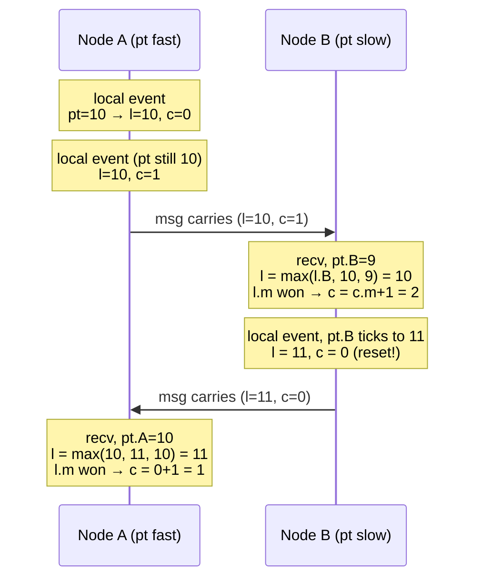

# Hybrid Logical Clocks

> **Thesis.** You can have one timestamp that is *both* a logical clock — it captures the happened-before relation, so causality is never violated — *and* a physical clock — it stays within a small bounded distance of wall-clock NTP time, so it can stand in for physical time. HLC achieves this in **bounded space** (fits a 64-bit NTP timestamp), needs **no extra messages**, and is a drop-in superposition over physical-time clocks.

**Source.** Sandeep S. Kulkarni, Murat Demirbas, Deepak Madeppa, Bharadwaj Avva, Marcelo Leone. *Logical Physical Clocks and Consistent Snapshots in Globally Distributed Databases.* Michigan State University & University at Buffalo, SUNY. In *OPODIS 2014* (Principles of Distributed Systems), LNCS 8878. (The implementation is the open-source *AugmentedTime* project.)

The paper closes the gap between two worlds: Lamport's **logical clock** (captures causality, but is divorced from real time) and **physical time** (is real time, but cannot reliably capture causality because clocks drift). HLC is the timestamp that does both jobs at once — and the headline application is taking **consistent snapshots** of a globally distributed database without any coordination.

---

## TL;DR

- **The gap.** A **Logical Clock (LC)** (Lamport, 1978) captures *happened-before* — if $e$ caused $f$ then $LC.e < LC.f$ — but its values have nothing to do with wall-clock time. **Physical Time (PT)** is real time, but because clocks drift you *cannot* infer causality from it: $e$ may cause $f$ yet have a larger physical timestamp.
- **What we want.** A single logical clock $l$ that (1) is a genuine logical clock ($e \to f \Rightarrow l.e < l.f$), (2) stays *close* to physical time ($|l.e - pt.e|$ is bounded), and (3) fits in **bounded space** — ideally the 64 bits already reserved for an NTP timestamp.
- **The naive attempt fails.** Just taking $l := \max(l, pt)$ on every event captures causality and tracks PT *when messages flow*, but in a quiet sub-system where one node's clock raced ahead, $l - pt$ can grow **without bound** — defeating requirements (2) and (3).
- **HLC's fix — a second counter.** Keep two numbers per node: $l$ (a logical-physical value, kept $\ge pt$) and a small bounded counter $c$ that breaks ties *within the same $l$*. The pair $(l, c)$ is compared lexicographically. $c$ resets to $0$ whenever physical time catches up and advances $l$.
- **Guarantees.** $e \to f \Rightarrow (l.e, c.e) < (l.f, c.f)$ (logical clock property); $l.e \ge pt.e$ always; under a clock-synchronization bound $\epsilon$, $|l.e - pt.e| \le \epsilon$ and $c.e \le N(\epsilon+1)$ — **both bounded**, so 16 bits of $c$ suffice in practice. HLC is also **self-stabilizing**: corrupted state heals.
- **The payoff — coordination-free snapshots.** To snapshot at logical-physical time $T$, every node independently includes its state as of $\langle T, \text{maxcounter}\rangle$. Because HLC respects causality, the result is a **consistent cut** — no message is received-but-not-sent across the snapshot — with *no* agreement protocol and *no* blocking.
- **Versus TrueTime.** Google's Spanner uses **TrueTime (TT)**: tightly-synchronized clocks plus *commit-wait* on an uncertainty interval $\Delta$ (GPS/atomic hardware). HLC gives the same consistent-snapshot capability over **commodity NTP**, with no special hardware and no waiting out an uncertainty window.

---

## 1. The problem: a clock that is two things at once

Distributed systems traditionally pick one of two notions of time, and each is crippled in a different way.

### 1.1 Logical Clocks (LC) capture causality but float free of real time

Lamport's logical clock assigns each event $e$ a value $lc.e$ so that the **happened-before** relation $\to$ is respected. Recall $e \to f$ ("$e$ happened before $f$") holds when $e$ and $f$ are on the same node with $e$ first, or $e$ is a send and $f$ its matching receive, or transitively. The LC guarantee is:

$$
e \to f \;\Rightarrow\; lc.e < lc.f
$$

The cost: $lc$ values are abstract integers. You can *order* causally-related events, but you cannot ask "what time did this happen?" or "give me everything as of 3:00:00 PM" — the clock has no anchor in real time.

### 1.2 Physical Time (PT) is real time but cannot be trusted for causality

If every node used a perfectly synchronized physical clock, $pt$ would *both* tell real time *and* respect causality. That is exactly the **perfect-clock** assumption — and it is infeasible. Real clocks drift; even with NTP, two nodes' clocks differ by an uncertainty $\epsilon$. The consequence is fatal for causality:

```
   Node A clock runs fast, Node B clock runs slow:

   real time ───────────────────────────────────▶

   A:  send(m) at  pt = 10.05  ───────┐   (A's clock is ahead)
                                       │
   B:                          recv(m) at pt = 10.02   ◀── earlier PT!
                                       └──────────────▶

   Causally,  send → recv,  yet  pt.send (10.05) > pt.recv (10.02).
   A naive "trust physical time" ordering would put the receive
   BEFORE the send — a causality violation.
```

> **Mental model:** LC and PT sit at opposite ends of a trade-off. LC is *causally correct but timeless*; PT is *timely but causally unreliable*. HLC is engineered to occupy the middle: causally correct **and** timely.

### 1.3 The four requirements

The paper states precisely what a usable logical-physical clock $l$ must satisfy. Given a desired bound $\epsilon$ on clock synchronization between nodes:

1. **$l$ is a logical clock:** $\quad e \to f \;\Rightarrow\; l.e < l.f$. (Capture happened-before.)
2. **Bounded space:** $\quad l.e \in O(1)$ integers — ideally fits the 64-bit NTP timestamp.
3. **$l$ represents physical time:** $\quad l.e$ is close to $pt.e$.
4. **Closeness is bounded:** $\quad |l.e - pt.e| \le \epsilon$.

Requirement 1 is what LC already gives. Requirements 3–4 are what PT already gives. The whole challenge is getting **all four simultaneously**, in bounded space.

---

## 2. The naive algorithm — and why it isn't enough

### 2.1 First attempt: fold physical time into Lamport's update

The obvious idea: run a Lamport clock, but instead of incrementing by $1$, jump up to physical time whenever physical time is larger. Each node $j$ keeps a single value $l.j$.

```text
Initially  l.j := 0

Send or local event:
    l.j := max(l.j, pt.j)            # advance to physical time if it is ahead
    Timestamp event with l.j

Receive event of message m:
    l.j := max(l.j, l.m + 1, pt.j)   # also dominate the sender's stamp
    Timestamp event with l.j
```
*(Figure 3 — the **naive** HLC.)*

This **does** satisfy requirement 1 (it is still a Lamport clock: every update is non-decreasing and a receive strictly dominates the send) and, when messages are flowing and clocks are roughly synced, $l$ tracks $pt$ nicely.

### 2.2 Why it breaks: unbounded $l - pt$

The trouble is a **quiet partition** where one node's physical clock has raced ahead. Consider the worst case the paper draws (Figure 4): a node whose clock is fast creates an event, stamping a large $l$. That large $l$ propagates through a chain of messages. Now suppose physical time *cannot* catch up — e.g. that fast clock keeps re-incrementing $l$ on every local event before $pt$ ever overtakes it. Because the update is $\max(l, pt)$ and never anything that re-syncs $l$ *down* toward $pt$, the difference $l - pt$ is **monotonically retained**:

```
   Naive HLC counter example (one fast node, others normal):

   l :  10 → 11 → 12 → 13 → …      (driven up by the fast node, propagated)
   pt:   9 →  9 →  9 →  9 → …      (real time barely moves in this window)

   l - pt :  1 →  2 →  3 →  4 → …   ← GROWS without bound
```

The naive algorithm keeps $l$ as the running max, so once $l$ overshoots $pt$ there is **no mechanism to bring it back**: every subsequent local event that re-increments $l$ to beat $pt$ widens the gap. This violates requirement 4 (bounded $|l-pt|$) and therefore requirement 2 (bounded space — an ever-growing $l - pt$ needs ever more bits).

> **Key gotcha:** $\max(l, pt)$ is *correct* for causality but *lossy* for boundedness. The instant $l$ leaves $pt$ behind, the algorithm has no way to know "physical time has now caught up, I can stop padding." The fix is to make the *amount of padding* explicit and resettable — which is exactly what the counter $c$ is.

---

## 3. HLC: Hybrid Logical Clocks

> *"All problems in computer science can be solved by another level of indirection."* — David Wheeler (quoted in the paper).

The level of indirection: split the timestamp into two parts. Keep $l.j$ as the logical-physical part, but **constrain it to equal the largest physical time heard so far** (rounded into $l$), and introduce a **second counter $c.j$** that counts how many events have happened *at the same $l$ value*. The pair $(l, c)$ is the HLC timestamp; comparison is **lexicographic**.

Because $l$ is now pinned to "max physical time heard," it cannot float away from $pt$; and because $c$ resets to $0$ the moment physical time advances $l$, $c$ stays small.

### 3.1 The algorithm

Each node $j$ maintains $(l.j, c.j)$. $pt.j$ is the node's local physical clock; $l.m, c.m$ are the timestamp carried on a received message.

```text
Initially  l.j := 0 ;  c.j := 0

Send or local event:
    l'.j := l.j
    l.j  := max(l'.j, pt.j)
    if l.j = l'.j then c.j := c.j + 1     # physical time did NOT advance l → bump counter
    else               c.j := 0           # physical time advanced l → reset counter
    Timestamp event with (l.j, c.j)

Receive event of message m:
    l'.j := l.j
    l.j  := max(l'.j, l.m, pt.j)          # dominate own past, the sender, and physical time
    if    l.j = l'.j = l.m then c.j := max(c.j, c.m) + 1
    elif  l.j = l'.j       then c.j := c.j + 1
    elif  l.j = l.m        then c.j := c.m + 1
    else                        c.j := 0   # physical time won → reset counter
    Timestamp event with (l.j, c.j)
```
*(Figure 5 — the **HLC** algorithm for node $j$.)*

Reading the receive case: $l.j$ becomes the max of three candidates — its own old $l$, the sender's $l.m$, and local physical time $pt.j$. The counter then depends on **which candidate(s) won**:

- **$l'.j$ and $l.m$ tie at the new $l$** → take $\max$ of both counters, $+1$ (both sides contributed at this $l$).
- **only own $l'.j$ won** → its counter $+1$.
- **only the sender's $l.m$ won** → the sender's counter $+1$.
- **physical time $pt.j$ strictly won** → reset $c.j := 0$ (real time has genuinely moved forward, so no tie-breaking is needed).

> **Mental model:** $l$ is *"the latest physical-clock reading anyone in my causal past has seen, ratcheted forward."* $c$ is *"how many logical steps I've taken since physical time last ticked $l$ forward."* When wall-clock time advances $l$, the logical debt $c$ is paid off and resets to zero. So $c$ only accumulates during the brief windows when physical time is momentarily behind — which, under bounded clock sync, are short.

### 3.2 Worked trace

Applying HLC to the same scenario where the naive clock blew up (Figure 6) keeps $l$ glued to physical time and lets $c$ absorb the wiggle:

```
   Node 0:  (10, 0) → (10, 1) → (10, 2) → (10, 3) → …    pt stuck at 10
                ↑ physical time hasn't advanced, so l stays 10 and c counts up

   when pt finally reaches 11:
            (11, 0)                                       ← c RESETS to 0

   l never exceeds the max physical time heard;  c stays small and bounded.
```

Contrast with the naive trace where $l$ marched $10, 11, 12, 13$ purely from logical pressure. Under HLC the *logical* pressure goes into $c$ (cheap, bounded, resettable), and $l$ only ever moves when *physical* time genuinely does.



Causality is preserved across the round-trip: each receive's $(l,c)$ strictly dominates the matching send's, while $l$ never wanders more than the clock-sync slack away from real time.

---

## 4. Correctness and boundedness

The paper proves four things: HLC is a logical clock; $l$ never falls below $pt$; $l$ stays *close* to $pt$ (bounded above); and $c$ is bounded. We give the statements with proof intuitions.

### 4.1 HLC is a logical clock

The HLC comparison uses the lexicographic order on pairs:

$$
(l.e, c.e) < (l.f, c.f) \;\overset{\text{def}}{=}\; l.e < l.f \;\vee\; \big(l.e = l.f \,\wedge\, c.e < c.f\big)
$$

**Theorem 1.** For any two events $e$ and $f$: $\quad e \to f \;\Rightarrow\; (l.e, c.e) < (l.f, c.f)$.

**Why (proof intuition).** Every step of the algorithm makes the pair strictly increase. A *local/send* event either advances $l$ (so the pair grows in its first component) or keeps $l$ and does $c{+}1$ (grows in the second). A *receive* event sets $l$ to a max that is $\ge$ both the local and the message values, and the counter rule guarantees that whenever $l$ ties with a predecessor, $c$ strictly exceeds that predecessor's counter. So along any happened-before chain the pair is strictly monotone. By induction over the structure of $\to$, $e \to f$ forces $(l.e,c.e) < (l.f,c.f)$. ∎

### 4.2 $l$ never lags physical time

**Theorem 2.** For any event $f$: $\quad l.f \ge pt.f$.

**Why.** Trivial from the updates: every assignment to $l.j$ is a $\max$ that includes $pt.j$ as one argument, so $l$ can never end up below the current physical clock. ∎

This is the "$l$ represents physical time *from above*" half of requirement 3: $l$ is a *ceiling* that tracks but never undershoots real time.

### 4.3 $l$ equals the max physical time in the causal past

**Theorem 4.** For any event $f$ with $l.f = k > 0$, there is a causal chain $g_1 \to g_2 \to \cdots \to g_k$ ending at $f$ such that $pt.g_1 = k$ — i.e. $l.f$ equals the **maximum physical-clock value among all events in $f$'s causal past** (and present).

**Why.** $l$ only ever becomes some value $k$ by copying a physical-clock reading $pt = k$ from somewhere — at $f$ itself, or inherited via a message or a local predecessor. Tracing back the $\max$ that produced $l.f = k$ leads to the originating event whose physical clock actually read $k$. ∎

> **Design lesson:** $l.f$ is not an arbitrary logical number — it is *literally* a physical-clock reading: the largest one that could have causally influenced $f$. That is what makes "snapshot as of physical time $T$" meaningful (§6).

### 4.4 Boundedness — the whole point

Now bring in the clock-synchronization assumption. Suppose NTP keeps any two nodes' physical clocks within $\epsilon$ of each other, and increment the **bounded** requirement with $\epsilon$ as a parameter.

**Corollary (bounded drift of $l$).** For any event $f$: $\quad |l.f - pt.f| \le \epsilon$.

**Why.** $l.f$ equals the largest physical clock in $f$'s causal past (Theorem 4); under $\epsilon$-synchronization that largest clock is at most $\epsilon$ ahead of $f$'s own physical clock. Combined with $l.f \ge pt.f$ (Theorem 2), $l$ is sandwiched: $\;pt.f \le l.f \le pt.f + \epsilon$. ∎

**Theorem (bounded counter).** Under the same assumption, $\quad c.f \le N(\epsilon + 1)$, where $N$ is the number of nodes.

**Why.** $c$ only grows while $l$ is *stuck* (physical time not yet advancing it). Because $l$ can be at most $\epsilon$ ahead of $pt$, and every node's physical clock advances, the window during which $l$ is frozen is bounded — and only events from the $N$ nodes within that window can pile onto the same $l$ value. So $c$ is bounded by a small multiple of $\epsilon$. ∎

> **Key result:** both halves of the HLC timestamp are bounded. $l$ is within $\epsilon$ of real time, and $c \le N(\epsilon+1)$. This is precisely what the naive algorithm could *not* guarantee, and it is what makes HLC fit in fixed space (§5). Note the trade-off the paper flags: a *smaller* $\epsilon$ (tighter clock sync) shrinks both bounds, but **the algorithm needs no knowledge of $\epsilon$ to run** — $\epsilon$ only appears in the *analysis* of how small the values stay.

---

## 5. Fitting in 64 bits — timestamping with $l$ and $c$

NTP timestamps are 64 bits. The paper shows HLC fits in that exact budget so it is **backward-compatible** with systems that already store an NTP timestamp:

- **48 bits for $l$.** An NTP timestamp's high 48 bits give time to roughly **microsecond** resolution and roll over only every $2^{16}$ seconds $\approx$ 36 years (with fractional second). $l$ is stored exactly like a physical-time stamp in these bits, so to any NTP-aware consumer it simply *looks like* a slightly-rounded physical time.
- **16 bits for $c$.** Since $c \le N(\epsilon+1)$ is small, 16 bits is ample headroom for the counter even in large clusters with loose sync.

The rounding scheme: $l$ keeps the high 48 bits of physical time; the low bits that would have held finer resolution are repurposed for $c$. Because $l$ is rounded *up* to track physical time (never below it), the clock stays a valid logical-physical clock while reusing the on-the-wire NTP layout. This is why HLC is described as **superimposable** on existing physical-time infrastructure: send/receive/local-event hooks update $(l,c)$, but the stored 64-bit value is still a legal NTP timestamp.

> **Design lesson:** HLC's compatibility is not incidental — it is engineered. By making $l$ *be* a (rounded) physical timestamp and hiding $c$ in the sub-resolution bits, you can deploy HLC into a stack that expects NTP timestamps without changing storage formats, indexes, or comparison logic.

---

## 6. The flagship application: consistent snapshots

The reason a *physical-yet-causal* clock matters: it lets a distributed database take a **consistent snapshot** at a chosen time **without coordination**.

### 6.1 What "consistent" means

A snapshot is a set of per-node local states. It is a **consistent cut** if it is closed under happened-before: if a *receive* event is included, the matching *send* must also be included. A snapshot that contains a received message but not its send is **inconsistent** — it records an effect without its cause.

With *physical time alone* you cannot do this safely: clock skew means "everyone freeze at PT = $T$" can capture a receive on a slow-clock node while missing the send on a fast-clock node (the cause is in the future relative to that node's clock). With *logical clocks alone* you can get a consistent cut but you cannot pick a *meaningful real-world time* $T$ to snapshot at.

### 6.2 HLC snapshots: pick a time, every node acts locally

Because HLC respects causality (Theorem 1) *and* tracks physical time (Theorem 4), a snapshot at HLC time $\langle T, \text{maxcounter}\rangle$ is consistent **and** corresponds to a real instant near $T$.

```
   Snapshot at logical-physical time  l = 10  (HLC):

   Node 1:  …  (9,3) | (10,0) (10,1) ┊ (11,0) …      ┊ = cut at l ≤ 10
   Node 2:  …  (8,1) | (10,2) (10,4) ┊ (12,0) …
   Node 3:  …        | (9,5)  (10,1) ┊ (10,7) (13,0) …

   Each node INDEPENDENTLY includes every event with  (l, c) ≤ (10, c_max).
   No message is received-but-not-sent across the cut  ⇒  CONSISTENT,
   with NO agreement protocol and NO blocking of transactions.
```
*(Figure 12 — a consistent snapshot for $l = 10$ in an HLC trace.)*

The mechanism: to snapshot at logical-physical time $T$, each node simply reports its state as of the largest event with $l \le T$. Because every causally-prior event has a strictly smaller $(l,c)$, a send that precedes an included receive is *guaranteed* to also have $(l,c) \le \langle T, \cdot\rangle$ and is therefore included too. Consistency falls out of the logical-clock property — no consensus round, no two-phase coordination, no pausing writes.

> **Mental model:** HLC turns "snapshot the whole system at a moment" from a *coordination* problem into a *local-comparison* problem. Each node answers "what did I have as of $T$?" independently, and the answers are automatically a consistent cut because the clock encodes causality.

---

## 7. HLC vs the alternatives

| Property | Lamport LC | Vector Clock (VC) | Physical Time (PT) | TrueTime (TT) | **HLC** |
|---|---|---|---|---|---|
| Captures happened-before ($e\to f \Rightarrow$ smaller stamp) | yes (one-way) | yes, and detects concurrency | **no** (drift breaks it) | yes (via uncertainty + wait) | **yes (one-way)** |
| Close to real (physical) time | no | no | yes | yes | **yes ($|l-pt|\le\epsilon$)** |
| Space per timestamp | $O(1)$ | $O(N)$ (one entry per node) | $O(1)$ | $O(1)$ + uncertainty | **$O(1)$, fits 64-bit NTP** |
| Detects concurrency / characterizes causality fully | no | **yes** | no | no | no |
| Extra messages / coordination | none | none | none | none (but special clocks) | **none** |
| Special hardware | no | no | no | **yes (GPS + atomic clocks)** | **no (commodity NTP)** |
| Waits out an uncertainty window | no | no | no | **yes (commit-wait $\Delta$)** | **no** |
| Consistent snapshots at a chosen time | not at a *real* time | not at a *real* time | unsafe under skew | yes | **yes, coordination-free** |
| Self-stabilizing / drift-resilient | n/a | n/a | n/a | depends on hardware | **yes** |

### 7.1 The TrueTime comparison in detail

Google **Spanner** uses **TrueTime**: every node has GPS and atomic-clock hardware so its physical clock is tightly synchronized, and TrueTime exposes time as an *interval* $[pt - \Delta,\ pt + \Delta]$ with a known uncertainty $\Delta$. To guarantee that a transaction's commit timestamp is causally consistent, Spanner does **commit-wait**: it *waits out* the uncertainty interval $\Delta$ before releasing locks, so no later transaction can possibly receive a smaller timestamp.

HLC reaches the same consistent-snapshot capability **without** either ingredient:

- **No special hardware.** HLC runs over ordinary NTP. The clock-sync slack $\epsilon$ plays the role of TT's $\Delta$, but loosely-synced commodity clocks are fine — $\epsilon$ only inflates the bounds on $l-pt$ and $c$, it never breaks correctness.
- **No waiting.** Where TT *blocks* for $\Delta$ to absorb uncertainty, HLC *encodes* the uncertainty into the counter $c$. Causally-ordered events are separated by the lexicographic $(l,c)$ order rather than by a real-time delay, so transactions are not stalled.

> **Design lesson:** TrueTime spends *hardware and latency* to make physical time trustworthy; HLC spends *a 16-bit counter* to make commodity physical time causally trustworthy. The counter is the software substitute for the atomic clock plus the commit-wait.

---

## 8. Robustness: self-stabilization and dealing with bad clocks

HLC is designed for the messy realities of NTP in the wild.

### 8.1 Self-stabilization

HLC is **self-stabilizing** (Theorem-level guarantee, §4 of the paper): from *any* arbitrary corrupted state — bad $l$, bad $c$, transient memory fault — the algorithm returns to a legitimate state once the system is left undisturbed. Intuitively, because $l$ is repeatedly reset toward physical time via the $\max$ and $c$ resets whenever $pt$ advances $l$, a spuriously large value is eventually overwritten or aged out; the physical clock acts as an external "ground truth" that continually pulls HLC back. (One caveat the paper notes: a corruption can perturb values until physical time catches up, so stabilization is *eventual*, paced by clock drift.)

### 8.2 Masking common NTP misbehaviour

Real NTP has known pathologies, and HLC is built to absorb them:

- **Non-monotonic time updates.** NTP can step a clock *backwards*. HLC's $l := \max(\dots)$ is monotone in $l$, so a backward $pt$ simply fails to advance $l$ (the $\max$ ignores it) and the run continues correctly — backward NTP steps are *masked*.
- **Stragglers / drifting-behind nodes.** A node whose clock lags reads stale $pt$, but every message it receives carries a larger $l.m$, which ratchets its $l$ forward via the receive rule. So a straggler is pulled up by traffic and does not corrupt others' timestamps.
- **Rushers / drifting-ahead nodes.** A node whose clock races ahead inflates $l$, but the bound $|l - pt| \le \epsilon$ caps how far this can propagate, and the offending node's $l$ stops climbing once it is $\epsilon$ ahead of the rest. If a node violates the assumed bound $\Delta$ outright (a *corrupted* clock), it can be detected and reset rather than allowed to poison the system.

> **Design lesson:** HLC does not *trust* NTP to be well-behaved; it *tolerates* NTP misbehaving. Monotone $\max$ masks backward steps, message traffic drags up stragglers, and the $\epsilon$ bound fences in rushers.

---

## 9. What the experiments show

The paper validates HLC on AWS deployments and in simulation.

- **AWS deployment.** Running over standard NTP (stratum-2 servers), the **vast majority of events carry $c = 0$**, and the rest carry tiny $c$. With $\epsilon \approx 5$ ms NTP offset and event-creation rate $\sim$1 ms, well over 99% of events had $c \le 4$; fewer than 1% reached $c = 5$. Tighter NTP sync drives $c$ values even closer to 0. The 90th-percentile $l - pt$ difference shrinks accordingly (down to fractions of a millisecond). A **WAN deployment** across continents (Ireland, US East/West, Tokyo) showed larger $l-pt$ gaps (because cross-continent message delays exceed clock skew) but still kept $c$ small for over 95% of events.
- **Stress simulation.** Even with event-creation rates 50–100× the clock-drift bound, $c$ stayed small (mostly $\le 4$–$5$). Introducing a **straggler** node — a clock drifting behind — kept $c$ bounded as long as the straggler stayed within the permissible boundary $5\epsilon$; pushing it *out* of sync was needed before $c$ climbed (and even then mostly $\le 5\epsilon$). A **rusher** (clock ahead) behaved symmetrically.

The experimental takeaway matches the theory: in practice $c$ is almost always $0$, $l$ is glued to physical time, and the bounded guarantees are *much* looser than what actually occurs.

---

## 10. Related work and lineage

- **Lamport clocks (1978)** — the ancestor: capture happened-before with $\max(l, l.m) + 1$. HLC keeps the logical-clock guarantee but anchors $l$ to physical time and reuses the counter idea.
- **Vector clocks (VC)** — characterize causality *fully* (can detect concurrency), but cost $O(N)$ space per timestamp and don't track real time. HLC deliberately gives up full concurrency detection to stay $O(1)$ and physical-time-anchored.
- **TrueTime / Spanner** — the closest peer in *capability* (consistent snapshots), but pays with GPS/atomic hardware and commit-wait latency. HLC is the commodity-NTP alternative.
- **Dynamo-style version vectors / Cassandra timestamps** — practical systems that stamp with physical time or version vectors but lack HLC's bounded-causality guarantee; HLC slots in as a drop-in upgrade because it reuses the 64-bit NTP layout.
- **Consistent global snapshots (Chandy–Lamport lineage)** — classic snapshots need marker messages / coordination; HLC makes snapshotting a purely local comparison against a chosen $(l,c)$.

---

## 11. Limitations and things to carry forward

- **One-way causality only.** Like Lamport clocks, HLC gives $e \to f \Rightarrow$ smaller stamp, but **not** the converse. A smaller $(l,c)$ does **not** imply happened-before; HLC cannot *detect concurrency*. If you need to know whether two events are causally unrelated, you still need vector clocks.
- **Bounds depend on clock sync.** $|l-pt| \le \epsilon$ and $c \le N(\epsilon+1)$ hold *under the $\epsilon$-synchronization assumption*. Catastrophically de-synchronized or maliciously-set clocks (beyond $\Delta$) break the bounds; the paper handles these by *detection and reset*, not by tolerating them silently.
- **Eventual, drift-paced stabilization.** Self-stabilization is real but its speed is governed by physical-clock progress; a corrupted large $l$ persists until physical time catches up to it.
- **Not a substitute for consensus.** HLC gives *causally consistent* snapshots, not *strongly consistent* transactions; serializability still needs the usual concurrency control on top.
- **Counter is bounded but not zero.** Under high event rates relative to clock resolution, $c$ grows (still bounded). Tighter NTP / finer physical resolution keeps it near zero.

### The one-paragraph distillation

Take a Lamport clock, but force its value $l$ to *be* the maximum physical-clock reading in the causal past (so it stays within $\epsilon$ of real time), and add a small bounded counter $c$ that breaks ties among events sharing the same $l$ and resets whenever physical time advances $l$. Compare $(l, c)$ lexicographically. The result captures happened-before like a logical clock, stays close to wall-clock time like a physical clock, fits in a 64-bit NTP timestamp, self-stabilizes against clock faults, and — without any coordination — lets a globally distributed database take consistent snapshots at a chosen real-world time. It is the software-only counterpart to Spanner's hardware-backed TrueTime.

---

## Glossary & notation

| Term | Meaning |
|---|---|
| **LC** (Logical Clock) | Lamport's clock: captures $e\to f \Rightarrow lc.e < lc.f$; values unrelated to real time. |
| **PT** (Physical Time) | A node's wall-clock reading $pt$; real time, but unreliable for causality under drift. |
| **HLC** (Hybrid Logical Clock) | The $(l, c)$ pair: a logical clock that also tracks physical time in bounded space. |
| **TT** (TrueTime) | Spanner's GPS/atomic-clock time interval $[pt\pm\Delta]$ plus commit-wait. |
| **VC** (Vector Clock) | $O(N)$ clock that *fully* characterizes causality (detects concurrency). |
| $\to$ **(happened-before)** | $e\to f$: $e$ causally precedes $f$ (same-node order, send→receive, or transitive). |
| $l.j$ | The logical-physical component at node $j$; kept $\ge pt.j$ and $\le pt.j+\epsilon$. |
| $c.j$ | The bounded counter at node $j$; counts events sharing the same $l$; resets when $l$ advances. |
| $pt.j$ | Node $j$'s physical (NTP) clock reading. |
| $l.m, c.m$ | The HLC timestamp $(l,c)$ carried on a received message $m$. |
| $(l,c) < (l',c')$ | Lexicographic order: $l<l'$, or $l=l'$ and $c<c'$. |
| $\epsilon$ | Clock-synchronization bound: max offset between any two nodes' physical clocks. |
| $\Delta$ | A hard bound on tolerable clock offset (beyond which a clock is treated as corrupt). |
| $N$ | Number of nodes; bounds the counter via $c \le N(\epsilon+1)$. |
| **Consistent cut / snapshot** | A set of states closed under $\to$: no received message lacks its send. |
| **Self-stabilizing** | Recovers to a legitimate state from any corrupted state once left undisturbed. |
| **Straggler / rusher** | A node whose physical clock drifts behind / ahead of the rest. |
| **AugmentedTime** | The open-source implementation of HLC accompanying the paper. |
