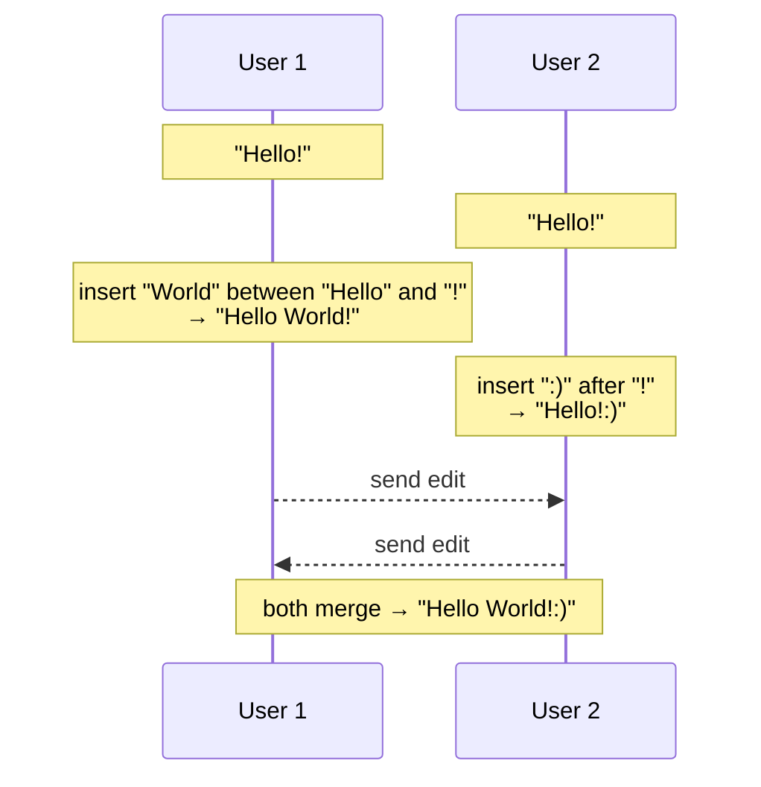
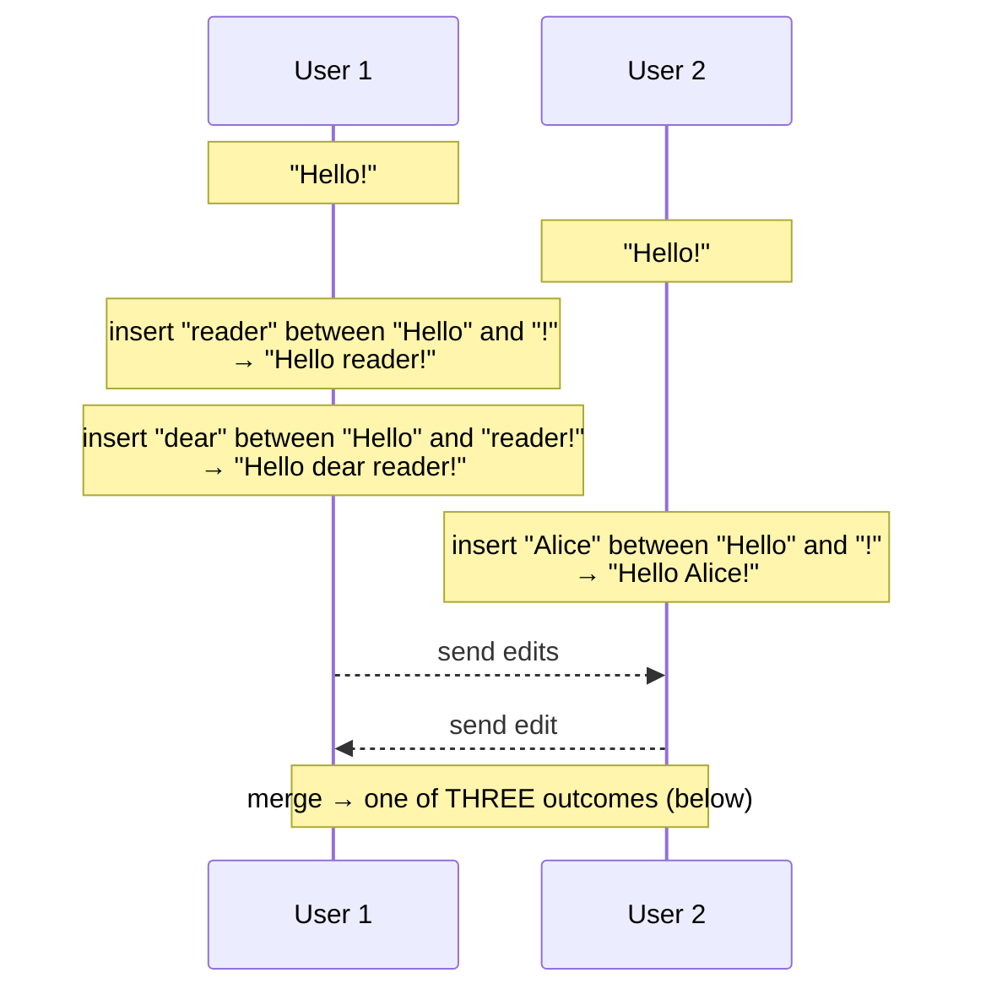

# Interleaving Anomalies in Collaborative Text Editors

> **Thesis.** Convergence is *necessary but not sufficient* for a usable collaborative editor. Several published sequence CRDTs — and even a leading formal *specification* — let two users' concurrently-typed runs of text be **shuffled together character-by-character** into an unreadable jumble. The anomaly is a property of the *specification*, not a bug, and can be ruled out by an explicit non-interleaving clause.

**Source.** Martin Kleppmann, Victor B. F. Gomes, Dominic P. Mulligan, Alastair R. Beresford. *Interleaving anomalies in collaborative text editors.* In *6th Workshop on Principles and Practice of Consistency for Distributed Data (PaPoC '19)*, March 25, 2019, Dresden, Germany. ACM. https://doi.org/10.1145/3301419.3323972

A short, sharply-focused workshop paper. Its value is not a big theorem but a precise *diagnosis*: it names a usability failure that "everyone in the CRDT community sort of knew about" but nobody had pinned down, shows exactly which algorithms suffer it and why, proves an existing spec is too weak, and patches both the spec and one algorithm (RGA).

---

## TL;DR

- **The setting.** Optimistic replication: every user edits a local copy immediately, edits propagate asynchronously, and a merge algorithm (a CRDT) must make all replicas converge. CRDTs guarantee **Strong Eventual Consistency** — replicas that saw the same edits end up in the same state.
- **The gap.** SEC only pins down *that* replicas agree, not *what* they agree on. You can "converge" to garbage. Convergence alone permits a document that stores all characters in lexicographic order — consistent, useless.
- **The anomaly.** When two users concurrently insert text **at the same position** (e.g. both type a word right after `Hello`), some algorithms randomly interleave the two insertions **per-character**: `Alice` + `Charlie` → `AlCiharcliee`. The relative order of the two runs is undefined, so the merge picks one arbitrarily *for each character*.
- **Who suffers it.**
  - **Logoot** and **LSEQ** exhibit the *full* anomaly — character-level shuffling — because they assign each character a position from a **dense identifier set** and the two users spread their identifiers independently across the same gap.
  - **Attiya et al.'s $\mathcal{A}_{\text{strong}}$ specification** *permits* the anomaly — so it is too weak to be a correct spec for text editing.
  - **RGA** avoids the full anomaly (proved in prior work) but suffers a **lesser anomaly**: whole concurrent insertions can be slotted *between* the two halves of another user's sequentially-typed text, if that text wasn't typed left-to-right.
- **The fixes.**
  - Add a **non-interleaving clause 1(d)** to $\mathcal{A}_{\text{strong}}$: concurrent insertion-sets at the same location must appear *all-before* or *all-after* each other, never interleaved.
  - Patch **RGA** by attaching to each insertion the set of *sibling* timestamps it observed, then ordering concurrent siblings by the **first point at which their editing histories diverged** — which groups an editing session's characters together.
- **Status.** The RGA fix and the conjecture that Treedoc/WOOT are anomaly-free are left as conjectures; formal proofs are future work.

---

## 1. Why convergence is not enough

### 1.1 The optimistic-replication backdrop

In collaborative software each user loads a *copy* (replica) of a shared document. Local edits apply immediately, then propagate asynchronously to other replicas (possibly through a server). Because several users edit at once, replicas **diverge** and must later be **merged**.

The benign case looks like this:


*(Figure 1. Solid lines = local state changes over time; dashed arrows = network communication. The merge is unambiguous: `World` clearly goes before `!`, `:)` clearly after it.)*

Conflict-free Replicated Data Types (CRDTs) automate such merges. A text CRDT typically models the document as a **list of characters**, with operations to insert or delete a character anywhere.

### 1.2 Strong Eventual Consistency, and its blind spot

CRDTs implement **strong eventual consistency**, defined by:

- **Eventual delivery.** An update applied at one correct replica is eventually applied at all correct replicas.
- **Convergence.** If the same set of updates has been applied (possibly in a *different order*) at two replicas, those replicas have **equivalent state**.
- **Termination.** Every method execution terminates.

Operation-based CRDTs get convergence by making **concurrent operations commute**: in Figure 1, User 1 applies `World` then `:)`, User 2 applies them in the opposite order, and commutativity forces the same final state.

> **Key gotcha:** Convergence fixes *that* replicas agree, but says nothing about *what* they agree on. The authors' sharpest line: a CRDT could satisfy convergence "by storing all inserted characters in lexicographical order" — perfectly consistent, completely unusable. **SEC is necessary but not sufficient.** A correct editor needs an additional consistency property the literature had overlooked.

That overlooked property is the absence of **interleaving**.

---

## 2. The interleaving anomaly

### 2.1 The symptom

Two users edit a document that reads `Hello!`. Concurrently:

- **User 1** inserts `Alice` between `Hello` and `!` → `Hello Alice!`
- **User 2** inserts `Charlie` between `Hello` and `!` → `Hello Charlie!`

Both insertions target the *same position*. After merge, a faulty algorithm produces:

```
User 1:  Hello!  ─▶  Hello Alice!    ─┐
                                       ├─▶  Hello AlCiharcliee!   ◀── garbled
User 2:  Hello!  ─▶  Hello Charlie!  ─┘
```
*(Figure 2.)* The two words are shuffled **character by character**:

```
       A l i c e            (User 1)
       C h a r l i e        (User 2)
   ─────────────────────
   →   A l C i h a r c l i e e        "AlCiharcliee"
```

The desirable outcomes would be `Alice Charlie` or `Charlie Alice` (whole words, in *some* agreed order). Instead the result is an unreadable jumble. With single words it is merely annoying; if the concurrent insertions are whole **paragraphs or sections**, the merge yields incomprehensible text that must be deleted and retyped — a serious data-usability failure.

> **Mental model:** interleaving is *fine-grained order indeterminacy*. The algorithm has decided the two runs share an interval but has **no rule for the relative order of their characters**, so it resolves the order *independently for every character* — and independent choices over a shared interval is exactly a random shuffle.

Note this does **not** happen in Figure 1: there the two insertions have a clear relative order (one before `!`, one after), so nothing is indeterminate.

### 2.2 The cause — dense identifier sets (Logoot, LSEQ)

Why does it happen in **Logoot** and **LSEQ**? Both assign every character a unique **position identifier** drawn from a *dense* totally-ordered set: for any two identifiers you can always mint a fresh distinct identifier strictly between them. Document order = identifier order. (In the real algorithms identifiers are *paths through a tree*; the paper uses rational numbers in $(0,1)$ as an equivalent, easier-to-read model.)

Take the interval between `Hello` and `!`. Say `o` has identifier $0.64$ and `!` has $0.95$. Each user must place their word's characters, in increasing order, somewhere inside $(0.64, 0.95)$ — **independently**, because neither knows about the other's concurrent insertion. So both *spread their characters across the whole gap*:

```
Position identifiers in the open interval (0.64, 0.95):

  base:    H     e     l     l     o                             !
           0.18  0.26  0.32  0.49  0.64                          0.95

  User 1   ......................... A     l     i     c     e   .....
           "Alice"                   0.69  0.71  0.74  0.79  0.86

  User 2   ........................ C    h    a    r    l    i    e ..
           "Charlie"                0.75 0.77 0.80 0.83 0.85 0.87 0.91

  merge = sort ALL identifiers ascending:

   H    e    l    l    o    A    l    C    i    h    a    r    c    l    i    e    e    !
  .18  .26  .32  .49  .64  .69  .71  .75  .74  .77  .80  .83  .85  .87  .86  .89  .91  .95
                            └User1┘  └─────────── interleaved ───────────┘
   →  "Hello AlCiharcliee!"
```
*(Figure 3.)* Each user assigned identifiers *correctly* and *in order*. But the **exact values are arbitrary**, and because the two users sampled the same interval $(0.64, 0.95)$ blindly, their identifiers end up interleaved on the number line. Sorting by identifier then interleaves the characters.

> **Design lesson:** density of the identifier space is the enemy here. The very property that makes Logoot/LSEQ flexible — "always room to insert between any two characters" — means two concurrent insertions into the *same* gap have no defined grouping. The authors confirmed the anomaly occurs in practice by testing open-source Logoot and LSEQ implementations.

### 2.3 Which algorithms are affected

| Algorithm | Identifier / structure | Full character-level interleaving? | Lesser interleaving? |
|---|---|---|---|
| **Logoot** | dense identifiers (tree paths) | **Yes** | — |
| **LSEQ** | dense identifiers (adaptive tree) | **Yes** | — |
| **RGA** | per-op timestamp, anchored to predecessor | **No** (proved in prior work) | **Yes** (Section 3) |
| **Treedoc** | binary-tree positions | conjectured **No** | conjectured **No** |
| **WOOT** | predecessor/successor constraints | conjectured **No** | conjectured **No** |
| $\mathcal{A}_{\text{strong}}$ spec | abstract list order | **permits it** (Section 2.4) | — |

The Treedoc/WOOT entries are explicitly stated as conjectures, with rigorous proof "left for future work."

### 2.4 The anomaly lives in the *specification* (Attiya et al.)

This is the paper's most important structural point: interleaving is not merely an implementation bug, it is **permitted by the leading formal specification** of collaborative text editing, $\mathcal{A}_{\text{strong}}$ (Attiya et al., PODC 2016). So an implementation can be *provably correct against the spec* and still garble text. The spec is too weak.

$\mathcal{A}_{\text{strong}}$ says: an abstract execution $A = (H, \text{vis})$ belongs to the strong list specification iff there exists a **list order** relation $\text{lo} \subseteq \text{elems}(A) \times \text{elems}(A)$ such that:

**(1)** Each event $e = \text{do}(op, w) \in H$ returns a sequence $w = a_0 \ldots a_{n-1}$ (with each $a_i \in \text{elems}(A)$) where:

- **(a) right elements:** $w$ contains exactly the elements visible to $e$ that were inserted but not deleted:
$$\forall a:\ a \in w \iff \big(\text{do}(\text{ins}(a,\_),\_) \xrightarrow{\text{vis}} e\big) \wedge \neg\big(\text{do}(\text{del}(a),\_) \xrightarrow{\text{vis}} e\big)$$
- **(b) consistent order:** the order of elements respects the list order:
$$\forall i,j:\ (i<j) \implies (a_i, a_j) \in \text{lo}$$
- **(c) right position:** an element is inserted at the position requested: if $op = \text{ins}(a, k)$ then $a = a_{\min\{k,\, n-1\}}$.

**(2)** The list order $\text{lo}$ is **transitive, irreflexive, and total**, hence determines the order of *all* insert operations in the execution.

> **The flaw:** the list order $\text{lo}$ here plays exactly the role the position identifiers play in Figure 3. Because $\text{lo}$ is only required to be *some* total order, it is free to place `Alice` and `Charlie` characters in any interleaved order. Totality is satisfied by the jumble. So the spec *permits* interleaving — it has no clause forbidding it.

---

## 3. Ruling interleaving out — the new clause 1(d)

The fix is to add one clause to $\mathcal{A}_{\text{strong}}$ that explicitly forbids interleaving of concurrent insertion sets at the same location. Clauses 1(a)–(c) and 2 stay; we add:

**(1)(d) Concurrent insertions are not interleaved.** For any two sets of insertions visible to $e$,

$$X = \{\, x \mid \exists a:\ x = \text{do}(\text{ins}(a,\_),\_) \wedge x \xrightarrow{\text{vis}} e \,\}$$
$$Y = \{\, y \mid \exists a:\ y = \text{do}(\text{ins}(a,\_),\_) \wedge y \xrightarrow{\text{vis}} e \,\}$$

such that **all operations in $X$ and $Y$ are pairwise concurrent**:

$$\forall x \in X:\ \forall y \in Y:\ \neg(x \xrightarrow{\text{vis}} y) \wedge \neg(y \xrightarrow{\text{vis}} x)$$

**if** the two sets are inserted at the *same location* — i.e. they exactly fill some contiguous gap $a_i \ldots a_j$ in the document,

$$\exists i,j:\ \{\, a_k \mid i < k < j \,\} = \{\, a \mid \text{do}(\text{ins}(a,\_),\_) \in X \cup Y \,\}$$

**then** one of the two runs lies entirely before the other:

$$\forall i,j:\ \text{do}(\text{ins}(a_i,\_),\_) \in X \wedge \text{do}(\text{ins}(a_j,\_),\_) \in Y \implies i < j$$
$$\textbf{or}\quad \forall i,j:\ \text{do}(\text{ins}(a_i,\_),\_) \in X \wedge \text{do}(\text{ins}(a_j,\_),\_) \in Y \implies j < i.$$

In words: **either all of $X$ appears before all of $Y$, or vice versa — never interleaved.**

```
ALLOWED                          FORBIDDEN by 1(d)
  Hello AliceCharlie!              Hello AlCiharcliee!
  Hello CharlieAlice!              Hello ChAalriclee!   (any per-char mix)
  └ X before Y ┘                   └─── shuffled ───┘
  └ Y before X ┘
```

Clause **1(b)** (consistent order) still forces *all replicas to pick the same one* of the two allowed orders — so this adds determinacy of grouping on top of determinacy of order. The clause is carefully scoped: it only constrains *concurrent* insertions *at the same location*; sequentially-related or differently-located insertions are unaffected.

> **Why a spec-level fix matters:** because the anomaly was permitted by the abstract spec, no amount of implementation cleverness "below" the spec is obligated to avoid it. Strengthening the spec makes non-interleaving a *required* property that conforming algorithms must now meet — turning a folklore concern into a checkable correctness condition.

---

## 4. The *lesser* interleaving anomaly (RGA)

Prior work by the same authors mechanically proved that **RGA** does *not* suffer the full character-level anomaly — provided insertions are made **in sequential order** (you type `Alice` left-to-right: space, `A`, `l`, `i`, `c`, `e`). Under sequential typing, RGA's only two merge outcomes for the Figure 2 scenario are `Hello AliceCharlie!` or `Hello CharlieAlice!`, with no mixture. Good.

But RGA does **not** satisfy the new clause 1(d), because it permits a weaker anomaly when insertions are **not** sequential.

### 4.1 The scenario


*(Figure 4.)* User 1 types `reader`, then moves the cursor back and types `dear` in front of it (so the document reads `dear reader`) — a perfectly natural editing pattern, but **not** left-to-right. User 2 concurrently inserts `Alice`.

The merge admits **three** outcomes:

1. `Hello dear reader Alice!`
2. `Hello dear Alice reader!`   ← `Alice` slotted *between* `dear` and `reader`
3. `Hello Alice dear reader!`

Outcome (2) **interleaves** User 1's two insertions (`dear` and `reader`) with User 2's insertion (`Alice`). This is the *lesser* anomaly: not a per-character shuffle, but a whole concurrent insertion wedged between the two halves of another user's text.

### 4.2 Why — anchoring and the insertion tree

In RGA, every inserted character is **anchored to the existing character that immediately precedes it at insertion time**. In Figure 4 both the first character of `reader` and the first character of `dear` were typed immediately after `Hello`'s last `o` — so **both are anchored to `o`**. User 2's `Alice` is *also* anchored to `o`. Three insertions, one anchor.

The anchoring relation forms a **timestamped insertion tree** (Attiya et al.) / **causal tree** (Grishchenko): each node is a character, its parent is the predecessor it was anchored to. The document is a **depth-first pre-order traversal**, visiting siblings in **descending timestamp order**.

```
Insertion tree for Figure 4   (siblings sorted by descending timestamp t₄ > t₃ > t₂ > t₁)

                        ┌──────────────┐
                        │ head         │
                        └──────┬───────┘
                  H — e — l — l — o   (t₀)
                               │
        ┌──────────────┬───────┴───────┬──────────────┐
        │              │               │              │
    "dear" (t₄)   "Alice" (t₃)   "reader" (t₁)      "!" (t₁')
    d-e-a-r        A-l-i-c-e      r-e-a-d-e-r
        (the four children of "o", visited high-timestamp first)
```

`dear` (timestamp $t_4$) and `reader` (timestamp $t_1$) come from the same user, so their order is fixed: $t_4 > t_1$ ⇒ `dear` before `reader`. But `Alice`'s timestamp $t_3$ is **concurrent** with both and may fall *anywhere* among the siblings of `o`. If $t_4 > t_3 > t_1$, the traversal yields `dear · Alice · reader` — outcome (2), the interleaving.

> **Key gotcha:** RGA groups characters that share an anchor and were typed sequentially, but two insertions by the *same* user that share an anchor (because the user moved the cursor backwards) are *not* automatically grouped — a concurrent third insertion can land between them. **The worst case:** if a user types a whole document *back-to-front*, every character anchors to `head`, ordered only by timestamp, and arbitrary character-level interleaving returns. Unlikely in practice, but a formal consistency model must account for it.

---

## 5. Fixing RGA — observed-siblings and divergence-point ordering

The patch keeps RGA's structure but changes how concurrent siblings (insertions with the same reference character) are **ordered**, so that an entire editing session's characters are grouped.

### 5.1 Augmented operation representation

Attiya et al. represent an RGA insertion as a triple $(a, t, r)$:

| Field | Meaning |
|---|---|
| $a$ | the character being inserted |
| $t$ | the timestamp (unique logical id) of this operation |
| $r$ | the timestamp of the **reference character** — the predecessor at insertion time (or `head`) |

(Deletions are tombstones that don't affect order, so they're ignored here.) The fix extends each insertion to a **4-tuple** $(a, t, r, e)$, where the new field is:

> $e$ = the set of timestamps of **all insertion operations with the same reference character $r$** that existed **at the time this insertion was performed** (not including $t$ itself).

That is, $e$ records the **siblings you had already observed** when you inserted. Formally, to insert character $a$ after reference $r$ into the current set $I$ of insertions:

$$I' = I \cup \big\{\, (a,\, t,\, r,\, \{\, t' \mid \exists a', e':\ (a', t', r, e') \in I \,\}) \,\big\}$$

**Worked example (Figure 5).** Let `Hello`'s last character have timestamp $t_0$. The insertion set becomes:

| character | tuple $(a, t, r, e)$ | reads as |
|---|---|---|
| `!` | $(\texttt{!},\ t_1,\ t_0,\ \varnothing)$ | first child of $t_0$, saw no siblings |
| `r` (of `reader`) | $(\texttt{r},\ t_2,\ t_0,\ \{t_1\})$ | saw `!` |
| `A` (of `Alice`) | $(\texttt{A},\ t_3,\ t_0,\ \{t_1\})$ | concurrent: also only saw `!` |
| `d` (of `dear`) | $(\texttt{d},\ t_4,\ t_0,\ \{t_1, t_2\})$ | saw `!` and `reader` |

Notice `dear`'s $e = \{t_1, t_2\}$ **includes `reader`** ($t_2$) — capturing that User 1 typed `dear` *after* and *aware of* `reader`. `Alice`'s $e = \{t_1\}$ does **not** include `reader` or `dear` — User 2 never saw them.

### 5.2 The ordering of concurrent siblings

We need a total order on insertions sharing reference $r$. Take two of them:
$$\text{ins}_1 = (a_1, t_1, r, e_1), \qquad \text{ins}_2 = (a_2, t_2, r, e_2).$$

**Case A — causally related.** If $\text{ins}_1$ happened before $\text{ins}_2$ then $t_1 \in e_2$ (the later op observed the earlier one), and vice versa. Order by happens-before:

$$\text{ins}_1 < \text{ins}_2 \quad\text{if } t_1 \in e_2, \qquad\qquad \text{ins}_2 < \text{ins}_1 \quad\text{if } t_2 \in e_1.$$

**Case B — concurrent.** Otherwise $\text{ins}_1 \parallel \text{ins}_2$, so $t_1 \notin e_2$ and $t_2 \notin e_1$. The key trick: compute, for each operation, the **first sibling at which the two editing histories diverged**. Form the symmetric-ish difference sets

$$\{t_1\} \cup (e_1 \setminus e_2) \neq \varnothing, \qquad \{t_2\} \cup (e_2 \setminus e_1) \neq \varnothing,$$

each non-empty, and (because timestamps are totally ordered) each having a unique minimal element:

$$m_1 = \min\big(\{t_1\} \cup (e_1 \setminus e_2)\big), \qquad m_2 = \min\big(\{t_2\} \cup (e_2 \setminus e_1)\big).$$

$m_1$ and $m_2$ are the **first operations at which the editing histories of $\text{ins}_1$ and $\text{ins}_2$ diverged**. It follows that $m_1 \neq m_2$, so order the concurrent insertions by them:

$$\text{ins}_1 < \text{ins}_2 \quad\text{if } m_1 < m_2, \qquad\qquad \text{ins}_2 < \text{ins}_1 \quad\text{if } m_2 < m_1.$$

```text
# Total order on two insertions ins1=(a1,t1,r,e1), ins2=(a2,t2,r,e2)
# with the same reference character r:

if t1 in e2:            order = ins1 < ins2          # causal: ins1 happened-before ins2
elif t2 in e1:          order = ins2 < ins1          # causal: ins2 happened-before ins1
else:                                                # concurrent
    m1 = min({t1} ∪ (e1 \ e2))                       # first divergence of ins1's history
    m2 = min({t2} ∪ (e2 \ e1))                       # first divergence of ins2's history
    order = (ins1 < ins2) if m1 < m2 else (ins2 < ins1)
```

### 5.3 Why it groups editing sessions

The divergence-point ordering has the property that **all operations from one editing session are grouped**: they are either all less than, or all greater than, the operations of a different concurrent session. Intuition: two characters typed in the same continuous session share a long prefix of observed siblings, so their histories *diverge from a competing session at the same earlier point* $m$ — they sort to the same side of that competitor. Hence characters from one session stay contiguous in the final document, and inter-session interleaving is prevented.

Applied to Figure 5: `reader` and `dear` (User 1's session) share their divergence point against `Alice`, so they sort together — only `dear · reader · Alice` or `Alice · dear · reader` survive; the wedged outcome `dear · Alice · reader` is gone.

> **Design lesson:** the fix turns "order by raw timestamp" (which only knows *when*, giving arbitrary concurrent placement) into "order by where your histories split" (which knows *what you'd seen*, giving session-coherent placement). Recording observed siblings is the same observed-state idea that powers observed-remove sets — here repurposed for *ordering* instead of *deletion*.

### 5.4 Cost and status

- **Cost.** Each operation now carries the extra timestamp set $e$, increasing memory and network bandwidth. But $e$ holds only the *siblings of one reference character*, and there are normally few insertions at the same anchor regardless of document length — so the sets are expected to be **small**, independent of document size.
- **Status.** The authors **conjecture** this construction yields an interleaving-free RGA satisfying clause 1(d); a formal proof is left for future work.

---

## 6. Conclusions, limitations, and lineage

### 6.1 What the paper establishes

- A real, observed-in-practice usability anomaly — concurrent text shuffled character-by-character — that **convergence/SEC does not rule out**.
- A precise *cause*: dense identifier sets (Logoot, LSEQ) let concurrent insertions into the same gap interleave.
- That the anomaly is **specification-level**: Attiya et al.'s $\mathcal{A}_{\text{strong}}$ permits it, so it's too weak.
- A *lesser* variant in RGA (whole-insertion interleaving when text isn't typed left-to-right).
- A **spec fix** (clause 1(d)) and a **conjectured algorithm fix** for RGA.

### 6.2 Limitations and open ends

- **Conjectures, not theorems.** The RGA fix's correctness, and the claim that Treedoc and WOOT avoid both anomalies, are conjectures; rigorous proofs are future work.
- **Worst-case RGA remains.** Even the *unfixed* analysis notes that back-to-front typing collapses RGA toward full character interleaving — a corner case any formal model must handle.
- **The anomaly was folklore.** The authors note it had been independently spotted (in their own draft, by Sun et al., and by a Stack Overflow user) and was "known in the community folklore," but no prior *published* work clearly explained or solved it. This paper's contribution is largely the clean diagnosis and the spec patch.
- **Scope.** The treatment is for *text* (linear sequences of characters); interleaving in richer collaborative structures (trees, rich text, tables) is not addressed.

### 6.3 The one-paragraph distillation

A collaborative text CRDT must do more than converge — it must converge to something *readable*. The failure mode is **interleaving**: when two users type at the same spot, an algorithm with no rule for the relative order of their runs resolves order per-character and shuffles them. Dense-identifier CRDTs (Logoot, LSEQ) do this badly; RGA does a milder version when text isn't typed left-to-right; and the leading abstract spec permits it. The cure is to *demand grouping*: at the spec level, require concurrent same-location insertions to appear all-before or all-after (clause 1(d)); at the algorithm level, order concurrent insertions not by raw timestamp but by the **first point their editing histories diverged**, which keeps each typing session's characters together.

---

## Glossary & notation

| Term | Meaning |
|---|---|
| **Optimistic replication** | each replica edits locally and immediately, propagating asynchronously; replicas diverge then merge. |
| **CRDT** | Conflict-free Replicated Data Type; here, a data type for text that merges concurrent edits automatically. |
| **SEC** | Strong Eventual Consistency: eventual delivery + convergence + termination. |
| **Convergence** | replicas that applied the same update set reach equivalent state. *Necessary but not sufficient* for usability. |
| **Interleaving anomaly** | concurrent same-position insertions shuffled character-by-character (`Alice`+`Charlie` → `AlCiharcliee`). |
| **Lesser interleaving anomaly** | a *whole* concurrent insertion wedged between two halves of another user's non-sequentially-typed run (RGA). |
| **Dense identifier set** | a totally-ordered set where a fresh identifier always exists strictly between any two; used by Logoot/LSEQ. |
| $\mathcal{A}_{\text{strong}}$ | Attiya et al.'s strong list specification of collaborative text editing; shown too weak (permits interleaving). |
| **list order** $\text{lo}$ | the transitive, irreflexive, *total* order over elements in $\mathcal{A}_{\text{strong}}$; the abstract analogue of position identifiers. |
| **clause 1(d)** | the paper's added non-interleaving clause: concurrent same-location insertion sets must be all-before or all-after, never mixed. |
| $\xrightarrow{\text{vis}}$ | the visibility (happens-before) relation between operations. |
| **RGA** | Replicated Growable Array; a sequence CRDT anchoring each insertion to its predecessor character. |
| **reference character** $r$ | the predecessor an RGA insertion is anchored to (or `head`). |
| **insertion tree / causal tree** | the tree of anchoring relations; document = depth-first pre-order, siblings in descending timestamp order. |
| **timestamp** $t$ | a unique logical id per operation (Lamport timestamp or similar); totally ordered. |
| **observed-siblings set** $e$ | (RGA fix) the set of same-anchor insertion timestamps a given insertion had seen when it was performed. |
| **divergence point** $m_i$ | $\min(\{t_i\} \cup (e_i \setminus e_j))$ — the first sibling at which two concurrent insertions' histories split; used to order them. |
| **tombstone** | a deleted character retained as a position marker (deletions don't affect order). |
