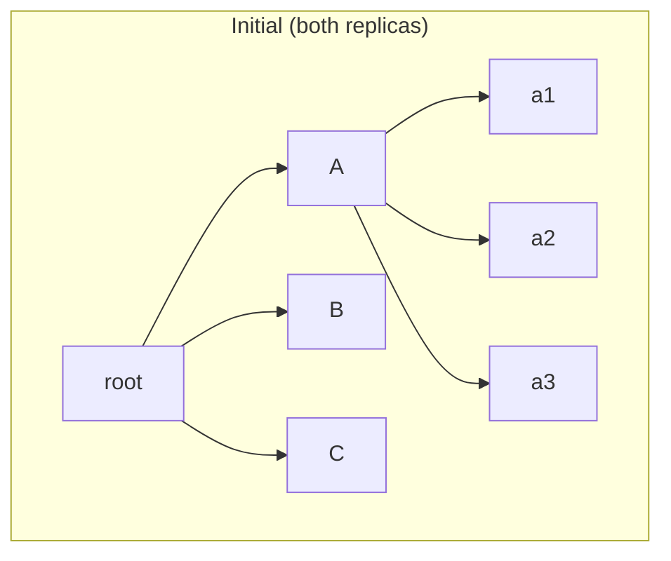
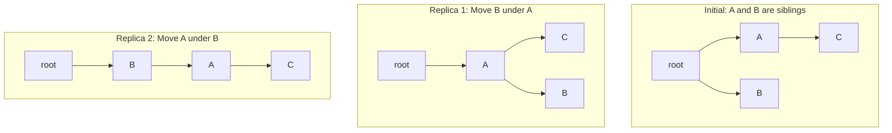
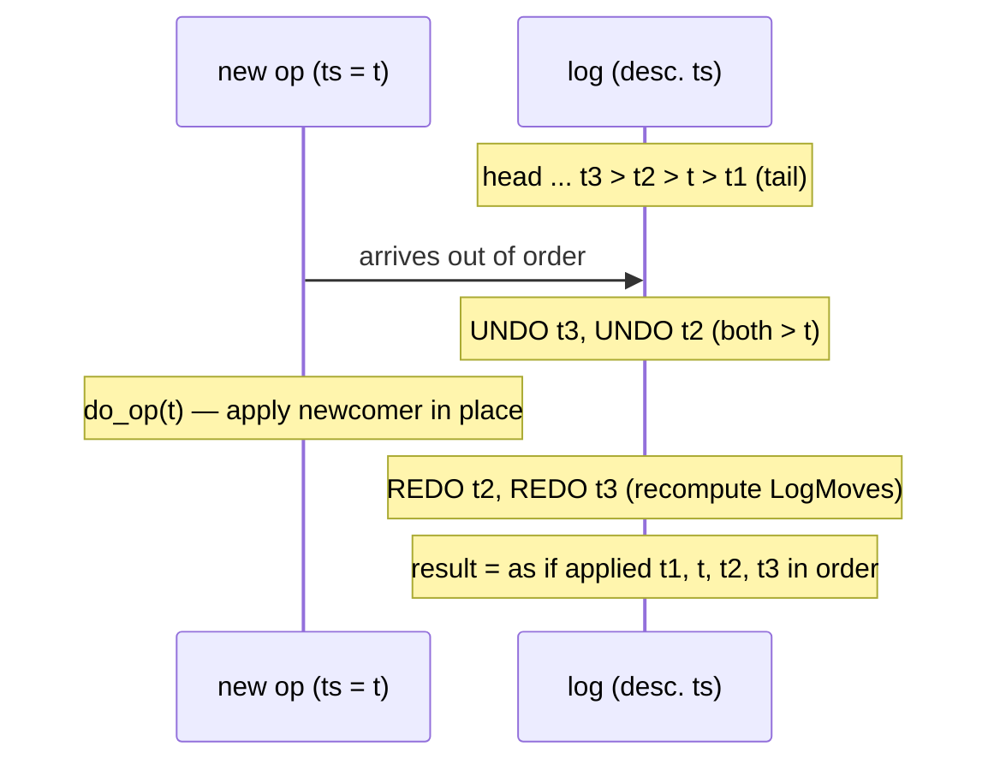

# A Highly-Available Move Operation for Replicated Trees

> **Thesis.** A `move` on a replicated tree can be made conflict-free *without any coordination* by recording every move in a per-replica **operation log ordered by timestamp**, and, on each incoming operation, **undoing** the log entries with a higher timestamp, **applying** the new one (rejecting it if it would create a cycle, by a simple is-ancestor check), then **redoing** the undone entries. Replicas reach the state they would have reached had all moves executed in timestamp order — so concurrent moves can neither duplicate, lose, nor tangle nodes into cycles.

**Source.** Martin Kleppmann, Dominic P. Mulligan, Victor B. F. Gomes, Alastair R. Beresford. *A highly-available move operation for replicated trees.* IEEE Transactions on Parallel and Distributed Systems (TPDS), 2022 (vol. 33, no. 7). Mechanised in Isabelle/HOL; source at `github.com/trvedata/move-op`.

This paper does one hard thing precisely: it refutes a published impossibility claim ("no filesystem can support an unsynchronised move without anomalies such as loss or duplication") by exhibiting a CRDT that does exactly that — and then *machine-checks* the proof.

---

## TL;DR

- **The problem.** Trees (filesystems, XML/JSON docs) need a `move`-subtree operation. Under optimistic replication, two replicas can each perform an *individually valid* move that, when merged, **duplicates** the subtree, turns the tree into a **DAG**, or — worst — forms a **cycle** detached from the root. The authors reproduce these as real bugs in **Dropbox** (duplication) and **Google Drive** (a permanent "unknown error" sync-stall).
- **Why naive fixes fail.** Implementing move as *delete-then-recreate* duplicates concurrently-edited subtrees. A local "would this create a cycle?" check is **insufficient**, because two concurrent moves can each pass the check locally yet jointly form a cycle (proved earlier by Najafzadeh et al. with the CISE tool).
- **The mechanism.** Each replica keeps `(log, tree)`. The log is a list of `LogMove` records in **descending timestamp order**, each carrying the *old* parent/metadata of the moved node so the move can be inverted. Applying an operation with timestamp $t$ uses **undo–do–redo**: pop and undo every logged op with timestamp $> t$, `do_op` the newcomer, then redo the popped ops. Net effect: the tree is *as if* all ops ran in increasing-timestamp order.
- **Cycle prevention.** `do_op` ignores a move if the moved node `c` is an **ancestor of** the new parent `newp` (or `c = newp`). Because undo–do–redo forces timestamp order, the *lower*-timestamped of two cycle-forming moves wins; the higher one is detected as cyclic and skipped — but **kept in the log**, since a later lower-timestamped op could make it safe again.
- **One operation to rule them all.** Create and delete are *not* separate operations: creating = moving a fresh ID under a parent; deleting = moving a node under a designated **trash** node. This shrinks the algorithm and its proofs.
- **Guarantees, machine-checked.** Isabelle/HOL proofs of three invariants — **unique parent**, **acyclic**, and **convergence** (concurrent ops *commute* ⇒ Strong Eventual Consistency) — over *unbounded* executions and *any* number of replicas. ~2,500 lines of proof on top of 59 lines of definitions.
- **Cost & evaluation.** Per-op worst case $O(n d)$ ($n$ = ops to undo/redo, $d$ = tree depth). Geo-replicated across 3 continents: local ops in **1–2 µs** — five orders of magnitude lower latency than leader-based replication — at the price of ~4× lower throughput than a leader.

---

## 1. The setting: why `move` is the hard operation

Many applications are trees: POSIX filesystems (directories = branch nodes, files = leaves), XML/JSON documents (rich text, vector graphics, CAD). All of them need to **move a node** — and all of its children — to a new parent. Renaming is a move that changes only the metadata (filename); grouping objects, promoting a paragraph to a bullet, dragging a directory: all moves.

Replicate this tree across devices and demand **offline work**, and you have committed to **optimistic replication**: any replica accepts updates locally without waiting for anyone, gossiping them later. By the CAP theorem, that buys high availability and partition-tolerance at the cost of strong consistency — replicas temporarily diverge and must *reconcile*. The goal is **Strong Eventual Consistency (SEC)**: any two replicas that have delivered the same set of operations are in the same state, with no manual conflict resolution.

> **Mental model:** insertion and deletion in a tree are "local" — they touch one neighbourhood. `move` is global: it asserts a relationship between *two* arbitrary regions (source and destination). Two concurrent moves can make contradictory assertions about overlapping regions, and that is where every anomaly comes from.

### Network model

- Each replica is a state machine; an operation transitions one state to the next. No shared memory.
- An operation is applied locally *immediately*, then sent asynchronously to all replicas and applied there with the *same* algorithm.
- The network may **arbitrarily delay or reorder** messages; an underlying layer **retransmits losses and suppresses duplicates** (so: reliable, but *not* causally ordered — any order is allowed).
- **No central server, no consensus.** Any number of replicas may crash; any non-crashed subset keeps working.

> **Key gotcha:** unlike many op-based CRDTs, this algorithm does **not** assume causally-ordered broadcast. It tolerates *arbitrary* delivery order, which is what makes it suitable for peer-to-peer sync. The undo–do–redo machinery is precisely what earns that freedom.

---

## 2. The anatomy of failure

### 2.1 Concurrent moves of the *same* node → duplication or a DAG

Replica 1 moves `A` under `B`; concurrently replica 2 moves the **same** `A` under `C`. After they sync, what is the merged tree?



```text
Replica 1 did:  Move A under B          Replica 2 did:  Move A under C

   (a) DELETE-RECREATE          (b) shared node          (c) / (d) ONE WINS
       → DUPLICATION                → a DAG, not a tree      → a valid tree

   root                         root                     root
   ├─ B                         ├─ B ─┐                  ├─ B ── A          (c)
   │  └─ A   (a1 a2 a3)         │     A  (a1 a2 a3)      │       (a1 a2 a3)
   └─ C                         └─ C ─┘                  └─ C
      └─ A'  (a1' a2' a3')      (two parents for A!)
         ^^ a COPY                                       root
                                                         ├─ B               (d)
                                                         └─ C ── A
                                                                 (a1 a2 a3)
```

- **(a)** delete-then-recreate independently rebuilds the subtree in each destination ⇒ **two divergent copies**. Subsequent edits land on only one copy; two users who think they collaborate are in fact editing different files. **Dropbox does this.**
- **(b)** letting both destinations point at the same `A` yields a **DAG**, which POSIX forbids (no hardlinks to directories).
- **(c)/(d)** the *only* reasonable outcomes: the subtree lands in **exactly one** destination. Which one is arbitrary — pick by **timestamp** (last-writer-wins à la Thomas's write rule; the timestamp can be a Lamport timestamp, not a wall clock). **Google Drive does this** (correctly, for this case).

### 2.2 Two concurrent moves form a CYCLE — the classic example

This is the dangerous one. `A` and `B` start as siblings. Replica 1 moves `B` under `A`; concurrently replica 2 moves `A` under `B`.



Each move is **safe in isolation** (in `init`, neither `A` nor `B` is an ancestor of the other). But naively merging both assertions — "`B`'s parent is `A`" **and** "`A`'s parent is `B`" — produces:

```text
   (a) CYCLE, detached from root        (b) DUPLICATION
                                        root
       root      (A and B float free,   ├─ A ── B ── C
                  unreachable!)         └─ B'── A'── C'
        A ⇄ B                              ^^ whole subtree cloned
        │
        C        ← orphaned

   (c) Replica 1 wins                   (d) Replica 2 wins
   root                                 root
   └─ A                                 └─ B
      ├─ C                                 └─ A
      └─ B                                    └─ C
```

- **(a)** the cycle: `A` is `B`'s parent and `B` is `A`'s parent. The component detaches from `root` and silently disappears from the application. A model checker found exactly this in Windows Server's DFS-R; **Google Drive** hit it as a permanent **"unknown error"** that froze sync until manual repair.
- **(b)** duplication again — undesirable as in §2.1. **Dropbox does this.**
- **(c)/(d)** the only acceptable outcomes: apply one move, ignore the other, chosen by timestamp.

> **Design lesson:** "have each replica reject moves that would create a cycle" is **not enough**. Cycle-creation is a property of the *combined* history, not of any single operation against any single local state. Najafzadeh et al. proved this with the CISE tool and concluded an unsynchronised move was impossible without loss/duplication. This paper's whole contribution is showing that a *global timestamp ordering*, reconstructed lazily via undo/redo, dissolves the problem.

### 2.3 The impossibility claim, refuted

| Prior approach | How it handles the §2.2 race | Cost |
|---|---|---|
| Najafzadeh et al. — duplicate nodes | outcome (b) | loses the "single shared subtree" semantics |
| Najafzadeh et al. — locking protocol | acquire a lock before moving | **not highly available**: must wait for a lock server / synchronous round-trip |
| Molli et al. (OT) — total-order broadcast | impose a global order via a leader | needs a leader / consensus; no offline P2P |
| Figma | central server prevents cycles | objects may temporarily vanish during sync; not coordination-free |
| **This paper** | timestamp-ordered op log + undo/do/redo + ancestor check | **no coordination**; never duplicates, loses, or cycles |

---

## 3. The data model: one operation, a tree, and a log

### 3.1 The tree as a relation

The tree is a **set of triples** $\{(p, m, c)\}$ where $(p,m,c)$ means "node $c$ is a child of parent $p$, with metadata $m$." Types are generic: node IDs `'n` must be globally unique (e.g. UUIDs); timestamps `'t` must be globally unique and **totally ordered** (e.g. Lamport timestamps); metadata `'m` is arbitrary (e.g. a filename).

Moving child `c` to parent `p` with metadata `m` is a one-line relational rewrite — *remove whatever parent $c$ has, then add the new edge*:

$$
\text{tree}' \;=\; \{\,(p', m', c') \in \text{tree} \;\mid\; c' \neq c\,\} \;\cup\; \{(p, m, c)\}
$$

This automatically enforces **at most one parent per child**: any pre-existing edge into `c` is wiped before the new one is added. The tree is really a *forest* — multiple roots are allowed, which is how the **trash** node lives outside the main tree.

### 3.2 The single operation type

There is exactly one operation:

$$
\textsf{Move}\;\; t\;\; p\;\; m\;\; c
$$

"at time $t$, move node $c$ to be a child of parent $p$ with metadata $m$." Note what it does **not** say: it never names $c$'s *old* location. The algorithm removes `c` from wherever it currently is. If `c` does not yet exist, it is **created** as a child of `p`.

That single omission — "new location only, never old location" — is what makes concurrent same-node moves (§2.1) well-defined under sequential replay: replaying `Move A under B` then `Move A under C` simply leaves `A` under `C`, no matter where `A` was.

| Move encodes... | ...by |
|---|---|
| **create** node `c` | `Move t p m c` with a fresh ID `c` (implicitly created under `p`) |
| **delete** node `c` | `Move t TRASH m c` — move it under a designated trash node outside the tree |
| **rename** `c` | `Move t p m' c` — same parent `p`, new metadata `m'` (filename) |
| **move** subtree | `Move t p m c` — children of `c` follow automatically |

### 3.3 Replica state = (log, tree)

A replica stores a pair `(log, tree)`. The `tree` is the triple-set above. The `log` is a list of **`LogMove`** records held in **descending timestamp order** (greatest at the head). A `LogMove` is a `Move` augmented with the *inverse information* needed to undo it:

$$
\textsf{LogMove}\;\; t\;\; \mathit{oldp}\;\; \mathit{newp}\;\; m\;\; c
$$

where `oldp : ('n × 'm) option` records `c`'s parent-and-metadata **before** the move:

- `oldp = None` if `c` did not exist before the move (the move *created* it);
- `oldp = Some (p', m')` if `c` was previously a child of `p'` with metadata `m'`.

`get_parent tree c` computes this `oldp` by looking up the (unique) triple whose child is `c`.

> **Mental model:** the log is an *undo journal*, exactly like write-ahead logging in databases or Jefferson's Time Warp in distributed simulation. Each `LogMove` is a reversible transaction: `oldp` is the "before image" you need to roll back.

---

## 4. The algorithm: undo–do–redo

### 4.1 `do_op` — apply one move, with the cycle guard

`do_op` takes `(Move t newp m c, tree)` and returns `(LogMove, tree')`. It builds the `LogMove` (capturing `oldp = get_parent tree c`), then **checks for a cycle**:

```text
do_op (Move t newp m c, tree) =
    ( LogMove t (get_parent tree c) newp m c ,           -- log entry, with undo info
      if  ancestor(tree, c, newp)  OR  c = newp           -- would this create a cycle?
      then  tree                                          -- YES: ignore the move
      else  { (p',m',c') in tree | c' != c } ∪ {(newp,m,c)} )  -- NO: do the rewrite
```

The guard is the **is-ancestor check**. `ancestor tree a d` is the transitive closure of the parent→child relation:

$$
\frac{(p,m,c)\in\text{tree}}{\textsf{ancestor}(tree, p, c)}
\qquad
\frac{(p,m,c)\in\text{tree}\quad \textsf{ancestor}(tree, a, p)}{\textsf{ancestor}(tree, a, c)}
$$

If the moved node `c` is already an ancestor of its proposed new parent `newp`, then attaching `c` under `newp` would close a loop — so `do_op` **leaves the tree untouched** (the move is ignored) but still emits a `LogMove` (so the attempt is remembered).

> **Key gotcha:** `do_op` returns a `LogMove` *even when it ignores the move*. The ignored operation must stay in the log, because its safety is **not permanent** — see §4.4.

### 4.2 `undo_op` and `redo_op`

`undo_op` inverts a `LogMove` using its `oldp`:

```text
undo_op (LogMove t None         newp m c, tree) =        -- it had created c
    { (p',m',c') in tree | c' != c }                     -- so just remove c

undo_op (LogMove t (Some(oldp,oldm)) newp m c, tree) =   -- it had moved c
    { (p',m',c') in tree | c' != c } ∪ {(oldp, oldm, c)}  -- restore old parent
```

`redo_op` re-applies a previously-undone op by feeding it back through `do_op` — crucially **recomputing** the `LogMove`, because the surrounding tree may now differ (so `oldp`, and even whether the op is safe, can change):

```text
redo_op (LogMove t p m c) (ops, tree) =
    let (op2, tree2) = do_op (Move t p m c, tree)
    in  (op2 # ops, tree2)
```

### 4.3 `apply_op` — the lazy timestamp-sort

This is the heart. To apply a new operation `op1` with timestamp `t` against state `(log, tree)`:

```text
apply_op op1 ([], tree) =                                  -- empty log: just do it
    let (op2, tree2) = do_op (op1, tree) in ([op2], tree2)

apply_op op1 (logop # ops, tree) =
    if  move_time(op1) < log_time(logop)                   -- newcomer is OLDER than head
    then  redo_op  logop  ( apply_op op1 (ops, undo_op(logop, tree)) )
          --  UNDO the head, recurse to insert op1 deeper, then REDO the head
    else  let (op2, tree2) = do_op (op1, tree)             -- newcomer is newest: do it
          in (op2 # logop # ops, tree2)                    -- push onto head of log
```

The recursion walks down the descending-timestamp log; for every entry with a *greater* timestamp than the newcomer it **undoes** that entry, then after inserting the newcomer in its rightful place it **redoes** the entry on the way back up. The invariant maintained: *the log is always in descending timestamp order, and the tree is exactly what you'd get by `do_op`-ing every op in ascending timestamp order.*



> **Mental model:** `apply_op` is **insertion sort that drags the tree along with it.** Receiving an op means splicing it into the timestamp-ordered log; undo/redo keeps the materialised tree consistent with that order at every step. Because a *local* op always carries the greatest timestamp the replica has seen (Lamport-clock property), the common case hits the `else` branch — pure `do_op`, no undo/redo — which is why local ops are near-constant time (§7).

`apply_ops` just folds `apply_op` over a list starting from `([], {})`.

### 4.4 Conflict resolution falls out for free

Because the tree always reflects ascending-timestamp execution, both anomalies resolve themselves with **no special-case code**:

- **Same-node concurrent moves (§2.1).** The lower-timestamp move runs first, the higher one runs second and wins. Final parent = the higher-timestamped move's destination. (Outcome (c) or (d).)
- **Cycle-forming concurrent moves (§2.2).** The lower-timestamp move runs first and succeeds (safe in isolation). When the higher-timestamp move runs, `do_op`'s ancestor check sees the cycle it *would* create and **ignores** it. (Outcome (c) or (d), again by timestamp.)

> **Key gotcha — safety is not monotonic.** Whether an op is safe can *flip* as lower-timestamped ops arrive later. An op once ignored (cyclic) can become safe if a later-arriving but lower-timestamped op (e.g. a deletion that breaks the offending ancestor edge) removes the cycle risk; and a once-safe op can become unsafe. **This is exactly why every operation — even ignored ones — must be retained in the log.** Each `apply_op` re-evaluates them via redo.

A third, milder conflict: two children with the *same* parent and *same* metadata (e.g. two files named `foo.txt` created concurrently in one directory). The algorithm does **not** prevent this — it keeps both — and leaves disambiguation (e.g. appending a replica ID to the name) to the application.

---

## 5. Creation, deletion, and the trash

Folding create/delete into `move` keeps the core tiny, but has consequences worth stating.

**Creation** can skip the log. A pure node-creation (`Move` of a brand-new ID under an existing parent) can be applied directly with `do_op`, *bypassing* undo/redo and *not* recorded in the log — proved safe under three easily-met assumptions:

1. the parent in any move/create already exists in the tree;
2. each node is created by a **unique** operation (no two creations of the same node);
3. a node's creation is applied **before** any move of that node.

This optimisation matters for create/delete-heavy workloads that rarely move.

**Deletion cannot skip the log.** Moving a node to trash *can* break an ancestor relationship and thereby make a previously-ignored higher-timestamped move become safe — so deletions must go through undo–do–redo to force that re-evaluation. When a node is trashed, **its children remain in the tree** (still parented under it) rather than being recursively removed: a concurrent move might pull the subtree *back out* of the trash, and we want its children preserved intact. Unreachable-from-root nodes are simply invisible to the application.

> **Design lesson:** "delete" in a convergent tree is not destruction; it is *re-parenting under a tombstone region*. The subtree lingers because concurrency might resurrect it. This is the tree analogue of CRDT tombstones.

---

## 6. Correctness: the three machine-checked theorems

Everything below is **formally proved in Isabelle/HOL** with `sorry`-free (assumption-free) proofs, over *unbounded* executions and *arbitrary* replica counts. The whole check runs in ~3 minutes; ~2,500 lines of proof sit atop 59 lines of definitions.

### 6.1 Invariant 1 — unique parent

$$
\textsf{apply\_ops}\; \mathit{ops} = (\mathit{log}, \mathit{tree}) \;\Longrightarrow\; \textsf{unique\_parent}(\mathit{tree})
$$

where `unique_parent` says: if `(p1,m1,c)` and `(p2,m2,c)` are both in the tree, then `p1=p2 ∧ m1=m2`. *Intuition:* every state-mutating step either removes all edges into `c` before adding one, or restores exactly one. No reachable state has two parents for a child. Holds for *any* `ops` — no assumptions.

### 6.2 Invariant 2 — acyclic (no cycles, ever)

$$
\textsf{apply\_ops}\; \mathit{ops} = (\mathit{log}, \mathit{tree}) \;\Longrightarrow\; \textsf{acyclic}(\mathit{tree})
$$

where `acyclic tree ≡ ¬∃n. ancestor(tree, n, n)` — no node is its own ancestor. *Intuition:* the only way to add an edge `(newp, m, c)` is via `do_op`, which first checks `¬ancestor(tree, c, newp) ∧ c ≠ newp`. Adding an edge from a non-descendant `newp` to `c` cannot close a loop, because any cycle through the new edge would require `c` to already reach `newp` — precisely what the guard forbids. Undo/redo only ever re-run `do_op`, so the guard protects every intermediate state.

Together, **unique-parent + acyclic = a forest**. (Multiple roots are allowed by design.)

### 6.3 Convergence — concurrent operations commute ⇒ SEC

$$
\textsf{set}(\mathit{ops_1}) = \textsf{set}(\mathit{ops_2}) \;\wedge\; \textsf{distinct}(\text{timestamps of } \mathit{ops_1}) \;\wedge\; \textsf{distinct}(\text{timestamps of } \mathit{ops_2}) \;\Longrightarrow\; \textsf{apply\_ops}\;\mathit{ops_1} = \textsf{apply\_ops}\;\mathit{ops_2}
$$

In words: if two operation lists are **permutations of each other** (same set, distinct timestamps), they produce the **identical** replica state — *same log and same tree*. This is the commutativity property that defines an op-based CRDT.

*Intuition:* `apply_op` deterministically inserts each op into its timestamp-sorted position and recomputes the tree as ascending-timestamp `do_op`s. Two different *arrival* orders of the same operation set both converge on the *same* sorted log, hence the same tree. The arrival order is washed out by the sort; only the (globally unique, total) timestamp order survives, and that is identical for both lists.

Feeding this commutativity into the **Gomes et al. (2017) Isabelle framework** for verifying CRDTs discharges full **Strong Eventual Consistency**: replicas that have delivered the same set of operations are in equivalent state — no manual merge, no consensus.

> **Why a proof assistant and not a model checker?** Model checking (as used on DFS-R) explores *bounded* executions and chokes on state-space explosion. Induction in Isabelle proves the invariants for **all** executions and **any** number of replicas. The bugs in Drive/Dropbox are exactly the kind a bounded check can miss.

### 6.4 From spec to runnable code, also proved

The Figure-4 definitions use non-executable HOL constructs (Hilbert choice in `get_parent`, the inductive `ancestor` relation, infinite `set`s). The authors define an **executable variant** that stores the tree as a **hash-map** keyed by child node → `(meta, parent)` — legitimate precisely because §6.1 guarantees the parent/metadata are unique per child, so the map is a faithful index over the triple-set. They then prove the two agree:

$$
\textsf{executable\_apply\_ops}\;\mathit{ops} = (\mathit{log_1}, t) \;\wedge\; \textsf{apply\_ops}\;\mathit{ops} = (\mathit{log_2}, T) \;\Longrightarrow\; \mathit{log_1} = \mathit{log_2} \,\wedge\, \textsf{simulates}(t, T)
$$

i.e. identical logs and extensionally-equal trees despite radically different in-memory shapes. Isabelle then **generates Scala** (also Haskell/OCaml/SML) from the verified definitions — a formally-verified implementation, with the commutativity and acyclicity corollaries carried over to the hash-map version.

---

## 7. Cost and evaluation

**Worst-case per operation:** $O(n d)$, where $n$ = number of log ops that must be undone and redone (those with a greater timestamp than the incoming op), and $d$ = tree depth (cost of one ancestor traversal in the cycle check).

The authors deployed three replicas on AWS EC2 in **California, Ireland, Singapore** (round-trips 145–176 ms), comparing the **Isabelle-generated** Scala against a **hand-optimised** (unverified) Scala, under a synthetic workload of random moves over 1,000 nodes with Lamport-clock timestamps.

| Metric | Isabelle-generated | Hand-optimised |
|---|---|---|
| **Local op latency** (no undo/redo needed) | ~50 µs | **1–2 µs** |
| **Remote op throughput** (saturation) | ~600 ops/s | ~5,700 ops/s |
| Undo/redo per remote op at peak | — | ~200 |

- **Local ops are near-constant time** — a local op always has the highest timestamp the replica has seen (Lamport property), so it hits the `else` branch: pure `do_op`, zero undo/redo.
- **Remote op cost rises with op rate**: more ops in flight relative to network delay ⇒ more out-of-order arrivals ⇒ more undos/redos to re-sort. Throughput saturates one CPU core.
- The 9.5× gap between the two implementations is *purely* code-generation overhead — same work, identical results.

**Versus alternatives.** A **lock-per-move** scheme is bounded by the round-trip to the lock server: with a Singapore→California server, ~5.7 ops/s — *three orders of magnitude* slower than the optimised CRDT. **State-machine replication** (a Californian leader totally ordering ops) achieves *higher throughput* (22,000 ops/s hand-optimised, ~4× the CRDT) and is *simpler* (it never undoes/redoes, since ops never arrive out of order) — but every operation pays a **round-trip to the leader** (145–176 ms), five orders of magnitude worse latency, and **clients cannot work offline.**

> **Design lesson — the trade-off named explicitly.** Maximise *throughput* ⇒ use a leader/state-machine. Minimise *latency* or survive *partitions / offline use* ⇒ use this CRDT. The CRDT trades a constant-factor throughput loss for unbounded-partition availability and microsecond local response.

---

## 8. Extensions

| Extension | Mechanism |
|---|---|
| **Hardlinks** | leaf nodes *reference* a file inode rather than containing data; the same inode can be referenced from multiple leaves. |
| **Symlinks** | trivially: a leaf node containing a path string. |
| **Sibling ordering** (e.g. XML child order) | attach a **list CRDT** (RGA / Logoot) per branch node; embed the list-position ID in the move's metadata. Reordering a child = a move with the same parent and a freshly-generated list-position ID. |
| **Log truncation** | once timestamp $t$ is **causally stable** (every future op will have a greater timestamp), discard all log entries $\le t$ — `apply_op` only ever examines the suffix of greater-timestamped ops. |
| **Trash GC** | once the operation that trashed a node is causally stable, no future op can resurrect it, so the trashed subtree can be reclaimed. |

**Detecting causal stability** (when replica set is known, timestamps per replica are monotonic, and links are FIFO/TCP): track the latest timestamp seen from each replica; the **minimum** is the causally-stable threshold.

> **Mental model:** the log only grows because the future might still reorder the past. *Causal stability* is the moment the past is frozen — once no incoming op can have a smaller timestamp than $t$, nothing below $t$ will ever be undone again, and it can be forgotten.

---

## 9. Where it sits relative to prior work

- **Tree CRDTs without move** (Martin et al. XML; Kleppmann–Beresford JSON): support insert/delete only; emulating move as delete+insert hits the §2.1 duplication bug.
- **Najafzadeh et al.**: either duplicate (outcome (b)) or lock (not highly available) — and claimed unsynchronised move *impossible* without loss/duplication. This paper refutes that.
- **Tao et al.**: allow a node in multiple locations ⇒ a DAG, not a tree; some conflicts duplicate.
- **OT trees** (Molli et al.): support move but require **total-order broadcast** (leader/consensus) — worse partition behaviour.
- **Sequence CRDTs that are internally trees** (Treedoc, LSEQ): the tree is an *implementation detail* of a linear sequence; the application cannot choose parents or move arbitrary nodes.
- **SECRO / De Porre et al.**: a general "replay in total order" framework; this algorithm could be expressed as a SECRO, but undo/redo is more efficient when replicas share most of their log, and the node-creation optimisation (§5) is specific to this design.
- **Lineage of the idea:** ordering ops by timestamp with undo/redo echoes **Bayou**, **Jefferson's Time Warp**, Burckhardt's standard conflict resolution, and write-ahead logging (ARIES). The novelty is applying it to *replicated trees with move*, and mechanising the proof.

---

## 10. Limitations & things to carry forward

- **Unbounded log growth** absent truncation; truncation needs *causal stability*, which in turn needs a known replica set, monotonic timestamps, and FIFO links.
- **Throughput is ~4× below a leader.** The undo/redo cost scales with in-flight concurrency; batching (amortising undos/redos over a batch) is suggested but left to future work.
- **No automatic same-name resolution.** Two concurrently-created same-name siblings both survive; the application must disambiguate.
- **Deletion can't be optimised** the way creation can — it must pay the undo/redo cost because it can make previously-ignored moves safe.
- **Consistency model is "only" SEC.** Convergence guarantees agreement, not that the *chosen* winner (highest timestamp) is the semantically desired one — that's a last-writer-wins policy. (The authors note SEC is the same model Drive/Dropbox already target.)
- **Generated code is slow** (~10× the hand-optimised version) — the price of code-generation from a proof assistant.

### The one-paragraph distillation

Represent the tree as a set of `(parent, metadata, child)` triples and express *every* edit — create, delete, rename, move — as a single timestamped `Move`. Keep, per replica, an **undo journal** of moves sorted by timestamp, each remembering the node's previous parent. When an operation arrives, **undo** every logged move with a larger timestamp, **do** the newcomer — silently ignoring it if its is-ancestor check shows it would close a cycle — then **redo** the undone moves. The tree is then always *as if* all moves had executed in global timestamp order. That single discipline gives a forest invariant (unique parent + acyclic), makes concurrent operations commute (Strong Eventual Consistency), and needs no locks, no leader, and no consensus — every claim machine-checked in Isabelle/HOL.

---

## Glossary & notation

| Term | Meaning |
|---|---|
| **`Move t p m c`** | the sole operation: at time `t`, move node `c` under parent `p` with metadata `m`. Old location is implicit. |
| **`LogMove t oldp p m c`** | a `Move` augmented with `oldp` — `c`'s prior parent/metadata — so it can be inverted. |
| **`oldp : ('n × 'm) option`** | `None` if the move *created* `c`; `Some (p', m')` if `c` was previously under `p'`. |
| **tree** | a set of triples `{(parent, meta, child)}`; really a *forest* (multiple roots allowed). |
| **state** | the pair `(log, tree)` per replica. |
| **`do_op`** | apply one move: build the `LogMove`, then rewrite the tree *unless* the ancestor check fires. |
| **`undo_op`** | invert a `LogMove` by restoring `oldp` (or removing `c` if it was created). |
| **`redo_op`** | re-apply a `LogMove` via `do_op`, **recomputing** it against the current tree. |
| **`apply_op`** | insert an op into the timestamp-sorted log via undo–do–redo; keeps the tree consistent. |
| **`ancestor(tree, a, d)`** | transitive closure of parent→child; true iff `a` reaches `d`. |
| **cycle guard** | `do_op` ignores the move if `ancestor(tree, c, newp) ∨ c = newp`. |
| **trash** | a designated node outside the tree; "delete" = move under trash. |
| **causal stability** | timestamp `t` is causally stable once every future op is guaranteed `> t` ⇒ log entries `≤ t` are safe to truncate. |
| **unique parent** | invariant: every child has at most one parent (and metadata). |
| **acyclic** | invariant: no node is its own ancestor. |
| **SEC** | Strong Eventual Consistency: same delivered ops ⇒ same state, no manual merge. |
| **`'t` / `'n` / `'m`** | generic types: totally-ordered timestamps / unique node IDs / metadata. |
| **`#`** | list cons (head-prepend), as in `logop # ops`. |
| $O(n d)$ | per-op cost: `n` ops undone/redone × tree depth `d` for the ancestor check. |
