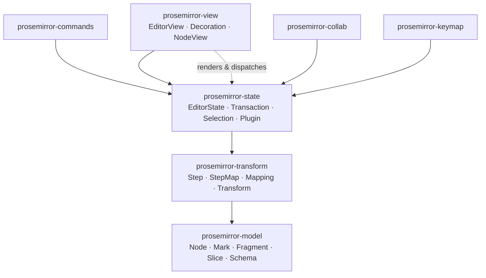
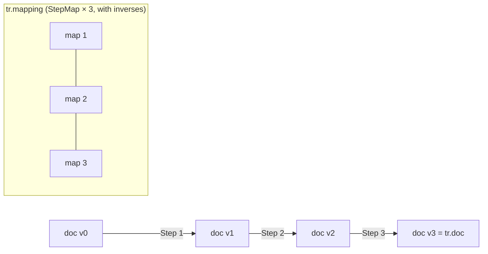
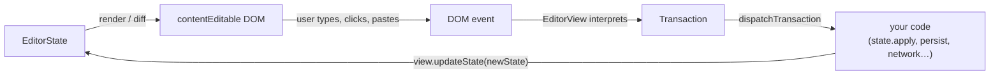
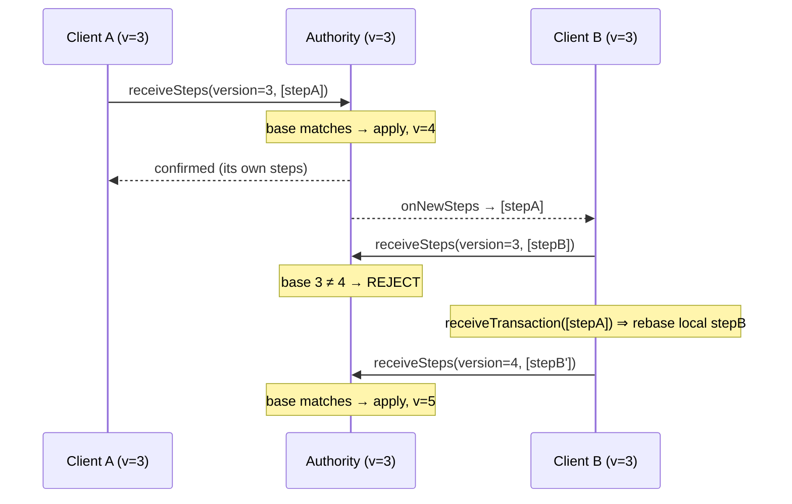

# ProseMirror

> **Thesis.** A rich-text editor is not a string and not a `contentEditable` blob — it is an **immutable, schema-constrained tree of values**, mutated only by **transactions** built from invertible **steps**, with a thin **view** that reconciles that value onto the DOM. Separate *what the document is* (model) from *what state surrounds it* (state) from *how it is shown and edited* (view), and every hard feature — undo, collaborative editing, decorations, custom rendering — falls out of position-mapping the same steps.

**Source.** Marijn Haverbeke et al., *The ProseMirror Guide* (prosemirror.net/docs/guide) and the reference manual, covering the four core modules `prosemirror-model`, `prosemirror-state`, `prosemirror-view`, `prosemirror-transform`, plus `prosemirror-commands`, `prosemirror-keymap`, and `prosemirror-collab`.

ProseMirror is deliberately *not* a drop-in editor. It is a toolkit ("a Lego set, not a Matchbox car") that prizes modularity and correctness over out-of-the-box convenience. The reward for that steeper curve is that you own the document model entirely, and the same small set of primitives explains the whole system.

---

## TL;DR

- **The document is a persistent value.** Documents are trees of immutable `Node`s. Updating produces a *new* document that structurally shares unchanged subtrees — like the number `3`, a node can appear in many trees at once. No node is ever mutated in place.
- **Inline content is flat, not nested.** Unlike HTML, ProseMirror does not nest `<strong><em>…`. A textblock holds a *flat sequence* of text nodes, and styling is carried as **marks** attached to each text node. This is what makes character-offset positions possible.
- **A schema is law.** Every document is validated against a `Schema` that declares which `NodeType`s and `MarkType`s exist and, via **content expressions**, what may nest in what. Documents that violate the schema cannot be constructed.
- **Positions are flat integer token-offsets.** Any place in the document is a single integer. Entering/leaving a non-leaf node costs 1 token; each text character costs 1; each leaf node costs 1. `doc.resolve(pos)` turns the integer back into tree context.
- **State is a value too.** `EditorState` bundles `doc`, `selection`, `storedMarks`, and per-plugin state. It is replaced wholesale, never edited.
- **Transactions are the only way to change state.** A `Transaction` is a `Transform` (a recorded list of `Step`s) plus selection/marks/metadata bookkeeping. `state.apply(tr)` yields a new state.
- **Steps are invertible and mappable.** Each `Step` can be applied, **inverted** (→ undo), and produces a **StepMap** that translates positions across the change (→ mapping, decorations, collab). A `Mapping` chains many maps, remembering their inverses.
- **The view is reactive and stateless-ish.** `EditorView` renders a state to editable DOM, diffs efficiently on `updateState`, and turns DOM events into transactions handed to `dispatchTransaction`. **Decorations** and **node views** customise rendering without touching the document.
- **Commands** are `(state, dispatch?, view?) => boolean` functions — they query applicability when `dispatch` is null and perform the edit otherwise.
- **Collaboration is rebasing.** A central **authority** linearises steps; clients rebase their unconfirmed local steps over confirmed remote steps using the very same position-mapping machinery. No operational-transform special cases.

---

## 1. The module architecture

ProseMirror ships as small composable packages. The four below are the load-bearing core; everything else (`-commands`, `-keymap`, `-history`, `-collab`, `-schema-basic`, `-menu`, …) builds on them.

| Module | Owns | Key exports |
|---|---|---|
| `prosemirror-model` | The document data structure and its rules | `Node`, `Fragment`, `Mark`, `Slice`, `Schema`, `NodeType`, `MarkType`, `ResolvedPos`, `DOMParser`, `DOMSerializer` |
| `prosemirror-transform` | Recorded, invertible, mappable document changes | `Step`, `ReplaceStep`, `AddMarkStep`, `Transform`, `StepMap`, `Mapping` |
| `prosemirror-state` | Whole-editor state and the transaction that evolves it | `EditorState`, `Transaction`, `Selection`, `TextSelection`, `NodeSelection`, `AllSelection`, `Plugin`, `PluginKey` |
| `prosemirror-view` | Rendering a state to editable DOM, dispatching events | `EditorView`, `Decoration`, `DecorationSet`, node-view interface |
| `prosemirror-commands` | Reusable editing actions | `deleteSelection`, `joinBackward`, `toggleMark`, `chainCommands`, `baseKeymap` |
| `prosemirror-collab` | Client side of central-authority collaboration | `collab`, `sendableSteps`, `receiveTransaction`, `getVersion` |

The crucial dependency arrow is *one-directional*: `view` depends on `state`, `state` depends on `transform`, `transform` depends on `model`. The model knows nothing about state, the state knows nothing about the DOM.



> **Mental model:** model = *the noun*, transform = *the verb*, state = *the sentence's full context*, view = *the speaker's mouth*. Each layer is pure with respect to the ones below it; only the view touches the messy outside world (the browser).

---

## 2. The document model

### 2.1 Trees of nodes, flat inline content

A ProseMirror document is a tree: every `Node` holds a `Fragment` — an ordered sequence of zero or more child nodes. So far this resembles the DOM. The decisive divergence is **inline content**.

In HTML, overlapping styles force a nested tree:

```html
<p>This is <strong>strong text with <em>emphasis</em></strong></p>
```

ProseMirror refuses to nest inline styling. A paragraph is a *flat* list of text nodes, and each text node carries its styles as a set of **marks**:

```
paragraph
├── "This is "                         marks: []
├── "strong text with "                marks: [strong]
└── "emphasis"                         marks: [strong, em]
```

This is the single most important model decision. Because inline content is a flat run of characters-with-marks rather than a tree of tags, a position inside a paragraph is just *an offset into a sequence*, and toggling a mark over a range is a flat array operation rather than a tree restructuring.

```
ASCII — the document tree, blocks nested, inline flat:

doc
├── heading (level 1)
│     └── "Title"                         [block, textblock]
├── paragraph                             [block, textblock]
│     ├── "Hello "                  marks []
│     ├── "world"                   marks [em]
│     └── image(src=…)              [inline LEAF — no children]
├── blockquote                            [block, NOT textblock]
│     └── paragraph
│           └── "nested"
└── horizontal_rule                       [block LEAF]

   Block nodes nest into trees.
   Inline content (text + inline leaves) is a flat row inside a textblock.
   Marks ride ON text nodes; they are not tree nodes.
```

Node roles, queryable as boolean properties:

| Property | True when… |
|---|---|
| `isBlock` / `isInline` | the node is a block / an inline node |
| `inlineContent` | the node's content is inline (it holds a row of inline nodes) |
| `isTextblock` | a block node whose content is inline (paragraph, heading) |
| `isLeaf` | the node allows no content at all (image, horizontal rule) |
| `isText` | the node is a text node |

### 2.2 Nodes are values, not objects

This is the persistence guarantee that makes everything else tractable:

> *"They are values, not stateful objects."*

A `Node` is immutable. You never mutate it; you derive a new document. Because the new document shares every unchanged subtree with the old one, an edit deep in a large document is cheap — only the spine from the root to the change is rebuilt. The guide is explicit that reaching in to mutate is forbidden and will break things "because they are almost always shared."

Consequences that this single decision buys you:

- **No invalid intermediate states** — there is no moment where the tree is half-updated.
- **Cheap structural sharing** — old and new documents coexist; the view can diff them.
- **Trivial undo** — keep the old value.
- **Safe concurrency / time-travel** — multiple document versions are just multiple values.

Each `Node` carries:

```
Node
├── type    : NodeType   (name, allowed attrs, schema back-reference)
├── content : Fragment   (sequence of child Nodes — possibly empty)
├── attrs   : Object     (e.g. {src, alt} for an image, {level} for a heading)
└── marks   : [Mark…]    (on inline nodes: em, link, …)
```

Updates go through value-returning helpers, never assignment: `node.replace(from, to, slice)`, `node.copy(newContent)`, `fragment.replaceChild(i, node)`, `fragment.append(other)`. Each returns a fresh value.

### 2.3 Marks

A `Mark` is a `{type: MarkType, attrs}` piece of metadata attached to an inline node — emphasis, code, a link with an `href`. Marks are a *set* on each text node (order is normalised by the schema). Two text nodes that are adjacent and carry the same mark set are equivalent to one longer run; ProseMirror normalises these. Marks are what let "bold" span an arbitrary range without introducing wrapper nodes into the tree.

### 2.4 Fragments and slices

A **`Fragment`** is an immutable sequence of sibling nodes — the `content` of any node. It is the unit you manipulate when working below the level of a whole node.

A **`Slice`** is a fragment plus an **open depth** on each side. It models a *cut* through the tree where the boundaries may fall *inside* nodes. Copy/paste, drag-and-drop, and range replacement all traffic in slices, because a selection from the middle of one paragraph to the middle of the next yields content whose first and last nodes are "open" — partial, and possibly momentarily schema-invalid at the cut edges.

```
ASCII — a Slice with openStart = openEnd = 1:

   …ph A: "abc[de"   "fg]hi" :ph B…
            └ open ┘   └ open ┘
   Slice.content = Fragment[ <p>"de"</p>, <p>"fg"</p> ]
   openStart = 1  (the first <p> is entered, not started fresh)
   openEnd   = 1  (the last  <p> is exited, not closed fresh)

   Pasting re-joins the open edges into surrounding content.
```

---

## 3. Schemas

A `Schema` is the grammar of a document type. No node or mark exists unless the schema declares it, and content expressions decide what may nest where. Documents that would violate the schema cannot be built — the constraint is enforced at construction time, not validated after the fact.

### 3.1 Node specs and the minimal schema

Every schema must declare a top node (default name `"doc"`) and a `"text"` node:

```javascript
const trivialSchema = new Schema({
  nodes: {
    doc: {content: "paragraph+"},   // a doc is one-or-more paragraphs
    paragraph: {content: "text*"},  // a paragraph is zero-or-more text
    text: {inline: true}            // the leaf text type
  }
})
```

### 3.2 Content expressions

The `content` field is a regex-like grammar over child node names/groups:

| Expression | Meaning |
|---|---|
| `"paragraph"` | exactly one |
| `"paragraph+"` | one or more |
| `"paragraph*"` | zero or more |
| `"caption?"` | zero or one |
| `"heading{2}"` / `"item{1,5}"` / `"x{2,}"` | counted ranges |
| `"heading paragraph+"` | a sequence (heading, then ≥1 paragraph) |
| `"(paragraph | blockquote)+"` | a choice |

> **Key gotcha:** a node type that has a **required attribute with no default** cannot appear in a *required* position of a content expression, because the editor sometimes needs to auto-create a node to satisfy the schema (e.g. fill an empty document) and it has no way to invent the attribute. Give defaults to attributes of structurally-required nodes.

### 3.3 Groups

Groups let many node types share a name in content expressions:

```javascript
const groupSchema = new Schema({
  nodes: {
    doc: {content: "block+"},                       // "block+" == "(paragraph | blockquote)+"
    paragraph: {group: "block", content: "text*"},
    blockquote: {group: "block", content: "block+"},
    text: {}
  }
})
```

The order of types in the `nodes` map matters: when the editor must auto-generate a member of a group, it picks the *first* listed.

### 3.4 Which marks are allowed

A node spec controls the marks its inline content may carry via the `marks` field — space-separated mark names or groups, `"_"` for *all*, `""` for *none*:

```javascript
nodes: {
  paragraph: {group: "block", content: "text*", marks: "_"},  // any mark
  heading:   {group: "block", content: "text*", marks: ""},   // no marks
  text:      {inline: true}
},
marks: {
  strong: {},
  em: {}
}
```

### 3.5 Attributes

Attributes are typed extra data on a node or mark:

```javascript
heading: {
  content: "text*",
  attrs: {level: {default: 1}}   // 1..6, defaulting to 1
}
```

An attribute with a `default` is optional at creation; one without a default is mandatory (omitting it throws).

### 3.6 Mapping to and from the DOM

A schema is also where DOM serialisation/parsing live, so the same definitions drive rendering *and* clipboard/initial-content parsing.

`toDOM` returns a *DOM-output spec* — a tag name, optional attribute object, and a `0` "hole" marking where children go:

```javascript
paragraph: { content: "text*", toDOM(node) { return ["p", 0] } }
heading:   { toDOM(node) { return ["h" + node.attrs.level, 0] } }
image:     { toDOM(node) { return ["img", {src: node.attrs.src}] } } // leaf: no hole

// marks render as wrappers:
marks: { em: { toDOM() { return ["em", 0] } } }
```

`parseDOM` is a list of rules matching tags/styles, used by `DOMParser.fromSchema(schema)` for paste and for parsing initial HTML:

```javascript
em: {
  parseDOM: [{tag: "i"}, {tag: "em"}, {style: "font-style=italic"}],
  toDOM() { return ["em", 0] }
}
```

Documents also serialise to plain JSON (`node.toJSON()` / `schema.nodeFromJSON(json)`), which is the natural wire/storage format.

> **Design lesson:** by colocating structure rules, mark rules, attributes, and DOM mapping in one schema object, ProseMirror guarantees that *what the document can be* and *how it is shown/parsed* never drift apart. The schema is the single source of truth.

---

## 4. Positions: the flat token-offset model

You address a place in the document with a **single integer**. Tokens are not objects — they are a *counting convention* over a depth-first walk of the tree.

```
Position-counting rules (verbatim intent from the guide):

  • The very start of the document, before all content, is position 0.
  • Entering OR leaving a non-leaf node (one that supports content) is +1 token.
  • Each character in a text node is +1 token.
  • A leaf node that allows no content (image, hr) is +1 token.
```

Worked example from the guide — `<p>One</p><blockquote><p>Two</p></blockquote>`:

```
ASCII — token offsets:

0   1 2 3 4   5
 <p> O n e </p>

5            6   7 8 9 10    11   12            13
 <blockquote> <p> T w o  </p> </blockquote>

  pos 0 : before <p>            pos 5 : after </p> / before <blockquote>
  pos 1 : inside <p>, before O  pos 6 : inside <blockquote>, before <p>
  pos 2,3,4 : after O, n, e     pos 7,8,9 : after T, w, o
                                pos 10 : after the  leaf (the img is 1 token: 9→10)
                                pos 11 : after </p>  (left the inner p)
                                pos 12 : after </blockquote>  (left the quote) — wait: see note
```

The arithmetic is mechanical. Formally, define a depth-first cost:

```
cost(textNode)              = number_of_characters
cost(leafNode)              = 1
cost(nonLeaf with children) = 1  +  Σ cost(child)  +  1     ← the two +1s are "enter" and "leave"
```

LaTeX form for the size contributed by a node $n$ with children $c_1,\dots,c_k$:

$$
\mathrm{size}(n) =
\begin{cases}
|\text{text}(n)| & n \text{ is text}\\[4pt]
1 & n \text{ is a non-text leaf}\\[4pt]
2 + \displaystyle\sum_{i=1}^{k} \mathrm{size}(c_i) & n \text{ has content}
\end{cases}
$$

and the document's own `content.size` excludes the outer doc's enter/leave (the doc node is not entered by a position).

> **Key gotcha:** a *position* and an *index* are different coordinate systems. An **index** is "the $i$-th child of this parent" (tree coordinates: `parent.child(i)`). A **position** is the flat integer above. Off-by-one bugs almost always come from mixing them. When you need both, **resolve** the position.

`doc.resolve(pos)` returns a `ResolvedPos` giving full context for that integer: the `parent` node, the `depth`, the ancestor chain (`node(d)`, `start(d)`, `end(d)`, `before(d)`, `after(d)`), the offset/index within the parent, and the node immediately before/after. This is how you turn a bare integer back into "I am inside this paragraph, which is the 2nd child of a blockquote."

```javascript
let $pos = doc.resolve(8)
$pos.parent          // the inner paragraph node
$pos.depth           // nesting depth at this position
$pos.parentOffset    // offset within the parent's content
$pos.nodeBefore      // node ending just before pos (or null)
```

---

## 5. EditorState and selection

`EditorState` is the complete, immutable description of the editor at one instant — never edited, only replaced.

### 5.1 What a state holds

```javascript
import {schema} from "prosemirror-schema-basic"
import {EditorState} from "prosemirror-state"

let state = EditorState.create({schema})
console.log(state.doc.toString())  // an empty paragraph
console.log(state.selection.from)  // 1, the start of the paragraph
```

A state contains:

- **`doc`** — the document `Node`.
- **`selection`** — a `Selection` value (see below).
- **`storedMarks`** — marks that will apply to the *next* typed character when the selection is empty (e.g. you pressed "bold" with no selection; the next keystroke is bold). `null` most of the time.
- **plugin fields** — each plugin with a `state` spec contributes one immutable slot, retrieved via `plugin.getState(state)`.

To start from existing content, parse it through the schema's DOM parser:

```javascript
let state = EditorState.create({
  doc: DOMParser.fromSchema(schema).parse(domNode)
})
```

### 5.2 Selection types

A `Selection` is immutable and exposes a common interface — `anchor` (fixed end), `head` (moving end), and the normalised bounds `from`/`to`, plus `empty`.

| Type | Models | Notes |
|---|---|---|
| `TextSelection` | a cursor or a text range | endpoints sit at inline positions; `empty` when `from == to` |
| `NodeSelection` | a single selected node | spans from just before to just after the node (e.g. cmd/ctrl-click an image) |
| `AllSelection` | the whole document | used for select-all where no single node/text range fits |

```javascript
import {TextSelection} from "prosemirror-state"
TextSelection.create(doc, from, to)   // a range
TextSelection.create(doc, pos)        // a cursor at pos
```

### 5.3 Transactions

A `Transaction` is the *only* path from one state to the next. It is a subclass of `Transform` (so it carries `steps`, `doc`, `mapping`) plus selection/marks/metadata tracking.

```javascript
let tr = state.tr                       // a fresh transaction over the current state
console.log(tr.doc.content.size)        // 25
tr.insertText("hello")                  // a convenience that records ReplaceStep(s)
let newState = state.apply(tr)          // → a NEW state
console.log(newState.doc.content.size)  // 30
```

Transactions are chainable and accumulate steps. Beyond document edits they manage:

```javascript
tr.setSelection(TextSelection.create(tr.doc, 3))  // move the cursor explicitly
tr.scrollIntoView()                                // request the view scroll to the selection
tr.setStoredMarks(marks)                           // marks for the next typed char
tr.ensureMarks(marks)
tr.setMeta(myPlugin, value)                        // attach side-channel info (see plugins)
tr.getMeta(myPlugin)
```

The selection is **automatically mapped** through the transaction's steps unless you set it explicitly — delete some text before the cursor and the cursor moves with it, for free, via the same position-mapping that powers everything else.

### 5.4 Plugins and plugin state

A `Plugin` extends the editor along two axes: it can carry **its own state slot**, and it can contribute **view props** (§7). A state slot is defined by `init` (build the initial value from the config + doc) and `apply` (derive the new value from a transaction + previous value). Plugin state must be immutable.

```javascript
let transactionCounter = new Plugin({
  state: {
    init() { return 0 },
    apply(tr, value) { return value + 1 }
  }
})

function getTransactionCount(state) {
  return transactionCounter.getState(state)
}
```

**Metadata** is the transaction side-channel plugins use to communicate intent that is not visible in the document itself — "this transaction is an undo," "don't count this one":

```javascript
let transactionCounter = new Plugin({
  state: {
    init() { return 0 },
    apply(tr, value) {
      if (tr.getMeta(transactionCounter)) return value   // tagged: skip
      else return value + 1
    }
  }
})
function markAsUncounted(tr) { tr.setMeta(transactionCounter, true) }
```

> **Mental model:** the document says *what is written*; metadata says *why this change happened*. The history plugin uses metadata to tell its own undo stack from a real edit; the collab plugin uses it to mark steps that arrived from the network so it doesn't echo them back.

---

## 6. Transforms and steps

`prosemirror-transform` is the engine room. A `Transform` records the *journey* from one document to another as a list of `Step`s, not just the destination. The guide's framing: a transform leaves "a *trail* of updates, in the form of values that represent the individual steps taken to go from an old version of the document to a new one." That trail is exactly what undo, collaboration, and plugin reactions consume.

### 6.1 Steps

A `Step` is an atomic, serialisable document change. The common ones:

- **`ReplaceStep(from, to, slice)`** — replace a range with a slice (covers insert, delete, and replace).
- **`AddMarkStep` / `RemoveMarkStep`** — add/remove a mark over a range.

Applying a step is deliberately dumb — it does *not* try to be clever and fix up schema constraints; it either works or returns an error:

```javascript
console.log(myDoc.toString())            // → p("hello")
let step = new ReplaceStep(3, 5, Slice.empty)
let result = step.apply(myDoc)
console.log(result.doc.toString())       // → p("heo")
```

Two more abilities make a step special, and both are essential infrastructure:

**Invertibility.** Given the document it applied to, a step yields its inverse step. A list of inverses, applied in reverse, is undo:

```javascript
let inverted = step.invert(docBeforeStep)
```

**Mapping.** A step produces a `StepMap` describing how positions move across it:

```javascript
let step = new ReplaceStep(4, 6, Slice.empty)   // delete 2 tokens at 4
let map = step.getMap()
console.log(map.map(8))   // → 6   (8 shifted left by the 2 deleted)
console.log(map.map(2))   // → 2   (before the change, unaffected)
```

### 6.2 Transform: chainable, immutable convenience

You rarely build steps by hand. `Transform` (and its subclass `Transaction`) gives high-level methods that *append the right steps*:

```javascript
let tr = new Transform(myDoc)
tr.delete(5, 7)
tr.split(5)
console.log(tr.doc.toString())
console.log(tr.steps.length)   // → 2
```

Useful members: content (`delete`, `replace`, `replaceWith`, `insert`), marks (`addMark`, `removeMark`), structure (`split`, `join`, `lift`, `wrap`, `setBlockType`, `setNodeMarkup`). Properties: `doc` (result), `steps` (the trail), `mapping` (accumulated maps). Methods return the transform, so they chain.



### 6.3 Mapping and bias

A `Mapping` accumulates the `StepMap`s of an entire transform, so you can translate a position from *before* a multi-step change to *after* it. The `bias` (a.k.a. `assoc`) argument resolves the ambiguity at an *insertion point*: when content is inserted exactly at position $p$, should an old position at $p$ end up *before* or *after* the inserted content?

```javascript
let tr = new Transform(myDoc)
tr.split(10)      // inserts +2 tokens at position 10
tr.delete(2, 5)   // removes 3 tokens starting at position 2

console.log(tr.mapping.map(15))      // → 14
console.log(tr.mapping.map(6))       // → 3
console.log(tr.mapping.map(10))      // → 9    (default bias +1: after the insertion)
console.log(tr.mapping.map(10, -1))  // → 7    (bias -1: stay before the insertion)
```

> **Key gotcha:** `bias` only matters at *deletion/insertion boundaries*. Choosing it wrong is the classic cause of a cursor or a decoration landing on the wrong side of just-typed text. Inserting at a cursor usually wants the cursor *after* the new text (bias +1, the default).

### 6.4 Rebasing

Rebasing is "take a step that was written against document $X$ and make it apply correctly against a divergent document $X'$." It is the heart of both collaboration and the history module. The basic move is `step.map(otherMapping)` — push the step's positions through the other change's maps.

```
Two concurrent edits from the same base `doc`:

    stepA(doc)  = docA
    stepB(doc)  = docB
    stepB(docA) = MISMATCH        ← stepB's positions assume `doc`, not `docA`
    stepB' = rebase(stepB, mapA)  ← map stepB's positions through A's map
    stepB'(docA) = docAB          ← now it applies
```

For a *chain* of local steps `[B1, B2, …]` to be rebased over remote steps `[A1, A2, …]`, you must first *undo* your own later steps to get back to the common base, then re-apply through the remote maps, then re-apply your own remapped earlier steps. The guide's pipeline for rebasing `B2` over `[A1, A2]` (where your local chain was `B1, B2`):

```
rebase(B2, Mapping[ invert(mapB1), mapA1, mapA2, mapB1' ])
```

and for `B3`:

```
rebase(B3, Mapping[ invert(mapB2), invert(mapB1), mapA1, mapA2, mapB1', mapB2' ])
```

Reading the first pipeline left-to-right: `invert(mapB1)` walks a position from the post-B1 document back to the shared base, `mapA1`/`mapA2` carry it forward through the remote changes, and `mapB1'` (the *rebased* B1) carries it forward through your already-rebased earlier step. The `Mapping` abstraction stores these maps *together with their inverse relationships* so it can do this bookkeeping for you.

```javascript
// schematic of the inner loop performed by the collab/history machinery
function rebaseSteps(localSteps, overMapping, startDoc) {
  let doc = startDoc, result = [], mapping = overMapping.slice()
  for (let i = 0; i < localSteps.length; i++) {
    let mapped = localSteps[i].map(mapping)     // push positions through the chain
    if (mapped && (let r = mapped.apply(doc)).doc) {
      result.push(mapped)
      doc = r.doc
      mapping.appendMap(mapped.getMap())        // future steps see this step's map too
      mapping.setMirror(/* link to original */) // remember the inverse relationship
    }
    // if `mapped` is null or fails to apply, the step is simply DROPPED
  }
  return {steps: result, doc}
}
```

> **Design lesson:** ProseMirror does *not* implement Operational Transformation's per-operation transform functions. It has exactly one position-mapping primitive (`StepMap`/`Mapping`) and *every* step type knows how to re-map itself through it. Rebasing is therefore generic — adding a new step type does not require writing N² transform cases.

> **Key gotcha:** "even if you have rebased a step, there is no guarantee that it can still be validly applied to the current document." If an intermediate change deleted the content a rebased step needed, **dropping the step is the correct outcome** — not an error. Convergence tolerates lost local edits when the ground they stood on is gone.

---

## 7. The EditorView

`EditorView` is the only impure layer: it owns the editable DOM and the browser's quirks. It renders an `EditorState` to a `contentEditable` element using the schema's `toDOM` specs, keeps the DOM selection in sync with the editor selection, and converts DOM events into transactions.

```javascript
let view = new EditorView(document.body, {state})
```

### 7.1 The update cycle

The view is reactive: a transaction makes a new state, and the view *reconciles* to it.

```javascript
let view = new EditorView(document.body, {
  state,
  dispatchTransaction(transaction) {
    let newState = view.state.apply(transaction)
    view.updateState(newState)
  }
})
```

`updateState` compares the previously-drawn document to the new one and touches only the DOM that changed, preserving browser state (spellcheck underlines, composition/IME, selection in hidden subtrees). The whole point of `dispatchTransaction` is that *you* sit in the middle: you can route the transaction through Redux, persist it, send it over the network, or veto it — the view only changes when you call `updateState`.



This single unidirectional loop — **state → (render) → DOM → (event) → transaction → (apply) → new state → updateState** — is the entire architecture in one sentence.

```javascript
// A Redux-style host owning more than just the editor:
let appState = { editor: EditorState.create({schema}), score: 0 }

let view = new EditorView(document.body, {
  state: appState.editor,
  dispatchTransaction(transaction) {
    update({type: "EDITOR_TRANSACTION", transaction})
  }
})
function update(event) {
  if (event.type == "EDITOR_TRANSACTION")
    appState.editor = appState.editor.apply(event.transaction)
  else if (event.type == "SCORE_POINT")
    appState.score++
  draw()
}
function draw() {
  document.querySelector("#score").textContent = appState.score
  view.updateState(appState.editor)
}
```

### 7.2 Props and precedence

"Props" are the view's behavioural parameters — some are direct only, but most can *also* be supplied by plugins, which is how features compose.

```javascript
let view = new EditorView(place, {
  state: myState,
  editable() { return false },              // read-only
  handleDoubleClick() { /* … */ return false }
})

// a plugin supplying a prop:
function maxSizePlugin(max) {
  return new Plugin({
    props: { editable(state) { return state.doc.content.size < max } }
  })
}
```

Precedence when several sources declare the same prop:

- Direct view props come first, then plugins in their array order.
- **Singular** props (e.g. `domParser`): the first provider wins.
- **Handler** props (e.g. `handleKeyDown`): tried in order; the first to return `true` consumes the event.
- **Union** props (`attributes`, `decorations`): all contributors are combined.

(`state` and `dispatchTransaction` are direct-only — a plugin cannot supply them.)

### 7.3 Decorations

Decorations change *how the document is drawn* without changing the document. Three kinds:

| Decoration | Effect |
|---|---|
| **Node** (`Decoration.node`) | add attributes/classes/styles to one node's DOM |
| **Widget** (`Decoration.widget`) | insert a non-document DOM node at a position (cursors, buttons, gutters) |
| **Inline** (`Decoration.inline`) | add attributes/styles over an inline range (highlights, lint squiggles) |

They are bundled in a `DecorationSet` (a tree-shaped index for efficiency) and provided through the `decorations` prop:

```javascript
let purplePlugin = new Plugin({
  props: {
    decorations(state) {
      return DecorationSet.create(state.doc, [
        Decoration.inline(0, state.doc.content.size, {style: "color: purple"})
      ])
    }
  }
})
```

For *many* decorations, keep the set in plugin state and **map it through each transaction** instead of recomputing it — the same position-mapping again:

```javascript
let specklePlugin = new Plugin({
  state: {
    init(_, {doc}) {
      let speckles = []
      for (let pos = 1; pos < doc.content.size; pos += 4)
        speckles.push(Decoration.inline(pos - 1, pos, {style: "background: yellow"}))
      return DecorationSet.create(doc, speckles)
    },
    apply(tr, set) { return set.map(tr.mapping, tr.doc) }  // move them as the doc changes
  },
  props: {
    decorations(state) { return specklePlugin.getState(state) }
  }
})
```

### 7.4 Node views

A **node view** lets you take over the rendering and interaction of a specific node type with imperative code — embeds, interactive images, custom widgets — while still living inside the document model.

```javascript
let view = new EditorView(place, {
  state,
  nodeViews: {
    image(node, view, getPos) { return new ImageView(node, view, getPos) }
  }
})

class ImageView {
  constructor(node, view, getPos) {
    this.dom = document.createElement("img")
    this.dom.src = node.attrs.src
    this.dom.alt = node.attrs.alt
    this.dom.addEventListener("click", e => {
      e.preventDefault()
      let alt = prompt("New alt text:", "")
      if (alt) view.dispatch(view.state.tr.setNodeMarkup(getPos(), null, {
        src: node.attrs.src, alt
      }))
    })
  }
  stopEvent() { return true }   // tell ProseMirror to ignore events on this DOM
}
```

The node-view interface:

- **`dom`** — the outer DOM element for the node.
- **`contentDOM`** — if present, ProseMirror renders the node's *children* into it (a textblock you style but whose content PM manages). If absent, the node's content is a **black box** you render yourself.
- **`update(node, decorations)`** — called when the node may have changed; return `true` if this view absorbed the update, `false` to force PM to rebuild it (e.g. the type changed).
- **`stopEvent(event)`** — return `true` to keep PM from handling a DOM event you handle yourself.
- **`ignoreMutation(mutation)`** — for content-managed views, tell PM which DOM mutations to ignore.
- **`getPos()`** — the callback (passed to the constructor) returning the node's *current* document position; you need it to build transactions that target this node.

```javascript
// A textblock node view that styles empty paragraphs, but lets PM own the text:
class ParagraphView {
  constructor(node) {
    this.dom = this.contentDOM = document.createElement("p")
    if (node.content.size == 0) this.dom.classList.add("empty")
  }
  update(node) {
    if (node.type.name != "paragraph") return false
    if (node.content.size > 0) this.dom.classList.remove("empty")
    else this.dom.classList.add("empty")
    return true
  }
}
```

---

## 8. Commands

A **command** is the unit of "an editing action a user can trigger" — bold, split block, delete selection. Its signature and contract are precise:

```
command : (state, dispatch?, view?) => boolean
```

- Return **`false`** if the action does not apply in this state (and do nothing).
- If it *does* apply and **`dispatch` is given**, perform it (build a transaction, call `dispatch(tr)`) and return `true`.
- If it applies but **`dispatch` is null/omitted**, return `true` *without doing anything* — this is the **applicability query** menus use to decide whether to enable a button.

```javascript
function deleteSelection(state, dispatch) {
  if (state.selection.empty) return false           // not applicable
  if (dispatch) dispatch(state.tr.deleteSelection()) // applicable + asked to run
  return true
}

deleteSelection(view.state, null)          // → can I delete? (enable the menu item)
deleteSelection(view.state, view.dispatch) // → actually delete
```

**Composition.** `chainCommands(a, b, c, …)` builds a command that tries each in turn and stops at the first that returns `true`. This is how one key does context-sensitive things:

```javascript
import {keymap} from "prosemirror-keymap"
import {chainCommands, deleteSelection, joinBackward, selectNodeBackward,
        toggleMark} from "prosemirror-commands"

keymap({
  "Backspace": chainCommands(deleteSelection, joinBackward, selectNodeBackward),
  "Mod-b": toggleMark(schema.marks.strong)   // toggleMark is a command *constructor*
})
```

`prosemirror-commands` supplies a `baseKeymap` of sensible defaults; `toggleMark(markType)` and `wrapIn(nodeType)` are constructors that *return* commands. Commands stay pure `(state, dispatch)` functions, so they are testable without a DOM and reusable across keymaps, menus, and input rules.

> **Mental model:** a command is a *pure proposal*. With `dispatch=null` it answers "would this do anything?"; with a real `dispatch` it commits. Keeping the two in one function guarantees the menu's enabled-state can never disagree with what the key actually does.

---

## 9. Collaborative editing

ProseMirror's collaboration is **centralised, version-linear rebasing** — and it reuses §6's machinery wholesale rather than inventing a new conflict algebra.

### 9.1 The authority

A single **authority** (a server, or any agreed coordinator) holds the canonical document, an ordered list of all confirmed steps, and the client IDs that produced them. Its version number *is* the length of the step list. It accepts steps only if they are based on the current version; otherwise it rejects, and the client must catch up and rebase.

```javascript
class Authority {
  constructor(doc) {
    this.doc = doc
    this.steps = []
    this.stepClientIDs = []
    this.onNewSteps = []
  }

  receiveSteps(version, steps, clientID) {
    if (version != this.steps.length) return          // stale base → reject silently
    steps.forEach(step => {
      this.doc = step.apply(this.doc).doc
      this.steps.push(step)
      this.stepClientIDs.push(clientID)
    })
    this.onNewSteps.forEach(f => f())                 // notify subscribers
  }

  stepsSince(version) {
    return {
      steps: this.steps.slice(version),
      clientIDs: this.stepClientIDs.slice(version)
    }
  }
}
```



### 9.2 The collab plugin on the client

`prosemirror-collab`'s `collab()` plugin tracks, per client, which local steps are *unconfirmed*. The contract:

- **`collab({version})`** — initialise tracking at the document's current version.
- **`sendableSteps(state)`** — returns the unconfirmed local steps (with their base version and a `clientID`) that are ready to ship, or `null`.
- **`receiveTransaction(state, steps, clientIDs)`** — build a transaction that incorporates confirmed remote steps *and rebases* the local unconfirmed steps over them.
- **`getVersion(state)`** — the client's current confirmed version.

```javascript
import {collab, sendableSteps, receiveTransaction, getVersion} from "prosemirror-collab"

let view = new EditorView(place, {
  state: EditorState.create({
    doc: authority.doc,
    plugins: [collab({version: authority.steps.length})]
  }),
  dispatchTransaction(transaction) {
    let newState = view.state.apply(transaction)
    view.updateState(newState)
    let sendable = sendableSteps(newState)         // anything to push?
    if (sendable)
      authority.receiveSteps(sendable.version, sendable.steps, sendable.clientID)
  }
})

// when the authority has new steps, pull and integrate them:
authority.onNewSteps.push(function() {
  let newData = authority.stepsSince(getVersion(view.state))
  view.dispatch(
    receiveTransaction(view.state, newData.steps, newData.clientIDs))
})
```

### 9.3 Why this converges

When two clients edit version $v$ concurrently, both send steps based on $v$. The authority applies whichever arrives first, advancing to $v+1$. The second client's submission is rejected (its base is now stale); it pulls the first client's step, and `receiveTransaction` **rebases** its own unconfirmed steps over that step — exactly the `step.map(mapping)` / drop-if-inapplicable procedure of §6.4. It then resubmits the rebased steps based on $v+1$, which the authority accepts.

Because (a) the authority imposes a *single total order* on confirmed steps and (b) every client rebases the *same* local steps over the *same* confirmed prefix using the *same* deterministic mapping, every client's document converges to the authority's. Steps that lose their footing (their content was concurrently deleted) are dropped, which is safe.

> **Design lesson:** ProseMirror gets collaborative editing essentially "for free" because it already needed invertible, mappable steps for undo. Collaboration is *the same rebasing problem as a redo applied after an intervening edit*. There is no separate OT transform matrix — the central authority supplies the linear order that OT systems work hard to synthesise, and position-mapping supplies the rest. The trade-off, made deliberately, is the dependency on a central coordinator (versus a fully peer-to-peer CRDT).

> **Key gotcha:** clients must be optimistic but reversible. You apply your local steps immediately for responsiveness, but you must be ready for the authority to make you rebase (and possibly drop) them. Never treat a locally-applied step as final until it has come back confirmed.

---

## 10. The whole system in one paragraph

A **schema** defines a grammar of node and mark types and how they map to the DOM. A **document** is an immutable value-tree obeying that grammar, with inline content kept *flat* and styled by **marks**, addressable by flat integer **positions** under a fixed token-counting rule. An **EditorState** wraps a document with a **selection**, stored marks, and per-**plugin** state, and is replaced — never mutated — by **transactions**. A transaction is a **transform**: a recorded list of invertible, position-**mappable** **steps**. Inversion gives undo; mapping gives selection-tracking, decoration-tracking, and **rebasing**; rebasing over a central **authority**'s linear step order gives collaborative editing. The **EditorView** renders the state to editable DOM, diffs efficiently, and turns user events into transactions handed back to you through `dispatchTransaction` — closing a single unidirectional loop. **Commands** are pure `(state, dispatch?) => boolean` proposals wired to keys and menus; **decorations** and **node views** customise presentation without disturbing the document. One position-mapping primitive, threaded through every layer, is what makes the hard features cheap.

---

## Glossary & notation

| Term | Meaning |
|---|---|
| **Node** | An immutable value in the document tree (`type`, `content`, `attrs`, `marks`). |
| **Fragment** | An immutable ordered sequence of sibling nodes; a node's `content`. |
| **Mark** | `{type, attrs}` styling/metadata attached to inline nodes (em, link). A *set* per text node. |
| **Slice** | A fragment plus `openStart`/`openEnd` depths — a cut through the tree with possibly-open edges (copy/paste, replace). |
| **Schema** | The grammar: which `NodeType`s/`MarkType`s exist and what may nest (via content expressions), plus DOM mapping. |
| **Content expression** | Regex-like rule (`"paragraph+"`, `"(a | b)*"`) constraining a node's children. |
| **Group** | A named set of node types usable in content expressions (`"block+"`). |
| **Position** | A single integer addressing a place in the document under the token-counting rule (enter/leave non-leaf = 1, char = 1, leaf = 1). |
| **Index** | Tree coordinate: the $i$-th child of a parent (`parent.child(i)`) — *not* a position. |
| **ResolvedPos** | The context of a position: parent, depth, ancestor chain, offsets (`doc.resolve(pos)`). |
| **EditorState** | Immutable whole-editor snapshot: `doc`, `selection`, `storedMarks`, plugin fields. |
| **Selection** | Immutable cursor/range with `anchor`/`head`, `from`/`to`, `empty` (`TextSelection`, `NodeSelection`, `AllSelection`). |
| **storedMarks** | Marks queued for the next typed character when the selection is empty. |
| **Transaction** | A `Transform` plus selection/marks/metadata; the only way to evolve state (`state.tr`, `state.apply(tr)`). |
| **Transform** | A recorded, immutable sequence of steps with `doc`, `steps`, `mapping`. |
| **Step** | An atomic, serialisable, invertible document change (`ReplaceStep`, `AddMarkStep`, …). |
| **StepMap** | The position-translation a single step induces. |
| **Mapping** | A chain of step maps (with inverse links) translating positions across many steps. |
| **bias / assoc** | At an insertion point, whether a mapped position lands before (`-1`) or after (`+1`, default) inserted content. |
| **Rebasing** | Re-mapping a step (`step.map(mapping)`) so it applies to a divergent document; drop if no longer valid. |
| **Plugin** | Extension carrying an immutable state slot (`init`/`apply`) and/or view props. |
| **Metadata** | Transaction side-channel (`setMeta`/`getMeta`) describing *why* a change happened. |
| **EditorView** | The DOM component: renders state, diffs, dispatches events as transactions. |
| **dispatchTransaction** | The view prop where you receive transactions and decide when to `updateState`. |
| **Decoration** | Render-only adornment (node / widget / inline) bundled in a `DecorationSet`. |
| **Node view** | Imperative custom rendering for a node type (`dom`, `contentDOM`, `update`, `stopEvent`, `getPos`). |
| **Command** | `(state, dispatch?, view?) => boolean`: query applicability when `dispatch` is null, perform otherwise. |
| **Authority** | The central coordinator holding the canonical doc and the linear list of confirmed steps. |
| **collab plugin** | Client tracker of unconfirmed steps; `sendableSteps`, `receiveTransaction`, `getVersion`. |
