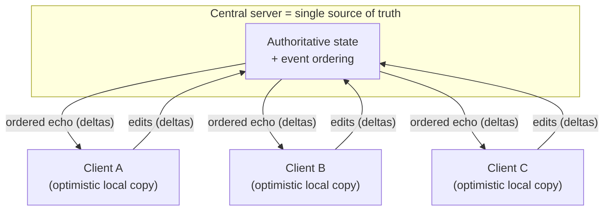
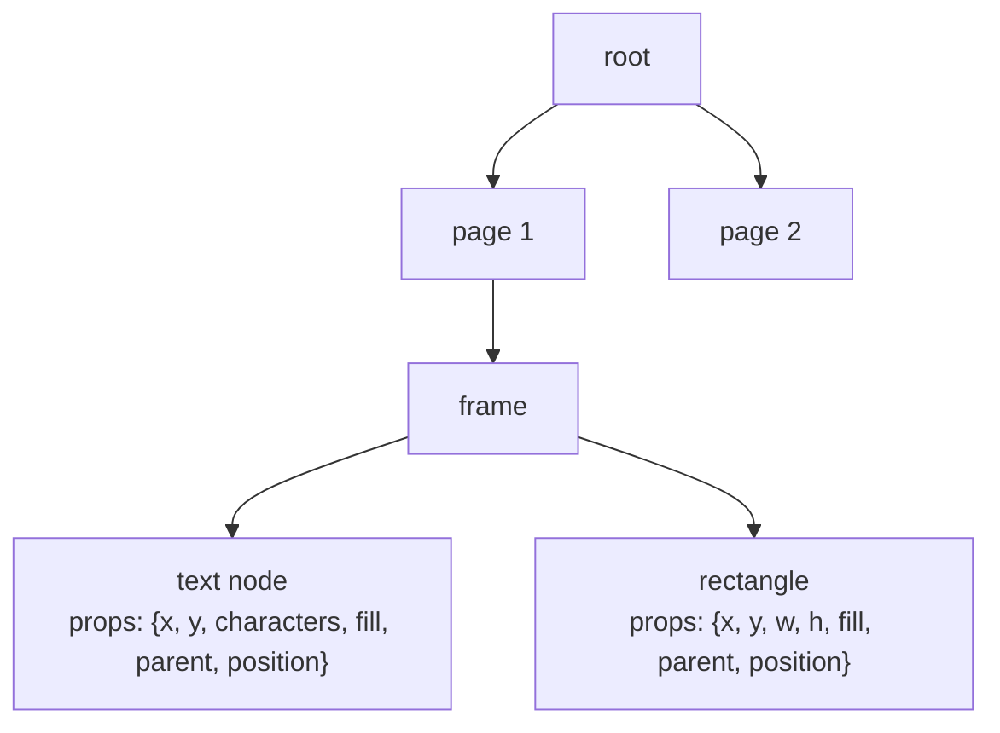
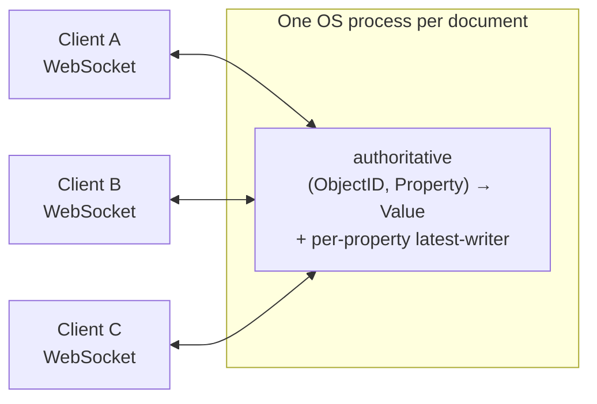
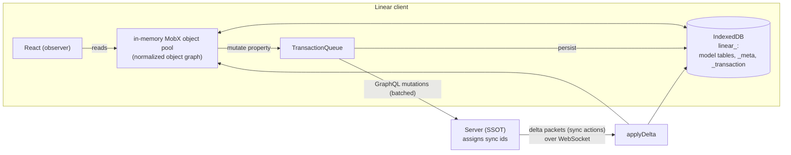

# Building a Realtime / Local-First Sync Engine

> **Thesis.** A production sync engine is a *replicated database with a UI bolted on*. The two best-documented designs — **Figma** (a document tree, last-writer-wins per property, one authoritative server process per file) and **Linear** (a normalized object graph, a totally-ordered transaction log, lazy/bootstrapped delta sync) — both reach the same conclusion: with a **central server as authority** you can throw away OT and full CRDTs, sync **deltas not documents**, apply changes **optimistically** on the client, and let a single **total order** (server-defined event order / monotonic sync-id) do all the conflict resolution that LWW needs.

**Source.**
- Evan Wallace, *How Figma's multiplayer technology works* — https://www.figma.com/blog/how-figmas-multiplayer-technology-works
- Tuomas Artman et al., *Scaling the Linear Sync Engine* — https://linear.app/now/scaling-the-linear-sync-engine
- wzhudev, *reverse-linear-sync-engine* (reverse-engineering writeup, endorsed by Linear's CTO) — https://github.com/wzhudev/reverse-linear-sync-engine
- Paulus Esterhazy, *Notes on building sync engines / local-first* — https://gist.github.com/pesterhazy/3e039677f2e314cb77ffe3497ebca07b

This is a synthesis across four engineering sources, not a paper summary. The Figma and Linear posts are the two canonical industry case studies; the reverse-engineering writeup supplies the mechanics the blog posts omit; the gist supplies the general framing. Where a source was thin (the Linear blog page itself is largely a talk announcement), the mechanics are reconstructed from the reverse-engineering writeup and corroborating secondary write-ups — flagged inline.

---

## TL;DR

- **You are building a database with replication.** The hard parts are the same as any replicated store: a consistency model, a propagation mechanism, bootstrapping a fresh replica, and what to do under concurrent writes. The UI is the easy part.
- **Centralization is a *simplification*, not a defeat.** Both Figma and Linear run a **central server as the single source of truth**. That one decision lets them delete the machinery decentralized systems need (consensus, vector clocks, true CRDTs) and replace it with a **server-defined total order** of events.
- **Sync deltas, not documents.** Neither system ships whole documents on every edit. Figma ships per-property `(object, property, value)` changes; Linear ships **transactions** up and **delta packets** (sync actions) down. Shipping the diff is the whole performance story.
- **Granularity is the central design knob.** Figma resolves conflicts at the **property** level (`Map<ObjectID, Map<Property, Value>>`); Linear at the **property-of-a-model** level inside a normalized object graph. Finer granularity ⇒ fewer false conflicts.
- **LWW beats OT/CRDT when you have an authority.** Figma uses **last-writer-wins per property** ("the server can define the order of events"). Linear uses LWW via **rebasing transactions** against incoming deltas. Both deliberately *avoid* Operational Transformation and *avoid* true CRDTs — "conflicts are actually not that common."
- **Optimism + a server round-trip.** The client mutates its in-memory model **immediately** and renders; the change is queued, sent, ordered by the server, and the authoritative echo comes back. Mispredictions are corrected on arrival.
- **Bootstrapping is its own problem.** A fresh or stale client must catch up before it can sync incrementally. Linear formalizes this into **full / partial / local bootstrap**, keyed off a persisted `lastSyncId`; Figma sidesteps it by re-downloading the whole document on (re)connect.
- **Lazy / partial sync is what makes it scale.** Linear loads only "instant" models eagerly and **lazy-hydrates** the heavy tables (Issue, Comment) on demand, persisting partial indexes so it never refetches.
- **Offline is bounded.** Both buffer edits locally (Figma in memory + undo buffer, Linear in an IndexedDB `__transaction` table) and replay on reconnect. The limits are real: Figma cannot merge concurrent text, Linear leans on LWW being "good enough."
- **General recipe (the gist's framing):** realtime push is *conceptually distinct from* replication. Build **polling-first**, then add a "shoulder-tap" push to wake clients. Most teams end up building their own engine because "every app has slightly different needs."

---

## 1. The mental model: a sync engine is a replicated database

> **Mental model:** "you're essentially building a database with replication." Every real decision — consistency model, change propagation, fresh-replica bootstrap, conflict policy — is a database decision. The collaborative-editing veneer hides a distributed data store.

The gist makes one separation that clarifies the whole design space:

> **Design lesson (push ≠ replication):** *Realtime updates are conceptually distinct from data replication.* Replication is "make this client's copy reflect the authoritative state." Realtime is "tell the client *promptly* that something changed." You can ship a correct sync engine with **polling alone** (client pulls every ~1 s), then bolt on a push channel (WebSocket/SSE) purely as latency optimization — a "lightweight shoulder tap" that wakes the client to pull. When the socket dies, **degrade to polling** rather than failing.

That separation is why both case studies are, at heart, *pull-based replicated stores* with a push notification layer on top — even though the push layer is what users perceive as "magic."

```
            ┌─────────────────────────── the four sub-problems ───────────────────────────┐
            │                                                                              │
   1. CONSISTENCY MODEL      2. PROPAGATION         3. BOOTSTRAP           4. CONFLICTS
      what does "in sync"        how does a delta       how does a fresh /     two writers, one
      even mean here?           reach other replicas?  stale replica catch   datum — who wins?
      (LWW / total order)       (push + pull)          up before syncing?    (LWW, OT, CRDT)
            │                         │                      │                     │
            └─────────────────────────┴──────────────────────┴─────────────────────┘
                          every sync engine answers all four, explicitly or not
```

---

## 2. The pivotal decision: a central server as authority

Both systems are **centralized**, and both treat that as the key simplification rather than a compromise.

Figma:

> "Figma is centralized (our server is the central authority), we can simplify our system by removing this extra overhead and benefit from a faster and leaner implementation."

> "Figma isn't using true CRDTs… CRDTs are designed for decentralized systems where there is no single central authority."

Linear (reverse-engineering writeup):

> "LSE relies on a centralized server to establish the order of all transactions. Within the LSE framework, all transactions follow a total order… represented by the sync id, which is an incremental integer."

The consequence is the same in both: **the server *defines the order of events*, so clients never have to agree on order among themselves.** That single fact dissolves most of distributed-systems theory's hard parts.



> **Design lesson:** centralization is not the lazy option — it is the *leverage*. A server that totally-orders events gives you a free, global "happened-before" relation. With that, **last-writer-wins is well-defined without timestamps or vector clocks**: "the last writer" simply means "the write the server ordered last." Decentralized systems pay for what they don't have here with CRDTs or consensus.

### 2.1 Why deliberately *not* OT, *not* true CRDT, *not* Git?

Figma's rejection of OT is explicit and worth keeping verbatim, because it is the clearest statement of the trade in the literature:

> "We didn't want to use operational transforms (a.k.a. OTs), the standard multiplayer algorithm popularized by apps like Google Docs."

> OTs suffer "a combinatorial explosion of possible states which is very difficult to reason about… formal proofs are very complicated and error-prone."

Figma was **inspired by** CRDTs but does not implement true ones:

> "It's inspired by multiple separate CRDTs and uses them in combination… Figma isn't using true CRDTs though."

Linear reaches the same place from the opposite direction — it had the option of CRDTs and declined, because in an issue tracker:

> "conflicts are actually not that common in Linear."

The gist generalizes the rule:

> **Key gotcha (CRDTs are useful but not essential):** CRDTs "often suffer from problems with regard to performance, memory usage and implementation complexity." Understand them to know their *limits*. If you have a central authority, you usually don't need them.

The "why not Git" answer is implicit but important: a Git-style three-way merge re-derives a result the *user never typed*. Figma's LWW guarantees the opposite —

> "the eventually consistent value for a given property is always a value sent by one of the clients."

No merge ever invents a value. That predictability is worth more than theoretical mergeability for these apps.

| Approach | What it gives you | Why these systems decline it |
|---|---|---|
| **Operational Transformation** | character-level concurrent text merge | combinatorial state explosion; "complicated and error-prone" proofs; needs per-op transform functions |
| **True CRDTs** | merge with *no* central authority | designed for decentralization they don't have; memory/perf/complexity cost; overkill when conflicts are rare |
| **Git-style 3-way merge** | structural merge of divergent trees | invents values no client sent; not interactive/realtime |
| **LWW per property + central order** *(chosen)* | simple, predictable, fast; result is always a real client value | loses concurrent *intra-value* merges (e.g. simultaneous text typing) |

---

## 3. Figma: a document tree with per-property LWW

### 3.1 Data model — `Map<ObjectID, Map<Property, Value>>`

A Figma file is **a tree of objects**, "similar to the HTML DOM": a single root, pages beneath it, and the page contents hanging off those. Each object is an ID plus a bag of properties. Conceptually the whole document is:

$$
\text{Document} \;\cong\; \texttt{Map}\langle \text{ObjectID},\ \texttt{Map}\langle \text{Property}, \text{Value}\rangle\rangle
\;\cong\; \{\,(\text{ObjectID}, \text{Property}, \text{Value})\,\}
$$

i.e. a flat set of `(object, property, value)` tuples that *happens* to encode a tree. **The tree is data, not structure** — which is exactly what makes reparenting tractable (§3.4).





> "Our servers currently spin up a separate process for each multiplayer document which everyone editing that document connects to."

> **Design lesson (server-per-file):** sharding the authority *by document* means each file's mutable state lives in one process with one in-memory copy and one event order. No cross-document coordination, trivial horizontal scaling (more files ⇒ more processes), and the consistency reasoning is entirely *within* a file.

Critically, Figma's multiplayer system handles **only document edits**. Everything else lives elsewhere:

> "We also sync changes to a lot of other data (comments, users, teams, projects, etc.) but that is stored in Postgres, not our multiplayer system, and is synced with clients using a completely separate system."

### 3.2 Conflict resolution — last-writer-wins, per property

The server keeps, for every `(object, property)`, the most recent value any client sent:

> "Figma's multiplayer servers keep track of the latest value that any client has sent for a given property on a given object."

> "we don't need a timestamp because the server can define the order of events."

Formally, let property writes to a single $(o, p)$ slot be ordered by the server's receive order $\prec_S$. The committed value is:

$$
\mathrm{value}(o, p) \;=\; v_k \quad\text{where } w_k = (o, p, v_k) \text{ is the } \prec_S\text{-maximal write to } (o,p)
$$

Because the order is *per slot* and *server-defined*, two key non-conflicts fall out for free:

- two clients editing **different properties of the same object** never conflict;
- two clients editing the **same property of different objects** never conflict.

A genuine conflict is only "same property, same object," and even then the rule is total: the last-ordered write wins, and the winning value is always one a client actually sent.

> **Key gotcha (atomicity is at the property-value boundary):** "changes are atomic at the property value boundary." If client A sends `characters = "AB"` and client B concurrently sends `characters = "BC"`, the result is **`"AB"` or `"BC"` — never `"ABC"`.** This is *exactly* why Figma cannot do Google-Docs-style simultaneous text co-editing: a string property is one indivisible value, not a sequence of mergeable operations. The granularity you pick is the granularity at which collaboration silently stops working.

### 3.3 Change propagation & the flicker problem

A client applies its own edit locally and optimistically, sends it, and keeps editing without waiting. The subtlety is what to do when a *server* update arrives for a property the client has an **unacknowledged** local change on:

> **Key gotcha (discard conflicting server echoes for in-flight writes):** the client must **drop incoming server changes that conflict with its own unacknowledged local changes**. Rationale: "our change is our best prediction because it's the most recent change we know about in last-to-the-server order." Apply the stale server value and you get a *flicker* — the property visibly snaps back to an old value, then forward again when your own echo lands. Suppressing it keeps the UI stable.

```
local edit  ──set p=v locally (optimistic)──▶ render v
            ──send (o,p,v)──────────────────▶ server
   meanwhile: server echo for (o,p)=v_old arrives
            ──IF (o,p) has an unacked local write: DISCARD v_old (would flicker)
            ──ELSE: apply
   later:    server echo for (o,p)=v arrives  ──reconcile, write now acknowledged
```

### 3.4 Object creation, deletion, and the tree

**Creation is a grow-only, client-minted-ID affair.** Clients generate globally unique IDs by embedding their **client ID**, so two clients never collide and **offline creation works** (the server doesn't assign IDs). Objects never exist implicitly; creation is always explicit.

**Deletion is destructive.** Removing an object deletes all server-side data about it; its properties survive *only in the deleting client's undo buffer*, and that client alone is responsible for restoring them on undo. This is a deliberate anti-tombstone choice:

> **Design lesson (destructive delete to bound growth):** unlike a CRDT's grow-forever tombstones, Figma *throws the data away* on delete and pushes the restore-on-undo burden to the one client that deleted it. The payoff is that "this prevents long-lived documents from growing unbounded" — a years-old file doesn't carry the ghost of every deleted layer.

**The tree itself is the hard part.** Parent-child is stored as a **`parent` property on the child** (plus a position), *not* as a child list on the parent:

- reparenting is just "set the child's `parent` property" — object identity is preserved across the move;
- child order uses **fractional indexing** — a position is a fraction in $(0,1)$; to insert between two siblings, set position to the *average* of their positions, so insertion never has to renumber neighbors;
- `parent` and `position` must update **atomically as one property**, or a child could briefly have a parent but no place in it.

The dangerous concurrency is a **reparent cycle**: two clients each move a node under the other, which would make the "tree" no longer a tree. The server is the referee:

> the server "reject[s] parent property updates that would create cycles," but a client "can't reject changes from the server because the server is the ultimate authority."

Because a client can momentarily *receive* both halves of a cycle before the server's rejection arrives, Figma handles the transient gracefully:

> "Figma's solution is to temporarily parent these objects to each other and remove them from the tree until the server rejects the client's change and the object is reparented where it belongs."

```
   client temporarily sees:  A.parent = B  and  B.parent = A   (a cycle!)
   → detach the cycle from the visible tree (don't render an impossible structure)
   → wait for the server, which rejects one of the two reparents
   → the loser snaps back to its real parent; tree is consistent again
```

### 3.5 Undo/redo in a multiplayer world

The guiding principle is the "round-trip identity":

> "if you undo a lot, copy something, and redo back to the present (a common operation), the document should not change."

The mechanism: "an undo operation modifies redo history at the time of the undo, and likewise a redo operation modifies undo history at the time of the redo." Recomputing the inverse *against current state* (rather than blindly replaying a recorded inverse) is what stops your undo from clobbering edits other people made in the meantime.

### 3.6 Offline — and its hard limit

Clients can go offline indefinitely and keep editing into a local copy. On reconnect:

1. download a **fresh copy** of the document,
2. **reapply** the offline edits on top of the latest state,
3. open a new WebSocket and resume.

> "This means that connecting and reconnecting are very simple and all of the complexity with multiplayer is in dealing with updates to already connected documents."

> **Design lesson (push the complexity to *one* place):** Figma deliberately makes (re)connection dumb — full re-download + replay — so that *all* the genuinely hard concurrency logic lives in the steady-state "already connected" path. It is the opposite of Linear's choice (§4.4), which invests heavily in *avoiding* the full re-download. Both are valid; they optimize different things (Figma: per-file blobs that re-download cheaply; Linear: a huge workspace graph you can't afford to refetch).

---

## 4. Linear: a normalized object graph with a transaction log

Where Figma syncs *one document's* property map, Linear syncs an entire **workspace's normalized object graph** — Issues, Comments, Teams, Users, Projects, all as interlinked typed models — into the browser, and keeps it live.

> **Mental model:** Figma replicates *a document*; Linear replicates *a database*. Linear's client holds a normalized, in-memory object store (a MobX "object pool") that *is* a local mirror of the server's relational data, and the UI reads from the pool first. "Since data is persisted on local devices, you don't pay for database reads as often as in a typical 3-tier application."

> **Source note:** the Linear blog page is largely a talk announcement; the mechanics below come from the wzhudev reverse-engineering writeup ("endorsed by Linear's CTO") and corroborating secondary write-ups. Internal class names (`SyncedStore`, `TransactionQueue`, etc.) are from that reverse-engineering and may not be Linear's own names.

### 4.1 The model layer

Models are declared with TypeScript decorators and registered in a `ModelRegistry` that holds metadata dictionaries (`modelLookup`, `modelPropertyLookup`, `modelReferencedPropertyLookup`). Every model extends a base `Model` (with `id`, an observability marker, and a `store` back-reference). Properties come in several flavors:

| Property kind | Meaning |
|---|---|
| `property` | a plain owned, persisted field |
| `ephemeralProperty` | computed/transient; not persisted |
| `reference` / `referenceModel` | a single link to another model |
| `referenceCollection` / `referenceArray` | one-to-many / many-to-many links |
| `backReference` | the inverse side of a reference |

Each model also declares a **load strategy** that governs bootstrapping:

| `loadStrategy` | Behavior |
|---|---|
| `instant` | hydrated eagerly at startup (the default for small, always-needed models) |
| `lazy` | fetched the first time it's needed |
| `partial` | a server-chosen subset loaded on demand |
| `explicitlyRequested` | only when explicitly asked for |
| `local` | lives only in IndexedDB, never sent to the server |

Reactivity is **MobX**: a helper wraps each property in `Object.defineProperty` getters/setters backed by MobX boxes, and React components wrapped in `observer` re-render automatically when an observable changes. The crucial timing fact:

> "before save() is called, the model in memory is already updated. Transactions do not update in-memory models — this happens immediately when a property is changed."

i.e. the optimistic update is the *assignment itself*; the transaction is the durable, sendable record of it.



### 4.2 The total order: `syncId` / `lastSyncId`

The spine of the whole engine is a single monotonic integer:

> "all transactions follow a total order… represented by the sync id, which is an incremental integer. lastSyncId is the latest sync id." Every server-executed transaction "increments global lastSyncId by 1."

`lastSyncId` is effectively **the version number of the entire database**. A client compares its persisted `lastSyncId` to the server's to know *exactly* how far behind it is, and therefore which catch-up path to take.

$$
\text{client is current} \iff \text{lastSyncId}_{\text{client}} = \text{lastSyncId}_{\text{server}}
$$
$$
\text{missing transactions} = \{\, t : \text{lastSyncId}_{\text{client}} < \text{syncId}(t) \le \text{lastSyncId}_{\text{server}} \,\}
$$

### 4.3 Transactions: the write path

A mutation is a **transaction**, not a raw field write. Types observed: `UpdateTransaction`, `CreationTransaction`, `DeletionTransaction`, `ArchivalTransaction`, `UnarchiveTransaction`.

Lifecycle of `user.name = "x"; user.save()`:

```text
1. assignment      setter → propertyChanged → markPropertyChanged(name, old, new)
                   in-memory model updated NOW (optimistic), old value stashed in modifiedProperties
2. save()          SyncClient.update → TransactionQueue.update
                   builds UpdateTransaction with a changeSnapshot of the modifications
3. persist         transaction written to IndexedDB __transaction table (survives refresh/offline)
4. batch           microtask scheduler moves it createdTransactions → queuedTransactions (shared batchIndex batches together)
5. send            dequeue → executingTransactions → serialized to a (batched) GraphQL mutation
6. server orders   server executes, assigns sync id(s), bumps lastSyncId, returns lastSyncId per mutation
7. await echo      transaction → completedButUnsyncedTransactions, with
                   syncIdNeededForCompletion = max(lastSyncId in response)
8. complete        when a delta packet carrying that lastSyncId arrives, the transaction is "done"
                   and removed from the __transaction table
```

The `TransactionQueue` maintains parallel arrays — `createdTransactions`, `queuedTransactions`, `executingTransactions`, and a `persistedTransactionsEnqueue` for transactions reloaded after a restart — and batches by `batchIndex` subject to a per-batch transaction limit and GraphQL mutation-size limits.

> **Key gotcha (optimistic in memory, but never in the local DB):** "LSE has not modified model tables in IndexedDB… because the local database is a subset of the server database (SSOT), it cannot contain unapproved changes." The optimistic write lives in the **MobX pool** (so the UI is instant) and as a pending **transaction**, but the IndexedDB *model tables* are only written when the authoritative delta comes back. The local DB is always a faithful (if stale) mirror of the server, never a speculative one.

### 4.4 Delta sync: the read path

After the server executes a transaction it **broadcasts a delta packet to every client, including the originator**. A delta packet carries **sync actions**, each with: `id` (sync id), `modelName`, `modelId`, an `action` code, and a `data` payload.

| Code | Action |
|---|---|
| `I` | insert |
| `U` | update |
| `D` | delete |
| `A` | archive |
| `V` | unarchive |
| `C` | "covering" (partial-index bookkeeping) |
| `G` / `S` | sync-group (access) changes |

`applyDelta` runs under an exclusive lock (`updateLock.runExclusive`) so packets are processed strictly sequentially, and roughly: (1) load any dependencies the packet references, (2) write new sync-group data, (3) walk the actions to create/update/delete models in the pool *and* IndexedDB, resolving same-packet conflicts by syncId comparison, (4) advance `lastSyncId` and wake any transactions whose `syncIdNeededForCompletion` is now satisfied (`syncWaitQueue.progressQueue()`).

> **Key gotcha (the echo can differ from what you sent):** a delta packet "may diverge from the original transaction due to server-side effects (e.g. history generation)." The client cannot assume its optimistic guess equals the authoritative result — it must reconcile to whatever the delta says. Side-effects (audit history, denormalized counters, server-set timestamps) only exist in the echo.

### 4.5 Conflict resolution: rebasing in-flight transactions (LWW)

Linear's LWW is implemented by **rebasing** any still-in-flight transaction against an arriving delta:

> "Upon receiving a delta packet, in-flight UpdateTransaction objects call rebase(). The original value of each transaction is updated to reflect the delta packet value; the in-memory model is reset to the transaction's new value."

Worked example from the writeup: you optimistically set `assignee = Bob`; meanwhile a delta arrives saying `assignee = Alice`. Rebasing sets the transaction's *baseline* to Alice, and the in-memory model is re-pinned to **Bob** — your write, being last in the server order once it commits, wins. Transactions already sitting in `completedButUnsyncedTransactions` are retired once a delta's `lastSyncId ≥ syncIdNeededForCompletion`.

> **Design lesson (LWW = rebase your optimism onto the authoritative timeline):** rather than transforming operations against each other (OT), Linear keeps each pending transaction as a *diff*, slides its baseline forward to whatever the server says is current, and re-applies the diff on top. "Conflicts are actually not that common," so this cheap rebase covers the overwhelming majority of cases, and the rare true conflict resolves to last-writer-wins.

### 4.6 Bootstrapping & partial/lazy sync — making a database fit in a tab

A fresh or stale client cannot just start streaming deltas; it must first *get a baseline*. Linear distinguishes three paths off the persisted `lastSyncId` and `_meta` state:

| Bootstrap type | When | What it does |
|---|---|---|
| **Full** | no local stores, `lastSyncId` undefined, or schema/models outdated | request `/sync/bootstrap?type=full&onlyModels=…`; server *streams* model instances + metadata; hydrate the pool & IndexedDB; open the WebSocket |
| **Partial** | a subset of models needed on demand | request `/sync/bootstrap?type=partial` with a narrower `onlyModels` |
| **Local** | local DB is fresh enough | hydrate from IndexedDB, then apply only the incremental deltas since the stored `lastSyncId` |

The full-bootstrap response metadata includes `method` (data source), `lastSyncId` (the snapshot version), `subscribedSyncGroups` (access control), and `returnedModelsCount` (a validation check).

```mermaid
sequenceDiagram
    participant C as Client (boot)
    participant IDB as IndexedDB
    participant S as Server
    C->>IDB: read _meta (lastSyncId, schemaHash, persisted models)
    alt no/old local data
        C->>S: GET /sync/bootstrap?type=full&onlyModels=…
        S-->>C: stream model instances + {lastSyncId, subscribedSyncGroups, …}
        C->>IDB: write model tables + _meta
        C->>C: hydrate in-memory object pool
    else local data is recent
        C->>IDB: hydrate pool from local model tables
        C->>S: open WebSocket, request deltas since stored lastSyncId
        S-->>C: delta packets (catch-up), then live stream
    end
    C->>C: pool live; UI reads pool-first
```

**Lazy hydration is what makes a whole workspace fit in a browser tab.** The two heaviest tables — **Issue** and **Comment** — are *not* loaded eagerly; they "lazy-hydrate on demand," which the secondary write-ups call *data-level code splitting*. References resolve through `LazyReferenceCollection`, and LSE auto-generates **partial indexes** (e.g. an `issueId` index on Comment) so it can fetch "all comments for this issue" by foreign key. For nested references it computes **transitive indexes up to ~3 levels deep**. Before going to the network it checks whether a covering partial index already exists locally (`canSkipNetworkHydration`); after a successful fetch it **persists the partial index so it never refetches**.

A batch-hydration request looks like:

```json
{
  "firstSyncId": 3528373991,
  "requests": [
    { "indexedKey": "issueId", "keyValue": "…", "modelName": "Comment" }
  ]
}
```

> **Design lesson (the bootstrapping problem is the scaling problem):** the engine doesn't get fast by syncing faster; it gets fast by **syncing less**. Eager-load only the small "instant" models, lazy-load the heavy ones behind partial indexes, and persist those indexes so the cost is paid once. `firstSyncId` marks the baseline so everything after it can be incremental.

### 4.7 Offline & persistence

IndexedDB holds two database tiers: a `linear_databases` registry (keyed by userId/version) and per-workspace `linear_<hash>` databases. Inside a workspace DB: the model tables (named by schema hash), a `_meta` table (`lastSyncId`, `firstSyncId`, `backendDatabaseVersion`, `subscribedSyncGroups`, per-model `persisted` flag), and a `_transaction` table of unsent/queued transactions.

Offline therefore "just works": edits mutate the pool and enqueue transactions persisted to the `_transaction` table; on reconnect, `loadPersistedTransactions` deserializes and replays them. A `__schemaHash` detects when a migration is needed.

> The gist's warning applies to both systems: **IndexedDB is "a janky corner of the web platform"** — schema/versioning, migrations, and quota all need careful handling. Linear's `_meta`/schemaHash machinery is exactly the bookkeeping that jankiness forces on you.

---

## 5. Figma vs Linear, side by side

| Dimension | **Figma** | **Linear** |
|---|---|---|
| **What is replicated** | one document (a tree of objects) | a whole workspace (normalized object graph) |
| **Client data model** | `Map<ObjectID, Map<Property, Value>>` (DOM-like tree) | typed Models in a MobX object pool + IndexedDB mirror |
| **Server authority** | yes — **one process per file** | yes — central server, single source of truth |
| **Ordering mechanism** | server-defined event order (no timestamps) | monotonic global **syncId / lastSyncId** |
| **Conflict granularity** | per **property** of an object | per **property** of a model |
| **Conflict resolution** | **LWW per property**; result is always a client-sent value | **LWW via transaction rebase** onto the authoritative timeline |
| **Wire — up** | `(object, property, value)` change | **transactions** (GraphQL mutations, batched) |
| **Wire — down** | property updates over WebSocket | **delta packets** of sync actions (I/U/D/A/V…) |
| **Optimism** | apply locally; discard conflicting echoes for in-flight writes | mutate pool immediately; rebase pending transactions on delta |
| **Bootstrap / reconnect** | **re-download whole document**, replay offline edits | **full / partial / local** bootstrap keyed off `lastSyncId` |
| **Partial / lazy sync** | n/a (single document, loaded whole) | **core feature** — lazy-hydrate Issue/Comment via partial indexes |
| **Offline buffer** | in-memory edits + undo buffer | IndexedDB `_transaction` table, replayed on reconnect |
| **Deletion** | **destructive**; restore-on-undo is the deleter's job | `DeletionTransaction` + `D` sync action |
| **Explicit non-goals** | no OT, no true CRDT, no concurrent text merge | no OT, no CRDT ("conflicts not that common") |
| **Where complexity lives** | the *connected* steady-state path | the *bootstrap/lazy-load* path |

---

## 6. The general recipe (cross-cutting lessons)

A distilled, source-grounded checklist for building one of these.

1. **Start by admitting it's a replicated database.** Choose a consistency model first. For app data with a backend, that's almost always **central authority + a total order + LWW**, not OT or CRDTs. *(gist; Figma; Linear)*

2. **Make the server define order.** A monotonic server-assigned ordinal (Figma's implicit receive order, Linear's `syncId`) gives you a free global happened-before and makes LWW exact without timestamps or vector clocks.

3. **Pick your granularity deliberately — it bounds collaboration.** Property-level conflict resolution eliminates most false conflicts, but the *value boundary* is the boundary at which co-editing stops. Figma can't merge concurrent text precisely because a string is one indivisible property. Choose the finest granularity your data model can carry.

4. **Sync deltas, not documents.** Up: small change records (`(o,p,v)` tuples / transactions). Down: the authoritative diff (property updates / delta packets). Re-downloading the whole state is acceptable only when the unit is small (Figma's file) — not when it's a whole workspace (Linear).

5. **Be optimistic in the *view*, conservative in the *store*.** Apply the change to the in-memory model and render immediately; do **not** write speculative state into the durable local DB until the server confirms it (Linear's rule). On confirmation, reconcile — the echo may differ from your guess due to server side-effects.

6. **Resolve conflicts by rebasing optimism onto the authoritative timeline.** Keep pending writes as diffs; when an authoritative delta arrives, slide their baseline forward and re-apply. Suppress stale echoes for slots you have an unacknowledged write on (Figma's anti-flicker rule).

7. **Treat bootstrapping as a first-class subsystem.** A replica is either current, behind, or empty. Persist a version cursor (`lastSyncId`) so you can pick **full / partial / local** catch-up. The cheapest correct path is "hydrate from local, apply deltas since cursor."

8. **Lazy/partial sync is how you scale.** Eager-load only the small always-needed models; lazy-load the heavy ones behind persisted partial indexes so you fetch each slice once. *Sync less*, don't sync faster.

9. **Separate realtime from replication.** Build pull/polling-first for correctness; add a WebSocket "shoulder tap" purely to lower latency, and **degrade to polling** when it drops. *(gist)*

10. **Bound your growth and your offline story.** Decide deletion semantics up front — destructive-with-undo (Figma) avoids unbounded tombstones. Offline is buffered edits replayed on reconnect; accept that LWW will silently drop some concurrent intent, and confirm "conflicts are rare" for *your* domain before betting on it.

11. **Budget for the platform's sharp edges.** IndexedDB is "a janky corner of the web platform" — migrations, schema hashing, quotas. And expect to **build your own**: "every app has slightly different needs," so off-the-shelf engines (Firebase, PouchDB, RxDB, ElectricSQL, PowerSync, Replicache, …) are best read as *inspiration*.

> **The one-paragraph distillation.** Put one authoritative server in charge of a **total order** of events; let every client keep an **optimistic in-memory replica** and render from it instantly; ship **deltas** (per-property changes or transactions) up, and the server's **ordered echo** (property updates or delta packets) back down; resolve the rare real conflict by **last-writer-wins** — Figma by keeping the latest value per property, Linear by rebasing pending transactions onto the latest `syncId`. Bootstrap fresh replicas explicitly (re-download, or full/partial/local catch-up off a persisted version cursor), lazy-load the heavy data behind persisted indexes, buffer offline edits and replay them, and skip OT and true CRDTs entirely because a central authority makes them unnecessary.

---

## Glossary & notation

| Term | Meaning |
|---|---|
| **Sync engine** | a replicated client-side data store kept consistent with a server; "a database with replication." |
| **Local-first** | architecture where the client holds a full/partial local replica and works offline, syncing when connected. |
| **Central authority** | a server that holds the source of truth and **defines the order of events**, removing the need for consensus/CRDTs. |
| **LWW (last-writer-wins)** | conflict policy: the write the server orders last wins; the committed value is always one a client actually sent. |
| **OT (Operational Transformation)** | char-level concurrent-merge algorithm (Google Docs); rejected here as "complex… error-prone." |
| **CRDT** | conflict-free replicated data type for *decentralized* merge; both systems are inspired-by but avoid true ones. |
| **Property / object (Figma)** | document = `Map<ObjectID, Map<Property, Value>>`; conflict resolution is per `(ObjectID, Property)`. |
| **Fractional indexing** | child ordering by a fraction in $(0,1)$; insert between siblings = average their positions. |
| **Reparenting (Figma)** | move a node by setting its `parent` property; server rejects cycles; clients detach transient cycles. |
| **Model / object pool (Linear)** | normalized typed objects in an in-memory MobX graph the UI reads from first. |
| **Transaction (Linear)** | a durable, sendable record of a mutation (Update/Creation/Deletion/Archival/Unarchive). |
| **syncId / lastSyncId** | monotonic global ordinal; `lastSyncId` is "the version number of the database." |
| **Delta packet / sync action** | server→client diff; actions coded `I`(insert)/`U`(update)/`D`(delete)/`A`(archive)/`V`(unarchive)/`C`/`G`/`S`. |
| **Rebase (Linear)** | slide a pending transaction's baseline to the authoritative value, re-apply its diff — the LWW mechanism. |
| **Bootstrap (full/partial/local)** | how a fresh/stale replica catches up before incremental sync; keyed off the persisted `lastSyncId`. |
| **Lazy hydration / partial index** | load heavy models (Issue/Comment) on demand by foreign key, persisting the index to avoid refetching. |
| **Optimistic update** | apply & render a change locally before the server confirms; reconcile on the authoritative echo. |
| **Shoulder tap** | a minimal push message that wakes a client to *pull*; lets realtime be an optimization over polling. |
| **Tombstone** | grow-only deletion marker (CRDT-style); Figma *avoids* it via destructive delete to bound growth. |
| **SSOT** | single source of truth — the server; the local DB is a faithful *subset*, never holds unapproved state. |
